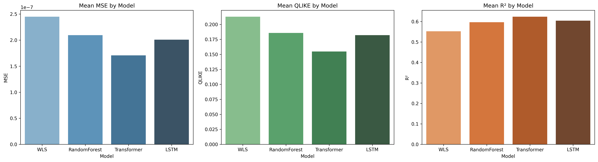

# Executive Summary

# Research Question

In this project, our objective is to identify which predictive model performs best in forecasting short-term volatility using high-frequency financial markets, using level-2 Limit Order Book (LOB) data. Accurate volatility forecasting is essential for market makers and trading firms like Optiver, where it directly impacts pricing, hedging, and real-time inventory management.

We define volatility as how much an asset’s price moves over time, with our target variable predicted as the log-transformed realised volatility 30 timesteps into the future.

With four models being narrowed down in our research, we aim to observe whether deep learning models, specifically Transformers, perform better than LSTM-based models given the same data, feature engineering, and data.

To evaluate model performance, we used two metrics: R-squared to capture the proportion of variance explained, and QLIKE loss, a function often used for volatility forecasts, penalising incorrect magnitude predictions. This allows us to assess both overall accuracy and forecasting reliability. Beyond accuracy, we are also considering the trade-offs in robustness, interpretability and practical relevance, to ensure usability and deployability in fast-moving trading environments.


# EDA

The Exploratory Data Analysis (EDA) stage involves data quality assessment and feature engineering, which were key to processing the dataset for time-series modelling. High frequency financial data may present challenges such as irregular sampling, missing observations, and noise that must be first addressed.

Considering the consecutive nature of the time series data, it is essential to keep missing data to a minimum and dealing with it systematically. Time IDs with at least 70% missing seconds are taken out of the used dataset. Bar charts were also used to visualise the distribution of missing percentages across time buckets, missing seconds in bucket per time ID, and missing seconds across time buckets. 

Little’s Missing Completely At Random (MCAR) Test was applied to check for patterns in missing data, and consequently whether imputation was appropriate. The result showed a high p-value of 1.00, indicating that the missing data is indeed MCAR and not dependent on other variables. We followed up by imputing low missing time intervals along with removing high missing time intervals to maintain the integrity of the dataset and utilising all available data that is reliable. 


## Feature Engineering

During the pre-cleaning stage, corrupt or out-of-range LOB records are removed. This includes (1) non-positive prices and sizes, (2) crossed quotes (ask < bid) at both levels, (3) seconds_in_bucket outside of the expected range, and (4) duplicate or non-monotonic timestamps within each time_id. For the train-test split, 70-30 split was used, non-randomised to keep the consecutive nature of the data. After aggregating the features, the dataset is winsorised to reduce the impact of outliers. This scaling method is done by replacing the extreme values with less extreme values from the dataset.

The feature selection process uses two criteria: Pearson Correlation and Mutual Information. Pearson correlation and mutual information are calculated between each feature and the target variable, with Pearson correlation measuring linear relationships between the variables while mutual information captures the non-linear aspects. The features are then selected if it meets either of two criteria: it has absolute Pearson correlation of higher than or equal to 0.10, or mutual information score higher or equal to 75th percentile. 


## Testing

In establishing a baseline, the naive prediction was made using the current realised volatility. It calculates the Root Mean Squared Error (RMSE) of this baseline, which was 0.92. This represents how well you would do by simply assuming tomorrow’s volatility is the same as today’s.

There were several regression models trained and evaluated in the process. Ridge Regression had a test RMSE of 0.56, while Random Forest had a test RMSE of 0.55, and LightGBM and Histogram-based Gradient Boosting both had test RMSEs of 0.50 each. The decreasing RMSE values show increasingly better performance. The gradient boosting models (LightGBM and Histogram GBM) both had the best performance, reducing the prediction error by approximately 46% from the naive approach. This suggests that the features selected contain valuable predictive information about future volatility, and that tree-based ensembles performed better at capturing complex relationships in this data than linear models like Ridge Regression. 


# Model Selection

After developing over 15 models, we strategically selected the following four models for detailed analysis including two top-performing models—Transformer and LSTM, along with a baseline model demonstrating solid foundational performance – Weighted Least Squares (WLS), and a high-performing model within its complexity class – Random Forest, which consistently outperformed other models of comparable complexity.

Our first implementation was a lightweight Transformer encoder for volatility forecasting. This involved projecting each 30 step LOB sequence into a 64-dimensional embedding, then stacking two encoder blocks—each with four-head self-attention with a key/query dimension of 64, a 4× feed-forward expansion to 256 units, and both residual and layer-norm connections. After global average pooling, a single linear output head produces the forecast, totaling an estimate of 100, 000 parameters. Inputs and log-transformed targets were MinMax-scaled. Training used the Adam optimiser with a learning rate of 1 × 10⁻³, using Mean Squared Error (MSE) loss on a strict 80/10/10 chronological split, a batch size of 32, and early stopping with a patience of 15 over 50 epochs. The model required approximately 500 GPU-hours to train and delivered strong out-of-sample RMSE, R², and QLIKE performance.

For our next model, we built a two-layer stacked LSTM.  with 64 units returning all 30 steps (~25 088 parameters), followed by 20 % dropout, then a 32-unit LSTM (~12 416 parameters) with another 20 % dropout—topped by a compact feed-forward head (16-node dense + single linear output, ~545 parameters), for ~38 k trainable weights. Inputs were min-max–scaled 30-step sequences of engineered LOB features and the target was log-transformed volatility. We enforced a strict chronological split (80 % train, 10 % val, 10 % test) to eliminate look-ahead bias, trained with Adam at a 1 × 10⁻⁴ learning rate, 128-sample batches, and early stopping (patience = 5) for up to 50 epochs. Out-of-sample RMSE, R², and QLIKE metrics demonstrate strong sequence learning and stable volatility forecasts.

For the next model, a two-layer stacked LSTM was built. The first layer consisted of 64 units returning all 30 steps, comprising approximately 25,088 parameters, followed by 20% dropout. This was then followed by a 32-unit LSTM layer with around 12,416 parameters and another 20% dropout. This architecture was topped by a compact feed-forward head, consisting of a 16-node dense layer and a single linear output, contributing approximately 545 parameters, for a total of approximately 38,000 trainable weights. Inputs were MinMax-scaled 30-step sequences of engineered LOB features, and the target was log-transformed volatility. A strict chronological split of 80% for training, 10% for validation, and 10% for testing was enforced to eliminate look-ahead bias. Training was conducted using the Adam optimizer with a 1×10−4 learning rate, 128-sample batches, and early stopping with a patience of 5 for up to 50 epochs. Out-of-sample RMSE, R², and QLIKE metrics demonstrated strong sequence learning and stable volatility forecasts.

Next, we used an ensemble of 500 trees grown to full depth, sampling the square root of features at each split and enforcing a minimum of three samples per leaf. Bootstrap aggregation was used to decorrelate trees and reduce variance. The volatility target was log-transformed to stabilize its heavy-tailed distribution, and we partitioned the data chronologically—80% for training, 10% for validation, 10% for testing—to eliminate look-ahead bias. Training ran in parallel across all CPU cores for efficiency, and we monitored progress in real time. Out-of-sample performance was measured with root-mean-square error and QLIKE loss (with clipping), demonstrating the model’s ability to capture complex nonlinear interactions in order-book dynamics.

Finally, we implemented a heteroskedasticity-aware WLS model in statsmodels to forecast 30-tick-ahead realized volatility. Observation weights were set as the inverse of a long-window rolling variance to counter time-varying noise. Using a chronological 80/20 train-test split across all 30 stocks, the model delivers a strong baseline out-of-sample R² and QLIKE loss.


# Model Evaluation

## Metrics Used

To evaluate model performance comprehensively, we used three complementary metrics:

* **R-squared (R²)**: This measures how much of the variance in the target variable is explained by the model. A higher R² means the model's predictions align more closely with actual volatility, giving a good sense of overall fit.

* **QLIKE (Quasi-Likelihood) Loss**: Tailored for volatility forecasting, QLIKE penalises underestimates more heavily than overestimates. This is especially important in financial risk settings, where underpredicting volatility can lead to poor hedging or mispricing.

* **Mean Squared Error (MSE)**: MSE calculates the average squared difference between predictions and actual values. It’s sensitive to large errors, making it a good measure of overall prediction accuracy.

Together, these metrics offer a balanced view:

* R² captures general trend fit,
* QLIKE evaluates calibration during volatility spikes,
* MSE reflects how the model handles large deviations.

This trio allows us to assess both statistical performance and practical utility in real-world forecasting.

## Fair Comparison

To keep model comparisons fair, we used the same feature engineering pipeline (make_features) and preprocessing (including scaling) across all models. Input features were kept consistent, and target labels were log-transformed in the same way where applicable. All models were trained and tested on the same temporal splits of the data, using time_id as a session boundary. This session-based splitting preserves time-series structure and prevents leakage, allowing us to compare models under the exact same conditions. Final metrics were computed strictly on held-out test sessions, untouched during training and validation, ensuring that evaluation results reflect true generalisation performance rather than overfitting or tuning artefacts.


# Key Findings

## Bar Plots of Mean MSE, QLIKE, and R² by Model

```{r include-model-plot, echo=FALSE, out.width='100%', fig.cap="Bar plots of Mean MSE, QLIKE, and R² by Model"}

```

### Transformer: Top Performance, Limited Transparency

The Transformer stood out across all metrics:

* Lowest MSE and QLIKE, indicating strong accuracy and reliability under volatile conditions.
* Highest R², showing excellent fit to actual trends.

Its self-attention mechanism enables the model to capture intricate temporal and nonlinear relationships in the limit order book (LOB). However, the downside is reduced interpretability, which can be a drawback in regulated or real-time settings.

### LSTM: Stable and Sequentially Aware

LSTM followed closely behind, with:

* Slightly higher MSE than the Transformer,
* Comparable QLIKE and R².

This indicates that LSTM, while simpler, still models sequential LOB dynamics effectively. It’s a strong candidate when computational resources are limited or model explainability is a concern.

### Random Forest: Reliable Static Baseline

Random Forest performed well for a non-sequential model:

* Outperformed WLS across all metrics,
* Achieved decent QLIKE and R² scores.

Its main limitation is the inability to directly model temporal dependencies. However, with engineered time-lagged features, it offers good predictive power and strong explainability via feature importance—useful for real-time systems requiring quick insights.

### WLS: Transparent but Weak

WLS lagged behind:

* Lowest R² and highest QLIKE,
* Moderate MSE but poor calibration for volatility.

Still, its simplicity and transparency make it a valuable baseline for benchmarking and for interpreting how features relate to outcomes.

## Summary Table

```{r, echo=FALSE}
# Example summary table (replace with actual values or DT::datatable)
summary_df <- data.frame(
  Model = c("Transformer", "LSTM", "Random Forest", "WLS"),
  Strengths = c("Best accuracy; learns complex temporal features",
                "Strong sequence modeling; stable performance",
                "Moderate accuracy; interpretable with feature importances",
                "Transparent; fast; strong baseline"),
  Weaknesses = c("High computational cost, low interpretability",
                 "Less accurate than Transformer; harder to interpret",
                 "No inherent temporal modeling",
                 "Poor fit and calibration in volatile conditions")
)
knitr::kable(summary_df, caption = "Comparison of Strengths and Weaknesses Across Models")
```


# Further Discussion

## Interpretability

Transformers have revolutionized sequence modeling by using self-attention to weigh every input position against every other, but this very strength makes them hard to interpret. 
In our volatility model, the lack of positional encodings and the use of global average pooling further obscure how the network arrives at its forecasts.

One natural way to open the “black box” is to visualize the attention weights themselves. By plotting attention maps for each head and layer, we can see which past time buckets 
the model emphasizes—revealing, for instance, whether it zeroes in on sudden price jumps or sustained order-flow imbalances. In parallel, model-agnostic tools such as LIME and 
SHAP can approximate the transformer’s behavior around a single forecast, attributing portions of the output to each input feature. For PyTorch implementations, Captum provides 
built-in gradient- and perturbation-based attributions, letting us drill down into any layer—even the pooling step—to understand how information flows through the network [@Lakham2024].

Looking further ahead, the emerging field of mechanistic interpretability (MI) offers a more fundamental approach. As demonstrated by Rai et al. (2024), MI aims to transform transformer-based 
language models from opaque black boxes into transparent, controllable systems by reverse-engineering their internal computations—neurons, attention heads, and composite circuits—into human-understandable 
mechanisms [@rai2024practical]. In our context, MI could pinpoint exactly which attention head signals an imminent spike in volatility, enabling targeted fine-tuning, bias mitigation, or safety audits. 
Together, these methods—from attention visualization and LIME/SHAP explanations to cutting-edge MI—provide a clear roadmap for making transformer-based volatility models both powerful and transparent.

LSTM networks remain opaque despite their power to learn nonlinear temporal patterns, because their high-dimensional hidden states and feedback loops cannot be reduced to clear, human-readable drivers. 
As Firouzjaee and Khalilian show in oil-stock forecasting, even adding highly correlated inputs like crude oil, gold, or USD prices does not improve an LSTM’s core interpretability,
since feature augmentation alone cannot expose its internal decision logic [@Firouzjaee2024]. As a result, although LSTMs excel at prediction, they offer little insight into which 
factors truly drive their forecasts. Addressing this “black-box” nature requires specialized interpretability techniques—such as state-space analysis, attention-augmented RNNs, or 
hybrid models—to bridge accuracy and transparency in financial applications.

Random forests also sacrifice some interpretability compared to single decision trees, but they are not entirely “black box.” By averaging many trees, they deliver strong predictive 
power while still offering ensemble-level diagnostics. Each tree’s split logic remains fully inspectable, allowing you to trace the exact path for any prediction. Global measures like
mean decrease in impurity and permutation importance rank features by overall influence, and partial dependence or ICE plots reveal how changes in key predictors affect outputs on 
average or for individual instances. Out-of-bag estimates provide nearly unbiased error and importance metrics without separate validation. Together, these built-in tools make random 
forests far more interpretable than most deep “black-box” models, even if they don’t match the simplicity of a single tree [@Grigg2019].

```{python, eval=FALSE}
# Get feature importances
importances = rf.feature_importances_

# Sort feature importances in descending order
indices = np.argsort(importances)[::-1]

# Print the feature ranking
print("Feature ranking:")

for f in range(len(feature_cols_mod)):
    print(f"{f + 1}. feature {indices[f]} ({importances[indices[f]]}) - {feature_cols_mod[indices[f]]}")

# Plot the feature importances of the forest
plt.figure()
plt.title("Feature importances")
plt.bar(range(len(feature_cols_mod)), importances[indices], align="center")
plt.xticks(range(len(feature_cols_mod)), [feature_cols_mod[i] for i in indices], rotation=90)
plt.xlim([-1, len(feature_cols_mod)])
plt.show()
```

Specifically to our project, the random forest indentified ___ as the most importance features. 


## Limitations

Although the transformer model outperforms our other approaches, it has several constraints that may limit its practical use. First, we restricted the context window to 30 
time steps—this may miss important longer-range dependencies if volatility patterns span beyond a half-minute interval. Second, our implementation uses only two encoder layers 
and a modest embedding size (d_model = 64), which may be insufficient to capture intricate, multi-scale dynamics in high-frequency data. Third, transformers are prone to 
overfitting, and even with early stopping this risk remains if the validation split does not fully represent market regimes. Finally, the heavy computation required by 
self-attention often forces compromises in data breadth: we trained on only a subset of stocks and files. If these trade-offs prove unacceptable, Optiver may need to scale up 
hardware, prune or distill the model, or fall back to simpler architectures.

Our LSTM suffers from related challenges. While two layers of 64 and 32 units coupled with dropout can learn nonlinear temporal patterns, the same 30-step window may not align 
with true autocorrelation horizons. Without additional regularization or batch normalization, dropout alone may not prevent overfitting—especially when model complexity outpaces
training data. And, like transformers, LSTMs offer limited visibility into their hidden-state dynamics.

Random forests sidestep many of these issues by fixing model complexity and avoiding sequence recursion, but they treat each bucket independently, failing to exploit the temporal 
order inherent in time series. This requires extensive feature engineering—lags, rolling statistics, seasonal indicators—to expose trends and autocorrelation. Furthermore, random 
forests assume stationarity and can still overfit if trees grow too deep, which is why we capped depth at 12.

Across all models, our use of MinMax scaling presumes that the distribution of prices remains constant between training and deployment. Because MinMaxScaler is sensitive to extreme 
values, any outliers in stock prices can distort feature ranges and destabilize predictions. More robust scaling methods or outlier‐mitigation steps may be necessary to ensure 
consistency on new data.


## Industry Context: Interpretability-Accuracy Trade-Off

Although Transformer- and LSTM-based models offered better accuracy, there is a trade-off between it and interpretability. WLS and Random Forest offer some feature transparency. Transformer is the best-performing, but also the most complex and opaque, with potential latency trade-offs. In practice, models with the same level of accuracy as Transformer would give Optiver a strong edge, if it could run with an acceptable level of latency.

The traditional assumption of a strict trade-off (more interpretability implies a lower level of accuracy) is oversimplified. A model with lower standalone accuracy (e.g. Random Forest, WLS) can outperform a more accurate but opaque model (e.g. Transformer) in collaborative human-machine settings, because it allows better interpretation and decision-making by the human. In a context like trading at Optiver, where humans interpret model output, collaborative performance matters more than standalone accuracy, as misinterpretation can be costly. Even high-performing models like Transformers can perform poorly in practice if humans can not understand their outputs. 


# Conclusion

This research was focused on the practical needs of market makers and trading firms like Optiver, where precise volatility forecasts are essential for pricing, hedging, and real-time inventory management.  The Transformer-based model proved to be more accurate than the other models, with the lowest MSE and QLIKE, and the highest R2 on test data. This shows its ability to capture complex patterns in volatility, aligning with findings that Transformers effectively model long-range dependencies in financial time series. Both LSTM and Transformer models showed relatively consistent performance across samples, demonstrating robustness under volatile market conditions. 

While the Transformer model offers superior accuracy, its complexity and opacity present challenges for real-world trading deployment. In practice, models that balance accuracy with interpretability and latency considerations may provide firms like Optiver with a stronger edge, enabling more efficient and transparent decision-making processes.


# References
