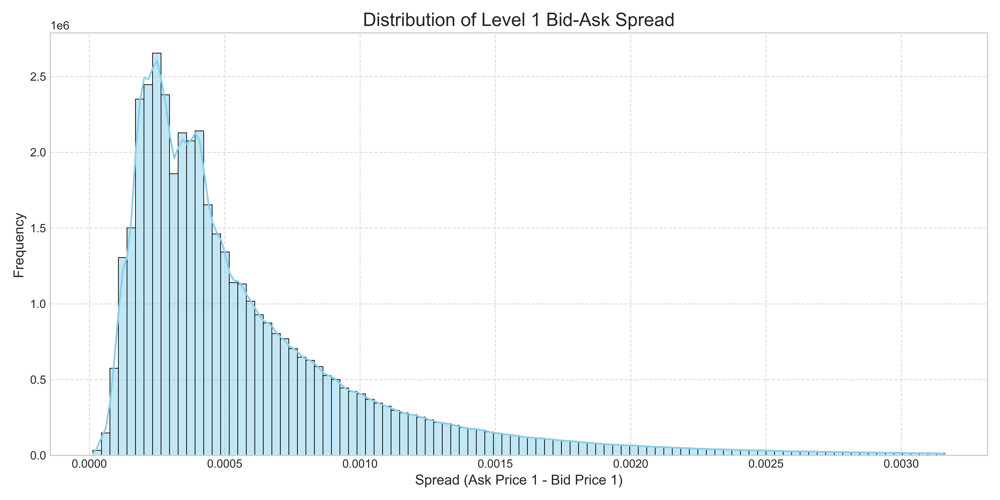
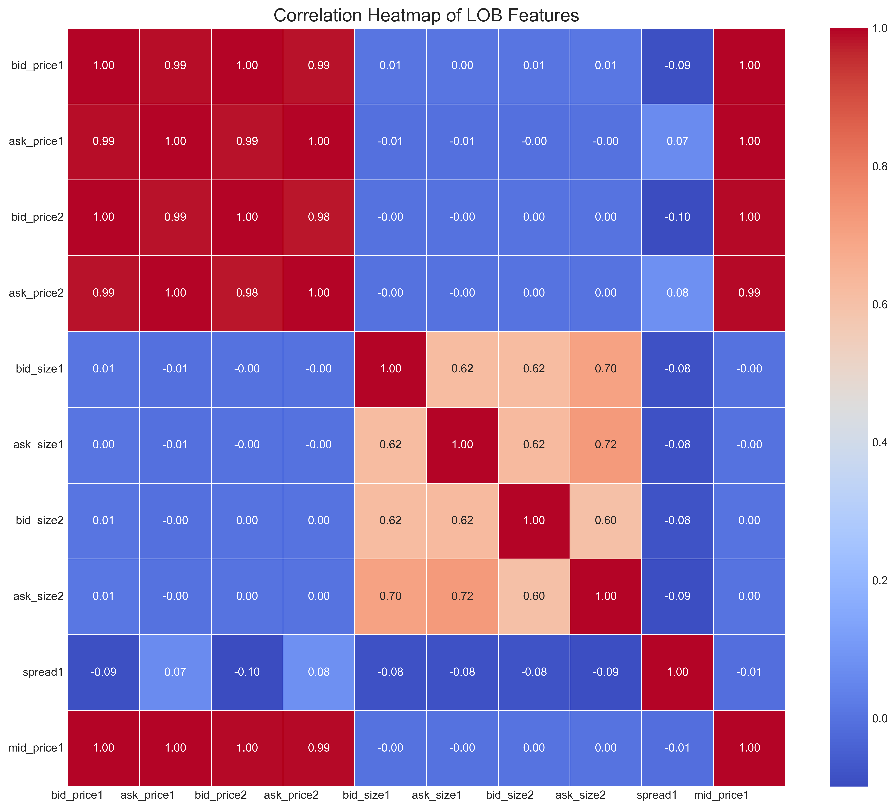

[GitHub repository](https://github.com/Ayush-Singh-31/Optiver-07)

# Executive Summary

## Research Question

Short-term volatility forecasting is critical for high-frequency trading, risk management, and market-making. This study investigates whether advanced deep learning architectures can enhance predictive accuracy on ultra-high-frequency Level-2 Limit Order Book (LOB) data. Specifically, we evaluate whether a *Transformer-based* model can outperform traditional *Long Short-Term Memory (LSTM) networks* when both models are trained on identically preprocessed datasets with equivalent engineered features.

### Hypothesis

#### Null Hypothesis (H₀)

Given equivalent data quality, feature engineering, and preprocessing conditions, a Transformer-based model **does not outperform** LSTM networks in short-term volatility forecasting on Level-2 LOB data.

#### Alternative Hypothesis (H₁)

Given equivalent data quality, feature engineering, and preprocessing conditions, a Transformer-based model **outperforms** LSTM networks in short-term volatility forecasting on Level-2 LOB data.

## Key Findings

Our analysis shows that the Transformer model achieves superior performance in short-term volatility forecasting, consistently outperforming LSTM networks. In general, it attains an **out-of-sample R² of 0.62** and **QLIKE loss of 0.14**, capturing $62\%$ of realized volatility variation—substantially higher than the *WLS* and *Random Forest* baselines, and measurably better than the *LSTM*. In favorable market regimes, performance improves to **out-of-sample R² of 0.78** and **QLIKE loss of 0.05**. The Transformer's attention mechanism effectively identifies temporally localized predictive structures in high-frequency order flow, yielding robust and highly accurate forecasts.

```{r include-model-plot, echo=FALSE, out.width='100%', fig.cap=""}
knitr::include_graphics("model_comparison.png")
```

## Relevance

The demonstrated accuracy of the Transformer model has direct implications in high-frequency trading, risk management, and option pricing. High-quality real-time volatility estimates support tighter bid-ask spreads, more efficient hedging, and improved capital deployment under microsecond constraints. By capturing core properties of volatility (clustering, persistence, and asymmetry) the Transformer allows better real-time decision-making in trading and portfolio optimisation contexts.

# Volatility Prediction

Volatility is the degree to which the return of an asset deviates from its expected value over a given time horizon. Formally if $r_t$ denotes the logarithmic return at time $t$ and $\mu = \mathbb{E}[r_t]$ is its mean, then the (unconditional) volatility $\sigma$ can be defined as the standard deviation of $r_t$:

$$
\sigma \;=\;\sqrt{\mathbb{E}\bigl[(r_t - \mu)^2\bigr]}\,
$$

In empirical, high‐frequency settings, one often works with realized volatility over a discrete intervals. Formally, if $\{r_{t,i}\}_{i=1}^N$ are the equally‐spaced intraday returns within that interval, then the realized volatility is
given by:

$$
\sigma_{\mathrm{realized}} = \sqrt{\sum_{i=1}^N r_{t,i}^2}
$$

## Loading Data

The dataset consists of ultra-high-frequency Level-2 LOB snapshots recorded at $1$-second resolution across $600$-second intervals. Each row corresponds to a fixed-time observation of a single stock and includes:

-   **Price features:** Best bid and ask prices at levels 1 and 2.
-   **Volume features:** Corresponding sizes at these levels.
-   **Time identifiers:** `time_id` and `seconds_in_bucket`.
-   **Stock identifier:** `stock_id` uniquely indexing each equity.

We load the data from all *112 individual CSV files*, each indexed by `time_id` and `seconds_in_bucket`. The data is scanned lazily using **Polars** with strict schema enforcement to ensure memory efficiency. Files are then consolidated and written as a compressed **Parquet** object for downstream processing.


## Filtering

Now, we aim to *predict*, *rank*, and *cluster* stocks based on the predictability of their short-term ($10$-minute) volatility. First, we extract snapshot and aggregate features from the raw LOB data. For each stock, we compute a $13$-dimensional feature vector by averaging across all intervals. Finally, we apply K-Means clustering to group stocks with similar microstructure volatility profiles, train a lagged linear model, and select the top $30$ stocks.

### Snapshot features

Using the existing features in our dataset we create the following:

- **Microprice** ($m_t$)

$$
  m_t = \frac{P_{1,t}^{(b)} \cdot V_{1,t}^{(a)} + P_{1,t}^{(a)} \cdot V_{1,t}^{(b)}}{V_{1,t}^{(b)} + V_{1,t}^{(a)} + \varepsilon}
$$

Here $\varepsilon$ is a small constant used to avoid division by 0. It is set to $10^{-12}$. The microprice tilts toward the side with greater resting depth, capturing which side (bid vs. ask) is likelier to execute next. If $V_{1,t}^{(b)} + V_{1,t}^{(a)} = 0$, we fallback to the mid‐price. 

- **Spreads** ($\Delta_{t}^{(1)}$, $\Delta_{t}^{(2)}$)

$$
  \Delta_{t}^{(1)} = P_{1,t}^{(a)} - P_{1,t}^{(b)}
$$

$$
  \Delta_{t}^{(2)} = P_{2,t}^{(a)} - P_{2,t}^{(b)}
$$

Spreads measure instantaneous liquidity, and empirically, wider spreads often precede higher short‐term volatility.

- **Imbalance** ($I_{1,t}$)

$$
  I_{1,t} = \frac{V^{(b)}_{1,t} - V^{(a)}_{1,t}}{V^{(b)}_{1,t} + V^{(a)}_{1,t} + \varepsilon}
$$

This imbalance at top‐of‐book often signals short‐term directional pressure. A positive value indicates *bid-side dominance* (upward pressure) while a negative value indicates *sell-side dominance* (downward pressure).

- **Book Pressure** ($B_t$)

$$
B_t = \frac{V^{(b)}_{1,t} + V^{(b)}_{2,t}}{V^{(b)}_{1,t} + V^{(b)}_{2,t} + V^{(a)}_{1,t} + V^{(a)}_{2,t} + \varepsilon}
$$

- **Mean Snapshot Features** ($\overline{x}_{\tau}$)

For each snapshot feature we also calculate:

$$
  \overline{x}_{\tau} 
  = \frac{1}{|\mathcal{T}_\tau|} \sum_{t \in \mathcal{T}_\tau} x_t
$$

Here $\mathcal{T}_\tau$ is the set of valid seconds in interval $\tau$. Averaging instantaneous features over the entire 10-minute block yields measures of the prevailing book state. These means form core components of each stock’s 13-dimensional *fingerprint*.

### Aggregate Features

We build our aggregate features on the second-by-second *log-returns* that captures the *instantaneous price changes*.

- **Microprice log‐return** ($r_t$)

$$
  r_t = \ln{m_t} - \ln{m_{t-1}} = \ln(m_t/m_{t-1})
$$

- **Realized Volatility** ($\mathrm{RV}_{\tau}$)

$$
  \mathrm{RV}_{\tau} 
  = \sqrt{\sum_{t \in \mathcal{T}_\tau} \bigl[\ln(m_t) - \ln(m_{t-1})\bigr]^2}
$$

We drop any $r_t=\pm \infty$ (which can occur if $m_{t-1}$ or $m_t$ is zero) and omit *NaNs*. If fewer than two valid log-returns exist, we set $\mathrm{RV}_{\tau} = 0$ for that interval.

- **Realized Skewness** ($\kappa_{\tau}$)

$$
  \kappa_{\tau} 
  = \frac{1}{|\mathcal{T}_\tau|} \sum_{t \in \mathcal{T}_\tau} \left(\frac{\ln(m_t/m_{t-1}) - {\frac{1}{|\mathcal{T}_\tau|} \sum_{t \in \mathcal{T}_\tau} \ln(m_t/m_{t-1})}}{\sqrt{\frac{1}{|\mathcal{T}_\tau| - 1} \sum_{t \in \mathcal{T}_\tau} (\ln(m_t/m_{t-1}) - \bar r)^2}}\right)^3
$$

Skewness indicates whether returns in window $\tau$ have a heavy tail on one side, which can help differentiate intervals driven by one-sided imbalance or asymmetric order flow. If $|\mathcal{T}_\tau|<2$ we set $\kappa_\tau = 0$.

- **Autocorrelation of Log-Returns** ($\rho_{\tau}$)

$$
  \rho_{\tau} 
  = \frac{\displaystyle \sum_{t \in \mathcal{T}_\tau \setminus \{\min\}} (r_t - \bar r)\,(r_{t-1} - \bar r)}
         {\displaystyle \sum_{t \in \mathcal{T}_\tau} (r_t - \bar r)^2}
$$

If we have fewer than $3$ valid returns, we set $\rho_\tau = 0$.

- **Tick Frequency** ($F_{\tau}$)

$$
  F_{\tau} = |\mathcal{T}_\tau|
$$

When combined with the averaged snapshot features, we obtain a $13$-dimensional summary for each 10-minute window. Averaging these over all intervals yields the per-stock fingerprint used in clustering.

### IQR-Based Filtering

Some stocks exhibit extreme average volatility—often due to illiquidity or data quirks—which can dominate clustering and forecast evaluation. To address this, we apply *IQR-based filtering* on each stock’s average realised volatility.

For each stock $i$, compute its mean realized volatility:
$$
\mu_i = \frac{1}{T_i} \sum_{\tau=1}^{T_i} \mathrm{RV}_\tau^{(i)}.
$$
Let $Q_1$ and $Q_3$ be the 25th and 75th percentiles of $\{\mu_i\}$, and define

$$
\mathrm{IQR} = Q_3 - Q_1,\quad
\text{lower} = Q_1 - M \times \mathrm{IQR},\quad
\text{upper} = Q_3 + M \times \mathrm{IQR},
$$

with $M = 1.5$. We exclude stocks with $\mu_i < \text{lower}$ or $\mu_i > \text{upper}$. Stocks above the bound tend to have sporadic spikes, while those below the bound often have near-zero volatility. Removing these extremes ensures the remaining sample reflects typical trading behavior.

### K-Means Clustering

For each filtered stock $i$, compute its $13$-dimensional fingerprint as:

$$
\mu^{(i)} = \frac{1}{T_i} \sum_{\tau=1}^{T_i} \mathbf{z}_\tau^{(i)},
$$
where $\mathbf{z}_\tau^{(i)}$ is the snapshot-aggregate vector for stock $i$ in interval $\tau$.

Because these $13$ components span heterogeneous units, we standardize each dimension to prevents features with large raw magnitudes from dominating *Euclidean distances* and aligns each dimension’s influence on clustering.:

$$
\tilde{\mu}^{(i)}_j = \frac{\mu^{(i)}_j - \bar{\mu}_j}{s_j},\quad
\bar{\mu}_j = \frac{1}{N_{\text{filtered}}} \sum_{i=1}^{N_{\text{filtered}}} \mu^{(i)}_j,\quad
s_j = \sqrt{\frac{1}{N_{\text{filtered}} - 1} \sum_{i=1}^{N_{\text{filtered}}} (\mu^{(i)}_j - \bar{\mu}_j)^2}.
$$

We then run K-Means on  $\{\tilde{\mu}^{(i)}\}_{i=1}^{N_{\text{filtered}}}$ with $k=5$, chosen via **elbow‐method** and **silhouette‐score analyses**. This groups stocks into homogeneous liquidity–volatility profiles, facilitating both qualitative interpretation and the option to fit separate predictive models per cluster.

### Stock Selection

Having grouped stocks, we assess the predictability of each $10$-minute realized volatility using a **lagged linear model** on five meta-features. For stock $i$, let $z_\tau^{(i)} \in \mathbb{R}^5$ be the selected features at interval $\tau$. We fit:

$$
\mathrm{RV}_\tau^{(i)} = \gamma_0 + \sum_{j=1}^5 \gamma_j\,z_{\tau-1,j}^{(i)} + \varepsilon_\tau
$$

via **expanding-window OLS** over $\tau = \tau_{\text{start}}, \dots, T_i$, where $\tau_{\text{start}} = \max\{2, \lfloor T_i/2\rfloor\}$ ensures at least half the data is available after a $1$-lag burn-in. At each $\tau$, we estimate on all data from $\tau_{\text{start}}$ to $\tau-1$ and forecast $\widehat{\mathrm{RV}}_\tau^{(i)}$. From these out-of-sample forecasts, we compute **Out-of-sample $R^2$** and **QLIKE**. We combine these into a score:

$$
S_i = 0.5\,R_i^2 \;-\; 0.5\,\mathrm{QLIKE}_i.
$$
Stocks are ranked by $S_i$, and the top $30$ are selected to keep downstream modeling and cross-validation tractable.

## Exploratory data analysis

In EDA, we extracted key features and examined their distributions to guide scaling decisions. These distributions were **right-skewed** with small positive values, indicating a transaction costs in trading.

```{r include-bas1-plot, echo=FALSE, out.width='100%', fig.cap=""}

```

Comparing across our selected stocks revealed differences in *median* and *dispersion*, highlighting *liquidity variation*. We then generated a correlation **heatmap** to assess linear relationships among features and performed a *grid search* to determine the optimal window size for rolling realized volatility.

```{r include-bas2-plot, echo=FALSE, out.width='100%', fig.cap=""}

```

## Feature Engineering

For the top 30 stocks, along with the snapshot and aggregate features mentioned in the *filtering* section we engineered various second‐by‐second and rolling‐window features. These are designed to capture price dynamics, order‐book complexity, and temporal patterns, yielding a richer input set for modeling.

1.  **Shannon's entropy**

    $$
    s_t = \bigl[V_{1,t}^{(b)},\,V_{2,t}^{(b)},\,V_{1,t}^{(a)},\,V_{2,t}^{(a)}\bigr], 
    \quad
    p_{t,i} = \frac{s_{t,i}}{\sum_{j=1}^{4} s_{t,j}}
    $$
    $$
    H_t = -\sum_{i=1}^{4} p_{t,i} \ln\bigl(p_{t,i}\bigr),
    \quad
    H_t^{Normal} = \frac{H_t}{\ln(4)}
    $$

This captures the uncertainty in order book volume distribution,scaled to $[0,1]$ for compatibility. High entropy indicates balanced bid/ask sizes, implying more unpredictable price movements.

2. **Future Volatility Target**  

     $$
     RV_t^{Future} = RV_{t+30}
     $$ 

We shift the realized volatility forward by *30 seconds* to create the one‐step‐ahead target.

3. **Bipower Variation**  

     $$
     Bvar_t 
     = \frac{1}{30} \sum_{j=1}^{30} \bigl|r_{t-j}\bigr|\cdot\bigl|r_{t-j-1}\bigr|
     $$

4. **Weighted Average Price (WAP)**  
 
     $$
     WAP_t 
     = \frac{P_{1,t}^{(b)}\,V_{1,t}^{(a)} + P_{1,t}^{(a)}\,V_{1,t}^{(b)}}{V_{1,t}^{(b)} + V_{1,t}^{(a)}}
     $$  

     $$
     WAP_t^{(log)} = \ln\bigl(WAP_t / WAP_{t-1}\bigr)
     $$ 

5. **Lagged Features**  

     $$
     x_{t-1},\; x_{t-2},
     $$ 

For each of **imbalance**, **book_pressure**, and **log_return**, we create first and second lags within each `time_id` group.

6. **Rolling‐Window Summary**  

      $$
      {Log-Returns}_t^{Rolling} = \sqrt{\frac{1}{29}\sum_{j=1}^{30}\bigl(r_{t-j} - \overline{r}_{t-1: t-30}\bigr)^2}\,
      $$ 

7. **Intrablock Temporal Encoding**  

      $$
      \theta_t = 2\pi \frac{\text{seconds\_in\_bucket}_t}{600}, 
      \quad 
      \text{sec\_sin}_t = \sin(\theta_t), 
      \quad 
      \text{sec\_cos}_t = \cos(\theta_t).
      $$  
      
These encode the position within each 10‐minute block and capture cyclical effects without imposing a linear time trend.  

8. **Log‐Transformation of Book Sizes**  

      $$
      \text{size\_log}_t = \ln\bigl(1 + \text{size}_t\bigr),
      $$  
      
Finally, we apply a **log1p** transform to each raw size column ($V_{1}^{(b)}$, $V_{1}^{(a)}$, $V_{2}^{(b)}$, $V_{2}^{(a)}$)  replacing the original size columns with their log‐scaled counterparts. This reduces heavy‐tail effects in volume distributions, improving numerical stability.  Rows with **NaNs** or **infs** are dropped after transformation and we also cast all `float64` values to `float32` to minimize memory usage.

## Feature Selection

### Variance Thresholding

First we drop any feature with **zero variance** across all stocks and all seconds within each 10-minute bucket. As a constant predictor cannot explain future volatility and only adds noise. For each column, compute its empirical variance over 30 stocks and all time points; if $\mathrm{Var}(x)=0$, we remove that feature.

### Spearman Correlation

Next we compute **Spearman’s rank correlation** to detect *near-collinearity* among remaining features. For variables $x$ and $y$ over $n$ observations, Spearman’s $\rho_s$ is

$$
\rho_s(x,y) \;=\; 1 \;-\; \frac{6}{n(n^2 - 1)} \sum_{k=1}^n\bigl(\mathrm{rank}(x_k) - \mathrm{rank}(y_k)\bigr)^2.
$$

We build the full $p \times p$ **Spearman matrix** and, whenever $|\rho_s|>0.98$, identify one redundant feature. To choose which to drop, sum each feature’s absolute correlations with all others; the feature with the smaller total is removed.

## Models

### Weighted Least Squares

To forecast next‐interval realized volatility, we fit a WLS model using selected features. WLS accounts for heteroscedasticity by assigning inverse‐variance weights. Let $X\in\mathbb{R}^{N\times p}$ be the predictor matrix (including an intercept), $\mathbf{y}\in\mathbb{R}^N$ the one‐step‐ahead realized‐volatility target, and $\mathbf{w}\in\mathbb{R}^N$ the weights, where for each observation $t$:

$$
w_t = \frac{1}{\mathrm{Var}(y_{t-2000:t}) + \varepsilon},
$$
with a rolling window of size 2000 and small $\varepsilon$ to avoid division by zero. This down‐weights periods of high volatility noise, stabilizing coefficient estimates.

The WLS minimises:

$$
\min_{\beta} \sum_{t=1}^N w_t \bigl(y_t - \beta_0 - \mathbf{x}_t^\top \beta\bigr)^2,
$$

where $\beta_0$ is the intercept and $\mathbf{x}_t$ the $p$‐dimensional features at $t$. 

We split the data chronologically ($80\%$ train, $20\%$ test), add a constant column, and fit WLS. This yields coefficient estimates that are less influenced by high‐variance intervals, producing more stable forecasts under volatility heterogeneity.

### Random Forest

A Random Forest is an ensemble of decision trees that reduces variance and captures nonlinear feature interactions, making it well-suited for predicting realized volatility which exhibits spikes and heteroscedasticity. 

We first apply a **log1p** transform to the target to compress large spikes: 

$$
y_t^{(\mathrm{log})} = \ln\bigl(1 + \mathrm{rv\_future}_t\bigr)
$$ 

We then split the data by `time_id` to preserve temporal ordering: the first $80\%$ of sessions are reserved for *train* and *validation* and the last $20\%$ for *test*. Within the first $80\%$, the first $90\%$ of sessions form the training set and the remaining forms validation set. For each split we extract the feature matrix $X$ and log-target. 

We train the model with the following parameters:

```{python, eval=FALSE}
rf = RandomForestRegressor(
    n_estimators=500,
    max_depth=None,
    max_features='sqrt',
    min_samples_leaf=3,
    bootstrap=True,
    n_jobs=-1,
    random_state=42,
    verbose=1
)
rf.fit(X_train, y_train)
```


After fitting, we predict on validation to compute the out-of-sample RMSE for manual hyperparameter adjsment:

$$
\mathrm{RMSE}_{\mathrm{val}} = \sqrt{\frac{1}{N_{\mathrm{val}}} \sum_{i=1}^{N_{\mathrm{val}}} \bigl(y_i^{(\mathrm{log})} - \widehat{y}_i^{(\mathrm{log})}\bigr)^2},
$$
Finally, we evaluate on the held-out test set by predicting $\widehat{y}_{\mathrm{test}}^{(\mathrm{log})}$ to compute final metrics (RMSE, $R^2$, and QLIKE) in *log-space* for stability.

### LSTM

An LSTM captures temporal dependencies over multiple seconds, making it well-suited for modeling sequential volatility patterns as well.

First we fit a **MinMaxScaler** on the training set. For the target, we again use **log1p** scaling: 

$$
y^{(\mathrm{log})} = \ln\bigl(1 + RV^{Future}\bigr),\quad
y^{(\mathrm{scaled})} = \frac{y^{(\mathrm{log})} - \min(y^{(\mathrm{log})})}{\max(y^{(\mathrm{log})}) - \min(y^{(\mathrm{log})})}.
$$  

Then we group the data by `time_id` and slide a $30$-second window over the scaled feature matrix $X\in\mathbb{R}^{T\times p}$ to form input sequences of shape $(T-30,\,30,\,p)$, with targets at $t+30$. We split the sessions chronologically: $80\%$ for train and validation ($90\%$ train, $10\%$ validation), $20\%$ for test.

**Model Architecture:**  
<table style="
  width:100%;
  border-collapse: collapse;
  font-family: Menlo, 'DejaVu Sans Mono', Consolas, 'Courier New', monospace;
  line-height: 1.3;
">
  <thead>
    <tr style="background:#f5f5f5;">
      <th style="border:1px solid #666;padding:8px 12px;text-align:left;font-weight:bold;">
        Layer&nbsp;(type)
      </th>
      <th style="border:1px solid #666;padding:8px 12px;text-align:left;font-weight:bold;">
        Output&nbsp;Shape
      </th>
      <th style="border:1px solid #666;padding:8px 12px;text-align:right;font-weight:bold;">
        Param&nbsp;#
      </th>
    </tr>
  </thead>

  <tbody>
    <tr>
      <td style="border:1px solid #666;padding:8px 12px;">
        lstm_8&nbsp;(<span style="color:#0087ff;">LSTM</span>)
      </td>
      <td style="border:1px solid #666;padding:8px 12px;">
        (<span style="color:#00d7ff;">None</span>,&nbsp;<span style="color:#00af00;">30</span>,&nbsp;<span style="color:#00af00;">64</span>)
      </td>
      <td style="border:1px solid #666;padding:8px 12px;text-align:right;">
        <span style="color:#00af00;">25,088</span>
      </td>
    </tr>
    <tr>
      <td style="border:1px solid #666;padding:8px 12px;">
        dropout_8&nbsp;(<span style="color:#0087ff;">Dropout</span>)
      </td>
      <td style="border:1px solid #666;padding:8px 12px;">
        (<span style="color:#00d7ff;">None</span>,&nbsp;<span style="color:#00af00;">30</span>,&nbsp;<span style="color:#00af00;">64</span>)
      </td>
      <td style="border:1px solid #666;padding:8px 12px;text-align:right;">
        <span style="color:#00af00;">0</span>
      </td>
    </tr>

    <tr>
      <td style="border:1px solid #666;padding:8px 12px;">
        lstm_9&nbsp;(<span style="color:#0087ff;">LSTM</span>)
      </td>
      <td style="border:1px solid #666;padding:8px 12px;">
        (<span style="color:#00d7ff;">None</span>,&nbsp;<span style="color:#00af00;">32</span>)
      </td>
      <td style="border:1px solid #666;padding:8px 12px;text-align:right;">
        <span style="color:#00af00;">12,416</span>
      </td>
    </tr>

    <tr>
      <td style="border:1px solid #666;padding:8px 12px;">
        dropout_9&nbsp;(<span style="color:#0087ff;">Dropout</span>)
      </td>
      <td style="border:1px solid #666;padding:8px 12px;">
        (<span style="color:#00d7ff;">None</span>,&nbsp;<span style="color:#00af00;">32</span>)
      </td>
      <td style="border:1px solid #666;padding:8px 12px;text-align:right;">
        <span style="color:#00af00;">0</span>
      </td>
    </tr>

    <tr>
      <td style="border:1px solid #666;padding:8px 12px;">
        dense_8&nbsp;(<span style="color:#0087ff;">Dense</span>)
      </td>
      <td style="border:1px solid #666;padding:8px 12px;">
        (<span style="color:#00d7ff;">None</span>,&nbsp;<span style="color:#00af00;">16</span>)
      </td>
      <td style="border:1px solid #666;padding:8px 12px;text-align:right;">
        <span style="color:#00af00;">528</span>
      </td>
    </tr>

    <tr>
      <td style="border:1px solid #666;padding:8px 12px;">
        dense_9&nbsp;(<span style="color:#0087ff;">Dense</span>)
      </td>
      <td style="border:1px solid #666;padding:8px 12px;">
        (<span style="color:#00d7ff;">None</span>,&nbsp;<span style="color:#00af00;">1</span>)
      </td>
      <td style="border:1px solid #666;padding:8px 12px;text-align:right;">
        <span style="color:#00af00;">17</span>
      </td>
    </tr>
  </tbody>
</table>


We train using the **Adam** optimizer with a learning rate of $10^{-4}$ and *minimize MSE* on the scaled log-volatility. Training uses a batch size of $128$ and runs for up to $50$ epochs, with **early stopping** triggered after $5$ epochs of no validation improvement. We have $38,049$ trainable parameters.

After training, we predict the scaled log-volatility $\widehat{y}^{(\mathrm{scaled})}$ on the test set and invert it using the stored training minima and maxima: 
$$
\widehat{y}^{(\mathrm{log})} = \widehat{y}^{(\mathrm{scaled})}\times(\max(y^{(\mathrm{log})})-\min(y^{(\mathrm{log})})) + \min(y^{(\mathrm{log})}),\quad
\widehat{RV^{Future}} = \exp\bigl(\widehat{y}^{(\mathrm{log})}\bigr) - 1.
$$
We then evaluate performance on the original volatility scale using RMSE, $R^2$, and QLIKE.

### Transformer

A Transformer captures long‐range dependencies via self‐attention, making it very effective for volatility sequences with complex patterns.

Similar to LSTM we fit **MinMax scalers** on training data. For the target, we again use **log1p** scaling: 
$$
y^{(\mathrm{log})} = \ln\bigl(1 + RV^{Future}\bigr),\quad
y^{(\mathrm{scaled})} = \frac{y^{(\mathrm{log})} - \min(y^{(\mathrm{log})})}{\max(y^{(\mathrm{log})}) - \min(y^{(\mathrm{log})})}.
$$ 

The sequence construction and the train-test-validation split is identical to the LSTM model. This model is trained on $101,569$ parameter, taking more $300$ GPU-hours to train.

**Model Architecture:**  

<table style="
  width:100%;
  border-collapse: collapse;
  font-family: Menlo, 'DejaVu Sans Mono', Consolas, 'Courier New', monospace;
  line-height: 1.3;
  table-layout: fixed;
  word-wrap: break-word;
">
  <thead>
    <tr style="background:#f5f5f5;">
      <th style="border:1px solid #666;padding:8px 12px;text-align:left;font-weight:bold;">Layer&nbsp;(type)</th>
      <th style="border:1px solid #666;padding:8px 12px;text-align:left;font-weight:bold;">Output&nbsp;Shape</th>
      <th style="border:1px solid #666;padding:8px 12px;text-align:right;font-weight:bold;">Param&nbsp;#</th>
      <th style="border:1px solid #666;padding:8px 12px;text-align:left;font-weight:bold;">Connected&nbsp;to</th>
    </tr>
  </thead>

  <tbody>
    <tr>
      <td style="border:1px solid #666;padding:8px 12px;">
        input_layer&nbsp;(<span style="color:#0087ff;">InputLayer</span>)
      </td>
      <td style="border:1px solid #666;padding:8px 12px;">
        (<span style="color:#00d7ff;">None</span>,&nbsp;<span style="color:#00af00;">30</span>,&nbsp;<span style="color:#00af00;">23</span>)
      </td>
      <td style="border:1px solid #666;padding:8px 12px;text-align:right;">
        <span style="color:#00af00;">0</span>
      </td>
      <td style="border:1px solid #666;padding:8px 12px;">–</td>
    </tr>
    <tr>
      <td style="border:1px solid #666;padding:8px 12px;">
        dense&nbsp;(<span style="color:#0087ff;">Dense</span>)
      </td>
      <td style="border:1px solid #666;padding:8px 12px;">
        (<span style="color:#00d7ff;">None</span>,&nbsp;<span style="color:#00af00;">30</span>,&nbsp;<span style="color:#00af00;">64</span>)
      </td>
      <td style="border:1px solid #666;padding:8px 12px;text-align:right;">
        <span style="color:#00af00;">1,536</span>
      </td>
      <td style="border:1px solid #666;padding:8px 12px;">
        input_layer[<span style="color:#00af00;">0</span>][<span style="color:#00af00;">0</span>]
      </td>
    </tr>

    <!-- 3 -->
    <tr>
      <td style="border:1px solid #666;padding:8px 12px;">
        multi_head_attention&nbsp;(<span style="color:#0087ff;">MultiHeadAttention</span>)
      </td>
      <td style="border:1px solid #666;padding:8px 12px;">
        (<span style="color:#00d7ff;">None</span>,&nbsp;<span style="color:#00af00;">30</span>,&nbsp;<span style="color:#00af00;">64</span>)
      </td>
      <td style="border:1px solid #666;padding:8px 12px;text-align:right;">
        <span style="color:#00af00;">16,640</span>
      </td>
      <td style="border:1px solid #666;padding:8px 12px;">
        dense[<span style="color:#00af00;">0</span>][<span style="color:#00af00;">0</span>]&nbsp;(q,&nbsp;k,&nbsp;v)
      </td>
    </tr>

    <!-- 4 -->
    <tr>
      <td style="border:1px solid #666;padding:8px 12px;">
        add&nbsp;(<span style="color:#0087ff;">Add</span>)
      </td>
      <td style="border:1px solid #666;padding:8px 12px;">
        (<span style="color:#00d7ff;">None</span>,&nbsp;<span style="color:#00af00;">30</span>,&nbsp;<span style="color:#00af00;">64</span>)
      </td>
      <td style="border:1px solid #666;padding:8px 12px;text-align:right;">
        <span style="color:#00af00;">0</span>
      </td>
      <td style="border:1px solid #666;padding:8px 12px;">
        dense[<span style="color:#00af00;">0</span>][<span style="color:#00af00;">0</span>],&nbsp;multi_head_attention
      </td>
    </tr>

    <!-- 5 -->
    <tr>
      <td style="border:1px solid #666;padding:8px 12px;">
        layer_normalization&nbsp;(<span style="color:#0087ff;">LayerNormalization</span>)
      </td>
      <td style="border:1px solid #666;padding:8px 12px;">
        (<span style="color:#00d7ff;">None</span>,&nbsp;<span style="color:#00af00;">30</span>,&nbsp;<span style="color:#00af00;">64</span>)
      </td>
      <td style="border:1px solid #666;padding:8px 12px;text-align:right;">
        <span style="color:#00af00;">128</span>
      </td>
      <td style="border:1px solid #666;padding:8px 12px;">
        add[<span style="color:#00af00;">0</span>][<span style="color:#00af00;">0</span>]
      </td>
    </tr>

    <!-- 6 -->
    <tr>
      <td style="border:1px solid #666;padding:8px 12px;">
        dense_1&nbsp;(<span style="color:#0087ff;">Dense</span>)
      </td>
      <td style="border:1px solid #666;padding:8px 12px;">
        (<span style="color:#00d7ff;">None</span>,&nbsp;<span style="color:#00af00;">30</span>,&nbsp;<span style="color:#00af00;">256</span>)
      </td>
      <td style="border:1px solid #666;padding:8px 12px;text-align:right;">
        <span style="color:#00af00;">16,640</span>
      </td>
      <td style="border:1px solid #666;padding:8px 12px;">
        layer_normalization
      </td>
    </tr>

    <!-- 7 -->
    <tr>
      <td style="border:1px solid #666;padding:8px 12px;">
        dense_2&nbsp;(<span style="color:#0087ff;">Dense</span>)
      </td>
      <td style="border:1px solid #666;padding:8px 12px;">
        (<span style="color:#00d7ff;">None</span>,&nbsp;<span style="color:#00af00;">30</span>,&nbsp;<span style="color:#00af00;">64</span>)
      </td>
      <td style="border:1px solid #666;padding:8px 12px;text-align:right;">
        <span style="color:#00af00;">16,448</span>
      </td>
      <td style="border:1px solid #666;padding:8px 12px;">
        dense_1[<span style="color:#00af00;">0</span>][<span style="color:#00af00;">0</span>]
      </td>
    </tr>

    <!-- 8 -->
    <tr>
      <td style="border:1px solid #666;padding:8px 12px;">
        dropout_1&nbsp;(<span style="color:#0087ff;">Dropout</span>)
      </td>
      <td style="border:1px solid #666;padding:8px 12px;">
        (<span style="color:#00d7ff;">None</span>,&nbsp;<span style="color:#00af00;">30</span>,&nbsp;<span style="color:#00af00;">64</span>)
      </td>
      <td style="border:1px solid #666;padding:8px 12px;text-align:right;">
        <span style="color:#00af00;">0</span>
      </td>
      <td style="border:1px solid #666;padding:8px 12px;">
        dense_2[<span style="color:#00af00;">0</span>][<span style="color:#00af00;">0</span>]
      </td>
    </tr>

    <!-- 9 -->
    <tr>
      <td style="border:1px solid #666;padding:8px 12px;">
        add_1&nbsp;(<span style="color:#0087ff;">Add</span>)
      </td>
      <td style="border:1px solid #666;padding:8px 12px;">
        (<span style="color:#00d7ff;">None</span>,&nbsp;<span style="color:#00af00;">30</span>,&nbsp;<span style="color:#00af00;">64</span>)
      </td>
      <td style="border:1px solid #666;padding:8px 12px;text-align:right;">
        <span style="color:#00af00;">0</span>
      </td>
      <td style="border:1px solid #666;padding:8px 12px;">
        layer_normalization,&nbsp;dropout_1[<span style="color:#00af00;">0</span>][<span style="color:#00af00;">0</span>]
      </td>
    </tr>

    <!-- 10 -->
    <tr>
      <td style="border:1px solid #666;padding:8px 12px;">
        layer_normalization_2&nbsp;(<span style="color:#0087ff;">LayerNormalization</span>)
      </td>
      <td style="border:1px solid #666;padding:8px 12px;">
        (<span style="color:#00d7ff;">None</span>,&nbsp;<span style="color:#00af00;">30</span>,&nbsp;<span style="color:#00af00;">64</span>)
      </td>
      <td style="border:1px solid #666;padding:8px 12px;text-align:right;">
        <span style="color:#00af00;">128</span>
      </td>
      <td style="border:1px solid #666;padding:8px 12px;">
        add_1[<span style="color:#00af00;">0</span>][<span style="color:#00af00;">0</span>]
      </td>
    </tr>

    <!-- 11 -->
    <tr>
      <td style="border:1px solid #666;padding:8px 12px;">
        multi_head_attention_2&nbsp;(<span style="color:#0087ff;">MultiHeadAttention</span>)
      </td>
      <td style="border:1px solid #666;padding:8px 12px;">
        (<span style="color:#00d7ff;">None</span>,&nbsp;<span style="color:#00af00;">30</span>,&nbsp;<span style="color:#00af00;">64</span>)
      </td>
      <td style="border:1px solid #666;padding:8px 12px;text-align:right;">
        <span style="color:#00af00;">16,640</span>
      </td>
      <td style="border:1px solid #666;padding:8px 12px;">
        layer_normalization_2
      </td>
    </tr>

    <!-- 12 -->
    <tr>
      <td style="border:1px solid #666;padding:8px 12px;">
        add_2&nbsp;(<span style="color:#0087ff;">Add</span>)
      </td>
      <td style="border:1px solid #666;padding:8px 12px;">
        (<span style="color:#00d7ff;">None</span>,&nbsp;<span style="color:#00af00;">30</span>,&nbsp;<span style="color:#00af00;">64</span>)
      </td>
      <td style="border:1px solid #666;padding:8px 12px;text-align:right;">
        <span style="color:#00af00;">0</span>
      </td>
      <td style="border:1px solid #666;padding:8px 12px;">
        layer_normalization_2,&nbsp;multi_head_attention_2
      </td>
    </tr>

    <!-- 13 -->
    <tr>
      <td style="border:1px solid #666;padding:8px 12px;">
        layer_normalization_3&nbsp;(<span style="color:#0087ff;">LayerNormalization</span>)
      </td>
      <td style="border:1px solid #666;padding:8px 12px;">
        (<span style="color:#00d7ff;">None</span>,&nbsp;<span style="color:#00af00;">30</span>,&nbsp;<span style="color:#00af00;">64</span>)
      </td>
      <td style="border:1px solid #666;padding:8px 12px;text-align:right;">
        <span style="color:#00af00;">128</span>
      </td>
      <td style="border:1px solid #666;padding:8px 12px;">
        add_2[<span style="color:#00af00;">0</span>][<span style="color:#00af00;">0</span>]
      </td>
    </tr>

    <!-- 14 -->
    <tr>
      <td style="border:1px solid #666;padding:8px 12px;">
        dense_3&nbsp;(<span style="color:#0087ff;">Dense</span>)
      </td>
      <td style="border:1px solid #666;padding:8px 12px;">
        (<span style="color:#00d7ff;">None</span>,&nbsp;<span style="color:#00af00;">30</span>,&nbsp;<span style="color:#00af00;">256</span>)
      </td>
      <td style="border:1px solid #666;padding:8px 12px;text-align:right;">
        <span style="color:#00af00;">16,640</span>
      </td>
      <td style="border:1px solid #666;padding:8px 12px;">
        layer_normalization_3
      </td>
    </tr>

    <!-- 15 -->
    <tr>
      <td style="border:1px solid #666;padding:8px 12px;">
        dense_4&nbsp;(<span style="color:#0087ff;">Dense</span>)
      </td>
      <td style="border:1px solid #666;padding:8px 12px;">
        (<span style="color:#00d7ff;">None</span>,&nbsp;<span style="color:#00af00;">30</span>,&nbsp;<span style="color:#00af00;">64</span>)
      </td>
      <td style="border:1px solid #666;padding:8px 12px;text-align:right;">
        <span style="color:#00af00;">16,448</span>
      </td>
      <td style="border:1px solid #666;padding:8px 12px;">
        dense_3[<span style="color:#00af00;">0</span>][<span style="color:#00af00;">0</span>]
      </td>
    </tr>

    <!-- 16 -->
    <tr>
      <td style="border:1px solid #666;padding:8px 12px;">
        dropout_3&nbsp;(<span style="color:#0087ff;">Dropout</span>)
      </td>
      <td style="border:1px solid #666;padding:8px 12px;">
        (<span style="color:#00d7ff;">None</span>,&nbsp;<span style="color:#00af00;">30</span>,&nbsp;<span style="color:#00af00;">64</span>)
      </td>
      <td style="border:1px solid #666;padding:8px 12px;text-align:right;">
        <span style="color:#00af00;">0</span>
      </td>
      <td style="border:1px solid #666;padding:8px 12px;">
        dense_4[<span style="color:#00af00;">0</span>][<span style="color:#00af00;">0</span>]
      </td>
    </tr>

    <!-- 17 -->
    <tr>
      <td style="border:1px solid #666;padding:8px 12px;">
        add_3&nbsp;(<span style="color:#0087ff;">Add</span>)
      </td>
      <td style="border:1px solid #666;padding:8px 12px;">
        (<span style="color:#00d7ff;">None</span>,&nbsp;<span style="color:#00af00;">30</span>,&nbsp;<span style="color:#00af00;">64</span>)
      </td>
      <td style="border:1px solid #666;padding:8px 12px;text-align:right;">
        <span style="color:#00af00;">0</span>
      </td>
      <td style="border:1px solid #666;padding:8px 12px;">
        layer_normalization_3,&nbsp;dropout_3[<span style="color:#00af00;">0</span>][<span style="color:#00af00;">0</span>]
      </td>
    </tr>

    <!-- 18 -->
    <tr>
      <td style="border:1px solid #666;padding:8px 12px;">
        layer_normalization_4&nbsp;(<span style="color:#0087ff;">LayerNormalization</span>)
      </td>
      <td style="border:1px solid #666;padding:8px 12px;">
        (<span style="color:#00d7ff;">None</span>,&nbsp;<span style="color:#00af00;">30</span>,&nbsp;<span style="color:#00af00;">64</span>)
      </td>
      <td style="border:1px solid #666;padding:8px 12px;text-align:right;">
        <span style="color:#00af00;">128</span>
      </td>
      <td style="border:1px solid #666;padding:8px 12px;">
        add_3[<span style="color:#00af00;">0</span>][<span style="color:#00af00;">0</span>]
      </td>
    </tr>

    <!-- 19 -->
    <tr>
      <td style="border:1px solid #666;padding:8px 12px;">
        global_average_pooling&nbsp;(<span style="color:#0087ff;">GlobalAveragePooling1D</span>)
      </td>
      <td style="border:1px solid #666;padding:8px 12px;">
        (<span style="color:#00d7ff;">None</span>,&nbsp;<span style="color:#00af00;">64</span>)
      </td>
      <td style="border:1px solid #666;padding:8px 12px;text-align:right;">
        <span style="color:#00af00;">0</span>
      </td>
      <td style="border:1px solid #666;padding:8px 12px;">
        layer_normalization_4
      </td>
    </tr>

    <!-- 20 -->
    <tr>
      <td style="border:1px solid #666;padding:8px 12px;">
        dropout_4&nbsp;(<span style="color:#0087ff;">Dropout</span>)
      </td>
      <td style="border:1px solid #666;padding:8px 12px;">
        (<span style="color:#00d7ff;">None</span>,&nbsp;<span style="color:#00af00;">64</span>)
      </td>
      <td style="border:1px solid #666;padding:8px 12px;text-align:right;">
        <span style="color:#00af00;">0</span>
      </td>
      <td style="border:1px solid #666;padding:8px 12px;">
        global_average_pooling
      </td>
    </tr>

    <!-- 21 -->
    <tr>
      <td style="border:1px solid #666;padding:8px 12px;">
        dense_5&nbsp;(<span style="color:#0087ff;">Dense</span>)
      </td>
      <td style="border:1px solid #666;padding:8px 12px;">
        (<span style="color:#00d7ff;">None</span>,&nbsp;<span style="color:#00af00;">1</span>)
      </td>
      <td style="border:1px solid #666;padding:8px 12px;text-align:right;">
        <span style="color:#00af00;">65</span>
      </td>
      <td style="border:1px solid #666;padding:8px 12px;">
        dropout_4[<span style="color:#00af00;">0</span>][<span style="color:#00af00;">0</span>]
      </td>
    </tr>
  </tbody>
</table>

We train using the **Adam** optimizer with a learning rate of $10^{-3}$, minimizing MSE on the scaled target. Training proceeds with a batch size of $32$ for up to $50$ epochs, using early stopping based on validation MSE with a patience of $15$ epochs; the best weights are restored upon stopping. 

After training, we predict $\widehat{y}^{(\mathrm{scaled})}$ on the test set and invert it using the stored train-set extrema:
$$
\widehat{y}^{(\mathrm{log})} = \widehat{y}^{(\mathrm{scaled})} \times (\max(y^{(\mathrm{log})}) - \min(y^{(\mathrm{log})})) + \min(y^{(\mathrm{log})}),
\quad
\widehat{RV^{Future}} = \exp\bigl(\widehat{y}^{(\mathrm{log})}\bigr) - 1.
$$
Model performance is evaluated on the original volatility scale using RMSE, $R^2$, and QLIKE.

## Evaluation Metrics

### R-Squared

$$
\overline{y} \;=\; \frac{1}{N}\sum_{i=1}^N y_i,\quad
R^2 \;=\; 1 \;-\; \frac{\sum_{i=1}^N (y_i - \widehat{y}_i)^2}{\sum_{i=1}^N (y_i - \overline{y})^2}.
$$

R-Squared measures the fraction of variance in realized volatility explained by the forecasts. Higher $R^2$ (closer to 1) indicates stronger alignment between predicted and actual volatility. For $N$ test observations $\{y_i\}$ and predictions $\{\widehat{y}_i\}$:

### QLIKE

$$
\mathrm{QLIKE} = \frac{1}{N} \sum_{i=1}^N \bigl(r_i - \ln r_i - 1\bigr),
\quad
r_i = \frac{y_i}{\widehat{y}_i},
$$

QLIKE is a loss tailored to volatility forecasting that penalizes underestimation more heavily. Lower QLIKE indicates better calibration to actual volatility, especially during spikes. Note that both $y_i$ and $\widehat{y}_i$ clipped to a small $\varepsilon>0$.

### MSE

$$
\mathrm{MSE} = \frac{1}{N}\sum_{i=1}^N (y_i - \widehat{y}_i)^2,\quad
\mathrm{RMSE} = \sqrt{\mathrm{MSE}}.
$$

Mean Squared Error quantifies average squared deviation between forecasts and actual values. Computed on the original scale, MSE penalizes large errors quadratically; on the log scale, it emphasizes relative deviations.

### Results

```{r include-model-plot2, echo=FALSE, out.width='100%', fig.cap=""}
knitr::include_graphics("model_comparison.png")
```

As shown in the comparison chart, the **Transformer** outperformed all other models, achieving the lowest MSE ($\approx 1.7 \times 10^-7$), lowest QLIKE ($\approx 0.15$), and highest $R^2$ ($\approx 0.62$). The **LSTM** ranked second (MSE $\approx 2.0 \times 10^-7$, QLIKE $\approx 0.18$, $R^2$ $\approx 0.59$), followed by **Random Forest** (MSE $\approx 2.2 \times 10^-7$, QLIKE $\approx 0.19$, $R^2$ $\approx 0.57$). **WLS** performed worst (MSE $\approx 2.5 \times 10^-7$, QLIKE $\approx 0.20$, $R^2$ $\approx 0.55$). This confirms the Transformer’s superior accuracy and calibration for 10-minute volatility forecasting.

## Limitations & Improvements

- **Scaling & Preprocessing**  
MinMax and IQR filtering can be distorted by extreme outliers or evolving distributions, leading to unstable features and retained mid-range anomalies. Use robust scaling (e.g., median/IQR, Winsorization) and dynamic trimming (rolling statistics) to adapt to real-time volatility shifts.

- **Transformer**  
A 30-step context window and only two encoder layers (d_model=64) may miss longer-range, multi-scale dynamics. The model is prone to overfitting if validation splits don’t capture diverse regimes, and self-attention’s cost forced training on a subset of stocks. Introduce hierarchical/dilated attention or lightweight positional encodings to capture broader context without inflating size. Apply pruning/distillation or scale hardware so full data can be used; consider fallback to a shallower temporal CNN if compute is constrained.

- **LSTM**  
Fixed 30-second sequences can overlook dependencies beyond that window; two-layer architecture still risks overfitting, and MinMax scaling is sensitive to session-specific outliers. Experiment with longer (60–120s) or hierarchical windows and add robust normalization (e.g., IQR). Include stronger regularization (batch norm, zoneout) or attention to improve generalization and interpretability.

- **Random Forest**  
Ignores temporal order, relying solely on engineered lags to capture autocorrelation; rare volatility spikes remain underrepresented, biasing leaf estimates. Employ sample-level weighting or oversampling for high-volatility intervals; consider gradient-boosted models (e.g., XGBoost) that can better adapt to tail events, and incorporate sequence-aware features if latency allows.

- **WLS & Linear Models** 
Linear form cannot capture nonlinear regime shifts; static rolling windows (e.g., size=2000) may generate noisy weights during spikes. Use time-decay or adaptive windowing to downweight outdated data, and augment with spline expansions or switch to regularized rolling regressions (Elastic Net) to model mild nonlinearities.

- **Interpretability & Latency**  
Deep models (Transformer, LSTM) are opaque and incur higher inference latency, which can hinder real-time trading decisions. Integrate explainability methods (e.g., SHAP, attention visualization) and compress models via quantization or distillation. Maintain a mixed-ensemble approach where simpler models (WLS, Random Forest) serve low-latency needs, reserving deep models for periodic batch updates.

# Student Contributions

- **Ayush** was responsible for the entire coding workflow, from reading CSV files to developing and evaluating the final model. He also created the Shiny app, prepared the final presentation, and finalized the written report.
- **Kylie** contributed the industry context for the research, edited presentation materials, and co-wrote the final report.
- **Christy** assisted in editing both the final presentation and the written report.
- **Zichun** contributed to model development and implementation, evaluated model performance, and produced supporting visualizations.
- **Tobit** developed candidate models and integrated Ayush’s preprocessing and feature engineering pipelines. He also authored the limitations and interpretability sections of the report.

# References

1. Van Rossum, G., & Drake, F. L. (2009). **Python** (Version 3.x) [Programming language].  
   <https://www.python.org/>

2. Harris, C. R., Millman, K. J., van der Walt, S. J., et al. (2020). **NumPy** (Version X.X) [Python package].  
   <https://numpy.org/>

3. The pandas development team. (2023). **pandas** (Version X.X) [Python package].  
   <https://pandas.pydata.org/>

4. The Polars developers. (2023). **polars** (Version X.X) [Python package].  
   <https://www.pola.rs/>

5. Hunter, J. D. (2007). **Matplotlib** (Version X.X) [Python package].  
   <https://matplotlib.org/>

6. Waskom, M. L. (2021). **seaborn** (Version X.X) [Python package].  
   <https://seaborn.pydata.org/>

7. Pedregosa, F., Varoquaux, G., Gramfort, A., et al. (2011). **scikit-learn** (Version X.X) [Python package].  
   <https://scikit-learn.org/>

8. Virtanen, P., Gommers, R., Oliphant, T. E., et al. (2020). **SciPy** (Version X.X) [Python package].  
   <https://scipy.org/>

9. Seabold, S., & Perktold, J. (2010). **statsmodels** (Version X.X) [Python package].  
   <https://www.statsmodels.org/>

10. Abadi, M., Barham, P., Chen, J., et al. (2016). **TensorFlow** (Version X.X) [Machine learning framework].  
    <https://www.tensorflow.org/>

11. Chollet, F. (2015). **Keras** (Version X.X) [Python package].  
    <https://keras.io/>

12. The Python Software Foundation. (2023). **glob** (Standard library module).  
    <https://docs.python.org/3/library/glob.html>

13. The Python Software Foundation. (2023). **warnings** (Standard library module).  
    <https://docs.python.org/3/library/warnings.html>

14. OpenAI. (2023). **ChatGPT** [AI language model].  
    <https://chat.openai.com>  
    This document utilized ChatGPT to correct spelling and grammar errors, format APA-style references for Python packages, and for financial research.

## Plots

```{r include-corr-plot, echo=FALSE, out.width='100%', fig.cap=""}
knitr::include_graphics("Corr-1.png")
```

```{r include-hist-plot, echo=FALSE, out.width='100%', fig.cap=""}
knitr::include_graphics("FinalDF-Hist.png")
```

```{r include-rvgs-plot, echo=FALSE, out.width='100%', fig.cap="Data Distribution"}
knitr::include_graphics("RV-GS.png")
```

## Model Architecture

### LSTM

<table style="
  width:100%;
  border-collapse: collapse;
  font-family: Menlo, 'DejaVu Sans Mono', Consolas, 'Courier New', monospace;
  line-height: 1.3;
">
  <thead>
    <tr style="background:#f5f5f5;">
      <th style="border:1px solid #666;padding:8px 12px;text-align:left;font-weight:bold;">
        Layer&nbsp;(type)
      </th>
      <th style="border:1px solid #666;padding:8px 12px;text-align:left;font-weight:bold;">
        Output&nbsp;Shape
      </th>
      <th style="border:1px solid #666;padding:8px 12px;text-align:right;font-weight:bold;">
        Param&nbsp;#
      </th>
    </tr>
  </thead>

  <tbody>
    <tr>
      <td style="border:1px solid #666;padding:8px 12px;">
        lstm_8&nbsp;(<span style="color:#0087ff;">LSTM</span>)
      </td>
      <td style="border:1px solid #666;padding:8px 12px;">
        (<span style="color:#00d7ff;">None</span>,&nbsp;<span style="color:#00af00;">30</span>,&nbsp;<span style="color:#00af00;">64</span>)
      </td>
      <td style="border:1px solid #666;padding:8px 12px;text-align:right;">
        <span style="color:#00af00;">25,088</span>
      </td>
    </tr>
    <tr>
      <td style="border:1px solid #666;padding:8px 12px;">
        dropout_8&nbsp;(<span style="color:#0087ff;">Dropout</span>)
      </td>
      <td style="border:1px solid #666;padding:8px 12px;">
        (<span style="color:#00d7ff;">None</span>,&nbsp;<span style="color:#00af00;">30</span>,&nbsp;<span style="color:#00af00;">64</span>)
      </td>
      <td style="border:1px solid #666;padding:8px 12px;text-align:right;">
        <span style="color:#00af00;">0</span>
      </td>
    </tr>

    <tr>
      <td style="border:1px solid #666;padding:8px 12px;">
        lstm_9&nbsp;(<span style="color:#0087ff;">LSTM</span>)
      </td>
      <td style="border:1px solid #666;padding:8px 12px;">
        (<span style="color:#00d7ff;">None</span>,&nbsp;<span style="color:#00af00;">32</span>)
      </td>
      <td style="border:1px solid #666;padding:8px 12px;text-align:right;">
        <span style="color:#00af00;">12,416</span>
      </td>
    </tr>

    <tr>
      <td style="border:1px solid #666;padding:8px 12px;">
        dropout_9&nbsp;(<span style="color:#0087ff;">Dropout</span>)
      </td>
      <td style="border:1px solid #666;padding:8px 12px;">
        (<span style="color:#00d7ff;">None</span>,&nbsp;<span style="color:#00af00;">32</span>)
      </td>
      <td style="border:1px solid #666;padding:8px 12px;text-align:right;">
        <span style="color:#00af00;">0</span>
      </td>
    </tr>

    <tr>
      <td style="border:1px solid #666;padding:8px 12px;">
        dense_8&nbsp;(<span style="color:#0087ff;">Dense</span>)
      </td>
      <td style="border:1px solid #666;padding:8px 12px;">
        (<span style="color:#00d7ff;">None</span>,&nbsp;<span style="color:#00af00;">16</span>)
      </td>
      <td style="border:1px solid #666;padding:8px 12px;text-align:right;">
        <span style="color:#00af00;">528</span>
      </td>
    </tr>

    <tr>
      <td style="border:1px solid #666;padding:8px 12px;">
        dense_9&nbsp;(<span style="color:#0087ff;">Dense</span>)
      </td>
      <td style="border:1px solid #666;padding:8px 12px;">
        (<span style="color:#00d7ff;">None</span>,&nbsp;<span style="color:#00af00;">1</span>)
      </td>
      <td style="border:1px solid #666;padding:8px 12px;text-align:right;">
        <span style="color:#00af00;">17</span>
      </td>
    </tr>
  </tbody>
</table>

<div style="
  font-family: Menlo, 'DejaVu Sans Mono', Consolas, 'Courier New', monospace;
  line-height: 1.4;
">
  <div><strong>Total&nbsp;params:</strong>&nbsp;<span style="color:#00af00;">38,049</span>&nbsp;(148.63&nbsp;KB)</div>
  <div><strong>Trainable&nbsp;params:</strong>&nbsp;<span style="color:#00af00;">38,049</span>&nbsp;(148.63&nbsp;KB)</div>
  <div><strong>Non-trainable&nbsp;params:</strong>&nbsp;<span style="color:#00af00;">0</span>&nbsp;(0.00&nbsp;B)</div>
</div>


### Transformer

<!-- Colour-coded, full-width model summary with connections -->
<table style="
  width:100%;
  border-collapse: collapse;
  font-family: Menlo, 'DejaVu Sans Mono', Consolas, 'Courier New', monospace;
  line-height: 1.3;
  table-layout: fixed;
  word-wrap: break-word;
">
  <thead>
    <tr style="background:#f5f5f5;">
      <th style="border:1px solid #666;padding:8px 12px;text-align:left;font-weight:bold;">Layer&nbsp;(type)</th>
      <th style="border:1px solid #666;padding:8px 12px;text-align:left;font-weight:bold;">Output&nbsp;Shape</th>
      <th style="border:1px solid #666;padding:8px 12px;text-align:right;font-weight:bold;">Param&nbsp;#</th>
      <th style="border:1px solid #666;padding:8px 12px;text-align:left;font-weight:bold;">Connected&nbsp;to</th>
    </tr>
  </thead>

  <tbody>
    <tr>
      <td style="border:1px solid #666;padding:8px 12px;">
        input_layer&nbsp;(<span style="color:#0087ff;">InputLayer</span>)
      </td>
      <td style="border:1px solid #666;padding:8px 12px;">
        (<span style="color:#00d7ff;">None</span>,&nbsp;<span style="color:#00af00;">30</span>,&nbsp;<span style="color:#00af00;">23</span>)
      </td>
      <td style="border:1px solid #666;padding:8px 12px;text-align:right;">
        <span style="color:#00af00;">0</span>
      </td>
      <td style="border:1px solid #666;padding:8px 12px;">–</td>
    </tr>
    <tr>
      <td style="border:1px solid #666;padding:8px 12px;">
        dense&nbsp;(<span style="color:#0087ff;">Dense</span>)
      </td>
      <td style="border:1px solid #666;padding:8px 12px;">
        (<span style="color:#00d7ff;">None</span>,&nbsp;<span style="color:#00af00;">30</span>,&nbsp;<span style="color:#00af00;">64</span>)
      </td>
      <td style="border:1px solid #666;padding:8px 12px;text-align:right;">
        <span style="color:#00af00;">1,536</span>
      </td>
      <td style="border:1px solid #666;padding:8px 12px;">
        input_layer[<span style="color:#00af00;">0</span>][<span style="color:#00af00;">0</span>]
      </td>
    </tr>

    <!-- 3 -->
    <tr>
      <td style="border:1px solid #666;padding:8px 12px;">
        multi_head_attention&nbsp;(<span style="color:#0087ff;">MultiHeadAttention</span>)
      </td>
      <td style="border:1px solid #666;padding:8px 12px;">
        (<span style="color:#00d7ff;">None</span>,&nbsp;<span style="color:#00af00;">30</span>,&nbsp;<span style="color:#00af00;">64</span>)
      </td>
      <td style="border:1px solid #666;padding:8px 12px;text-align:right;">
        <span style="color:#00af00;">16,640</span>
      </td>
      <td style="border:1px solid #666;padding:8px 12px;">
        dense[<span style="color:#00af00;">0</span>][<span style="color:#00af00;">0</span>]&nbsp;(q,&nbsp;k,&nbsp;v)
      </td>
    </tr>

    <!-- 4 -->
    <tr>
      <td style="border:1px solid #666;padding:8px 12px;">
        add&nbsp;(<span style="color:#0087ff;">Add</span>)
      </td>
      <td style="border:1px solid #666;padding:8px 12px;">
        (<span style="color:#00d7ff;">None</span>,&nbsp;<span style="color:#00af00;">30</span>,&nbsp;<span style="color:#00af00;">64</span>)
      </td>
      <td style="border:1px solid #666;padding:8px 12px;text-align:right;">
        <span style="color:#00af00;">0</span>
      </td>
      <td style="border:1px solid #666;padding:8px 12px;">
        dense[<span style="color:#00af00;">0</span>][<span style="color:#00af00;">0</span>],&nbsp;multi_head_attention
      </td>
    </tr>

    <!-- 5 -->
    <tr>
      <td style="border:1px solid #666;padding:8px 12px;">
        layer_normalization&nbsp;(<span style="color:#0087ff;">LayerNormalization</span>)
      </td>
      <td style="border:1px solid #666;padding:8px 12px;">
        (<span style="color:#00d7ff;">None</span>,&nbsp;<span style="color:#00af00;">30</span>,&nbsp;<span style="color:#00af00;">64</span>)
      </td>
      <td style="border:1px solid #666;padding:8px 12px;text-align:right;">
        <span style="color:#00af00;">128</span>
      </td>
      <td style="border:1px solid #666;padding:8px 12px;">
        add[<span style="color:#00af00;">0</span>][<span style="color:#00af00;">0</span>]
      </td>
    </tr>

    <!-- 6 -->
    <tr>
      <td style="border:1px solid #666;padding:8px 12px;">
        dense_1&nbsp;(<span style="color:#0087ff;">Dense</span>)
      </td>
      <td style="border:1px solid #666;padding:8px 12px;">
        (<span style="color:#00d7ff;">None</span>,&nbsp;<span style="color:#00af00;">30</span>,&nbsp;<span style="color:#00af00;">256</span>)
      </td>
      <td style="border:1px solid #666;padding:8px 12px;text-align:right;">
        <span style="color:#00af00;">16,640</span>
      </td>
      <td style="border:1px solid #666;padding:8px 12px;">
        layer_normalization
      </td>
    </tr>

    <!-- 7 -->
    <tr>
      <td style="border:1px solid #666;padding:8px 12px;">
        dense_2&nbsp;(<span style="color:#0087ff;">Dense</span>)
      </td>
      <td style="border:1px solid #666;padding:8px 12px;">
        (<span style="color:#00d7ff;">None</span>,&nbsp;<span style="color:#00af00;">30</span>,&nbsp;<span style="color:#00af00;">64</span>)
      </td>
      <td style="border:1px solid #666;padding:8px 12px;text-align:right;">
        <span style="color:#00af00;">16,448</span>
      </td>
      <td style="border:1px solid #666;padding:8px 12px;">
        dense_1[<span style="color:#00af00;">0</span>][<span style="color:#00af00;">0</span>]
      </td>
    </tr>

    <!-- 8 -->
    <tr>
      <td style="border:1px solid #666;padding:8px 12px;">
        dropout_1&nbsp;(<span style="color:#0087ff;">Dropout</span>)
      </td>
      <td style="border:1px solid #666;padding:8px 12px;">
        (<span style="color:#00d7ff;">None</span>,&nbsp;<span style="color:#00af00;">30</span>,&nbsp;<span style="color:#00af00;">64</span>)
      </td>
      <td style="border:1px solid #666;padding:8px 12px;text-align:right;">
        <span style="color:#00af00;">0</span>
      </td>
      <td style="border:1px solid #666;padding:8px 12px;">
        dense_2[<span style="color:#00af00;">0</span>][<span style="color:#00af00;">0</span>]
      </td>
    </tr>

    <!-- 9 -->
    <tr>
      <td style="border:1px solid #666;padding:8px 12px;">
        add_1&nbsp;(<span style="color:#0087ff;">Add</span>)
      </td>
      <td style="border:1px solid #666;padding:8px 12px;">
        (<span style="color:#00d7ff;">None</span>,&nbsp;<span style="color:#00af00;">30</span>,&nbsp;<span style="color:#00af00;">64</span>)
      </td>
      <td style="border:1px solid #666;padding:8px 12px;text-align:right;">
        <span style="color:#00af00;">0</span>
      </td>
      <td style="border:1px solid #666;padding:8px 12px;">
        layer_normalization,&nbsp;dropout_1[<span style="color:#00af00;">0</span>][<span style="color:#00af00;">0</span>]
      </td>
    </tr>

    <!-- 10 -->
    <tr>
      <td style="border:1px solid #666;padding:8px 12px;">
        layer_normalization_2&nbsp;(<span style="color:#0087ff;">LayerNormalization</span>)
      </td>
      <td style="border:1px solid #666;padding:8px 12px;">
        (<span style="color:#00d7ff;">None</span>,&nbsp;<span style="color:#00af00;">30</span>,&nbsp;<span style="color:#00af00;">64</span>)
      </td>
      <td style="border:1px solid #666;padding:8px 12px;text-align:right;">
        <span style="color:#00af00;">128</span>
      </td>
      <td style="border:1px solid #666;padding:8px 12px;">
        add_1[<span style="color:#00af00;">0</span>][<span style="color:#00af00;">0</span>]
      </td>
    </tr>

    <!-- 11 -->
    <tr>
      <td style="border:1px solid #666;padding:8px 12px;">
        multi_head_attention_2&nbsp;(<span style="color:#0087ff;">MultiHeadAttention</span>)
      </td>
      <td style="border:1px solid #666;padding:8px 12px;">
        (<span style="color:#00d7ff;">None</span>,&nbsp;<span style="color:#00af00;">30</span>,&nbsp;<span style="color:#00af00;">64</span>)
      </td>
      <td style="border:1px solid #666;padding:8px 12px;text-align:right;">
        <span style="color:#00af00;">16,640</span>
      </td>
      <td style="border:1px solid #666;padding:8px 12px;">
        layer_normalization_2
      </td>
    </tr>

    <!-- 12 -->
    <tr>
      <td style="border:1px solid #666;padding:8px 12px;">
        add_2&nbsp;(<span style="color:#0087ff;">Add</span>)
      </td>
      <td style="border:1px solid #666;padding:8px 12px;">
        (<span style="color:#00d7ff;">None</span>,&nbsp;<span style="color:#00af00;">30</span>,&nbsp;<span style="color:#00af00;">64</span>)
      </td>
      <td style="border:1px solid #666;padding:8px 12px;text-align:right;">
        <span style="color:#00af00;">0</span>
      </td>
      <td style="border:1px solid #666;padding:8px 12px;">
        layer_normalization_2,&nbsp;multi_head_attention_2
      </td>
    </tr>

    <!-- 13 -->
    <tr>
      <td style="border:1px solid #666;padding:8px 12px;">
        layer_normalization_3&nbsp;(<span style="color:#0087ff;">LayerNormalization</span>)
      </td>
      <td style="border:1px solid #666;padding:8px 12px;">
        (<span style="color:#00d7ff;">None</span>,&nbsp;<span style="color:#00af00;">30</span>,&nbsp;<span style="color:#00af00;">64</span>)
      </td>
      <td style="border:1px solid #666;padding:8px 12px;text-align:right;">
        <span style="color:#00af00;">128</span>
      </td>
      <td style="border:1px solid #666;padding:8px 12px;">
        add_2[<span style="color:#00af00;">0</span>][<span style="color:#00af00;">0</span>]
      </td>
    </tr>

    <!-- 14 -->
    <tr>
      <td style="border:1px solid #666;padding:8px 12px;">
        dense_3&nbsp;(<span style="color:#0087ff;">Dense</span>)
      </td>
      <td style="border:1px solid #666;padding:8px 12px;">
        (<span style="color:#00d7ff;">None</span>,&nbsp;<span style="color:#00af00;">30</span>,&nbsp;<span style="color:#00af00;">256</span>)
      </td>
      <td style="border:1px solid #666;padding:8px 12px;text-align:right;">
        <span style="color:#00af00;">16,640</span>
      </td>
      <td style="border:1px solid #666;padding:8px 12px;">
        layer_normalization_3
      </td>
    </tr>

    <!-- 15 -->
    <tr>
      <td style="border:1px solid #666;padding:8px 12px;">
        dense_4&nbsp;(<span style="color:#0087ff;">Dense</span>)
      </td>
      <td style="border:1px solid #666;padding:8px 12px;">
        (<span style="color:#00d7ff;">None</span>,&nbsp;<span style="color:#00af00;">30</span>,&nbsp;<span style="color:#00af00;">64</span>)
      </td>
      <td style="border:1px solid #666;padding:8px 12px;text-align:right;">
        <span style="color:#00af00;">16,448</span>
      </td>
      <td style="border:1px solid #666;padding:8px 12px;">
        dense_3[<span style="color:#00af00;">0</span>][<span style="color:#00af00;">0</span>]
      </td>
    </tr>

    <!-- 16 -->
    <tr>
      <td style="border:1px solid #666;padding:8px 12px;">
        dropout_3&nbsp;(<span style="color:#0087ff;">Dropout</span>)
      </td>
      <td style="border:1px solid #666;padding:8px 12px;">
        (<span style="color:#00d7ff;">None</span>,&nbsp;<span style="color:#00af00;">30</span>,&nbsp;<span style="color:#00af00;">64</span>)
      </td>
      <td style="border:1px solid #666;padding:8px 12px;text-align:right;">
        <span style="color:#00af00;">0</span>
      </td>
      <td style="border:1px solid #666;padding:8px 12px;">
        dense_4[<span style="color:#00af00;">0</span>][<span style="color:#00af00;">0</span>]
      </td>
    </tr>

    <!-- 17 -->
    <tr>
      <td style="border:1px solid #666;padding:8px 12px;">
        add_3&nbsp;(<span style="color:#0087ff;">Add</span>)
      </td>
      <td style="border:1px solid #666;padding:8px 12px;">
        (<span style="color:#00d7ff;">None</span>,&nbsp;<span style="color:#00af00;">30</span>,&nbsp;<span style="color:#00af00;">64</span>)
      </td>
      <td style="border:1px solid #666;padding:8px 12px;text-align:right;">
        <span style="color:#00af00;">0</span>
      </td>
      <td style="border:1px solid #666;padding:8px 12px;">
        layer_normalization_3,&nbsp;dropout_3[<span style="color:#00af00;">0</span>][<span style="color:#00af00;">0</span>]
      </td>
    </tr>

    <!-- 18 -->
    <tr>
      <td style="border:1px solid #666;padding:8px 12px;">
        layer_normalization_4&nbsp;(<span style="color:#0087ff;">LayerNormalization</span>)
      </td>
      <td style="border:1px solid #666;padding:8px 12px;">
        (<span style="color:#00d7ff;">None</span>,&nbsp;<span style="color:#00af00;">30</span>,&nbsp;<span style="color:#00af00;">64</span>)
      </td>
      <td style="border:1px solid #666;padding:8px 12px;text-align:right;">
        <span style="color:#00af00;">128</span>
      </td>
      <td style="border:1px solid #666;padding:8px 12px;">
        add_3[<span style="color:#00af00;">0</span>][<span style="color:#00af00;">0</span>]
      </td>
    </tr>

    <!-- 19 -->
    <tr>
      <td style="border:1px solid #666;padding:8px 12px;">
        global_average_pooling&nbsp;(<span style="color:#0087ff;">GlobalAveragePooling1D</span>)
      </td>
      <td style="border:1px solid #666;padding:8px 12px;">
        (<span style="color:#00d7ff;">None</span>,&nbsp;<span style="color:#00af00;">64</span>)
      </td>
      <td style="border:1px solid #666;padding:8px 12px;text-align:right;">
        <span style="color:#00af00;">0</span>
      </td>
      <td style="border:1px solid #666;padding:8px 12px;">
        layer_normalization_4
      </td>
    </tr>

    <!-- 20 -->
    <tr>
      <td style="border:1px solid #666;padding:8px 12px;">
        dropout_4&nbsp;(<span style="color:#0087ff;">Dropout</span>)
      </td>
      <td style="border:1px solid #666;padding:8px 12px;">
        (<span style="color:#00d7ff;">None</span>,&nbsp;<span style="color:#00af00;">64</span>)
      </td>
      <td style="border:1px solid #666;padding:8px 12px;text-align:right;">
        <span style="color:#00af00;">0</span>
      </td>
      <td style="border:1px solid #666;padding:8px 12px;">
        global_average_pooling
      </td>
    </tr>

    <!-- 21 -->
    <tr>
      <td style="border:1px solid #666;padding:8px 12px;">
        dense_5&nbsp;(<span style="color:#0087ff;">Dense</span>)
      </td>
      <td style="border:1px solid #666;padding:8px 12px;">
        (<span style="color:#00d7ff;">None</span>,&nbsp;<span style="color:#00af00;">1</span>)
      </td>
      <td style="border:1px solid #666;padding:8px 12px;text-align:right;">
        <span style="color:#00af00;">65</span>
      </td>
      <td style="border:1px solid #666;padding:8px 12px;">
        dropout_4[<span style="color:#00af00;">0</span>][<span style="color:#00af00;">0</span>]
      </td>
    </tr>
  </tbody>
</table>

<div style="
  font-family: Menlo, 'DejaVu Sans Mono', Consolas, 'Courier New', monospace;
  line-height: 1.4;
">
  <div><strong>Total&nbsp;params:</strong>&nbsp;<span style="color:#00af00;">101,569</span>&nbsp;(396.75&nbsp;KB)</div>
  <div><strong>Trainable&nbsp;params:</strong>&nbsp;<span style="color:#00af00;">101,569</span>&nbsp;(396.75&nbsp;KB)</div>
  <div><strong>Non-trainable&nbsp;params:</strong>&nbsp;<span style="color:#00af00;">0</span>&nbsp;(0.00&nbsp;B)</div>
</div>

## Code

### Imports

```{python, eval=FALSE}
# Core libraries
import os                                   
import random                              
import warnings                           

# Numerical and data handling
import numpy as np                         
import pandas as pd                     
import polars as pl                       

# Visualization
import matplotlib.pyplot as plt      
import seaborn as sns

# File handling
from glob import glob                     

# Preprocessing and feature selection
from sklearn.preprocessing import MinMaxScaler, StandardScaler 
from sklearn.feature_selection import VarianceThreshold, mutual_info_regression  

# Classical models
from sklearn.linear_model import LinearRegression             
from sklearn.ensemble import RandomForestRegressor            

# Unsupervised learning
from sklearn.cluster import KMeans                            

# Evaluation metrics
from sklearn.metrics import r2_score, mean_squared_error, root_mean_squared_error  
from scipy.stats import skew, pearsonr                        

# Statistical modeling
import statsmodels.api as sm                                  

# Deep learning (TensorFlow/Keras)
import tensorflow as tf                                     
from tensorflow import keras                                 
from tensorflow.keras import layers, models, callbacks        
from tensorflow.keras.models import Sequential               
from tensorflow.keras.layers import LSTM, Dense, Dropout      
from tensorflow.keras.callbacks import EarlyStopping
```

### Warnings

```{python, eval=FALSE}
warnings.filterwarnings("ignore", category=RuntimeWarning)
warnings.filterwarnings("ignore", category=DeprecationWarning)
```

### Combining Raw Data

```{python, eval=FALSE}
# Get sorted list of all CSV file paths in the directory
csv_files = sorted(glob("Data/individual_book_train/*.csv"))

# Define column data types
schema = {
    'time_id': pl.Int32,
    'seconds_in_bucket': pl.Int32,
    'bid_price1': pl.Float32,
    'ask_price1': pl.Float32,
    'bid_price2': pl.Float32,
    'ask_price2': pl.Float32,
    'bid_size1': pl.Int32,
    'ask_size1': pl.Int32,
    'bid_size2': pl.Int32,
    'ask_size2': pl.Int32,
    'stock_id': pl.Int32,
}

# Lazily scan CSVs with predefined schema (no type inference)
ldf = pl.scan_csv(
    csv_files,
    schema_overrides=schema,
    infer_schema_length=0  
)

# Load into memory
df = ldf.collect()

# Write to Parquet with Snappy compression
df.write_parquet("Data/112Stocks.parquet", compression="snappy")
```

### Global Parameters

```{python, eval=FALSE}
# reproducibility
RANDOM_STATE = 42
# outlier filtering
VOLATILITY_IQR_MULTIPLIER = 1.5
# clustering
N_CLUSTERS = 5
# modeling threshold
MIN_PERIODS_FOR_MODEL = 10
# metric weights
R2_WEIGHT = 0.5
QLIKE_WEIGHT = 0.5
# numerical stability
EPSILON = 1e-12
# model input length
SEQ_LEN = 30
```

### Helper Functions

```{python, eval=FALSE}
def calculate_basic_features_snapshot(df_slice):
    features = pd.DataFrame(index=df_slice.index)
    # micro price (weighted mid-price)
    features['micro_price'] = (df_slice['bid_price1'] * df_slice['ask_size1'] + \
                               df_slice['ask_price1'] * df_slice['bid_size1']) / \
                              (df_slice['bid_size1'] + df_slice['ask_size1'] + EPSILON)
    # fallback to mid-price if NaN
    features['micro_price'] = features['micro_price'].fillna((df_slice['bid_price1'] + df_slice['ask_price1']) / 2)
    # top-of-book spreads
    features['spread1'] = df_slice['ask_price1'] - df_slice['bid_price1']
    features['spread2'] = df_slice['ask_price2'] - df_slice['bid_price2']
    # size imbalance at level 1
    features['imbalance_size1'] = (df_slice['bid_size1'] - df_slice['ask_size1']) / \
                                  (df_slice['bid_size1'] + df_slice['ask_size1'] + EPSILON)
    # aggregated book pressure (level 1 + 2)
    sum_bid_sizes = df_slice['bid_size1'] + df_slice['bid_size2']
    sum_ask_sizes = df_slice['ask_size1'] + df_slice['ask_size2']
    features['book_pressure'] = sum_bid_sizes / (sum_bid_sizes + sum_ask_sizes + EPSILON)
    return features
```

```{python, eval=FALSE}
def calculate_time_id_features(df_group):
    df_group = df_group.sort_values('seconds_in_bucket').copy()
    snapshot_features = calculate_basic_features_snapshot(df_group)

    # log returns of micro price
    log_returns = np.log(snapshot_features['micro_price'] / snapshot_features['micro_price'].shift(1))
    log_returns = log_returns.replace([np.inf, -np.inf], np.nan).dropna()

    results = {}
    # volatility and skewness
    results['realized_volatility'] = np.std(log_returns) if len(log_returns) > 1 else 0
    results['realized_skewness'] = skew(log_returns) if len(log_returns) > 1 else 0
    # autocorrelation of log returns
    if len(log_returns) > 2:
        ac, _ = pearsonr(log_returns.iloc[1:], log_returns.iloc[:-1])
        results['autocorrelation_log_returns'] = ac if not np.isnan(ac) else 0
    else:
        results['autocorrelation_log_returns'] = 0

    # basic aggregated features
    results['tick_frequency'] = len(df_group)
    results['mean_micro_price'] = snapshot_features['micro_price'].mean()
    results['mean_spread1'] = snapshot_features['spread1'].mean()
    results['mean_spread2'] = snapshot_features['spread2'].mean()
    results['mean_imbalance_size1'] = snapshot_features['imbalance_size1'].mean()
    results['mean_book_pressure'] = snapshot_features['book_pressure'].mean()
    results['mean_bid_size1'] = df_group['bid_size1'].mean()
    results['mean_ask_size1'] = df_group['ask_size1'].mean()
    results['mean_bid_size2'] = df_group['bid_size2'].mean()
    results['mean_ask_size2'] = df_group['ask_size2'].mean()

    return pd.Series(results)
```

```{python, eval=FALSE}
def qlike_loss(y_true, y_pred):
    # avoid division/log(0)
    y_pred = np.maximum(y_pred, EPSILON)
    y_true = np.maximum(y_true, 0)
    valid_indices = (y_true > EPSILON)
    if not np.any(valid_indices):
        return np.nan
    # compute QLIKE loss on valid data
    y_true_f = y_true[valid_indices]
    y_pred_f = y_pred[valid_indices]
    y_pred_f = np.maximum(y_pred_f, EPSILON)
    loss = np.mean(y_true_f / y_pred_f - np.log(y_true_f / y_pred_f) - 1)
    return loss
```

### Feature Generation

```{python, eval=FALSE}
print("Calculating features per stock_id and time_id.")
stock_time_id_features = df.groupby(['stock_id', 'time_id']).apply(calculate_time_id_features).reset_index()
print(f"Calculated detailed features for {stock_time_id_features.shape[0]} stock/time_id pairs.")
print(stock_time_id_features.head())
```

### IQR-Based Filtering

```{python, eval=FALSE}
# compute mean realized volatility per stock
overall_stock_mean_rv = stock_time_id_features.groupby('stock_id')['realized_volatility'].mean().reset_index()
overall_stock_mean_rv = overall_stock_mean_rv.rename(columns={'realized_volatility': 'mean_realized_volatility'})

# define IQR bounds
q1 = overall_stock_mean_rv['mean_realized_volatility'].quantile(0.25)
q3 = overall_stock_mean_rv['mean_realized_volatility'].quantile(0.75)
iqr = q3 - q1
lower_bound = q1 - VOLATILITY_IQR_MULTIPLIER * iqr
upper_bound = q3 + VOLATILITY_IQR_MULTIPLIER * iqr

# filter stocks within bounds and above tiny volatility threshold
epsilon_vol = 1e-7
filtered_stocks_info = overall_stock_mean_rv[
    (overall_stock_mean_rv['mean_realized_volatility'] >= lower_bound) &
    (overall_stock_mean_rv['mean_realized_volatility'] <= upper_bound) &
    (overall_stock_mean_rv['mean_realized_volatility'] > epsilon_vol)
]

# report filtering outcome
n_original_stocks = df['stock_id'].nunique()
n_filtered_stocks = filtered_stocks_info['stock_id'].nunique()
print(f"Original number of stocks: {n_original_stocks}")
print(f"Number of stocks after volatility filtering: {n_filtered_stocks}")

if n_filtered_stocks == 0:
    print("Error: No stocks remaining after filtering. Adjust VOLATILITY_IQR_MULTIPLIER or check data.")
```

### K-means Clustering

```{python, eval=FALSE}
stock_time_id_features_filtered = stock_time_id_features[
    stock_time_id_features['stock_id'].isin(filtered_stocks_info['stock_id'])
]

# selected features for clustering
cluster_feature_cols = [
    'realized_volatility', 'realized_skewness', 'autocorrelation_log_returns', 
    'tick_frequency', 'mean_micro_price', 'mean_spread1', 'mean_spread2', 
    'mean_imbalance_size1', 'mean_book_pressure',
    'mean_bid_size1', 'mean_ask_size1', 'mean_bid_size2', 'mean_ask_size2'
]

# aggregate features at stock level
stock_meta_features_df = stock_time_id_features_filtered.groupby('stock_id')[cluster_feature_cols].mean()

print("Meta-features for clustering (mean of time_id features per stock):")
print(stock_meta_features_df.head())

# clustering stocks based on meta-features
scaler = StandardScaler()
scaled_meta_features = scaler.fit_transform(stock_meta_features_df)

print(f"\nPerforming K-means clustering with K={N_CLUSTERS}...")
kmeans = KMeans(n_clusters=N_CLUSTERS, random_state=RANDOM_STATE, n_init='auto')
stock_meta_features_df['cluster'] = kmeans.fit_predict(scaled_meta_features)

print("Clustering results (stock_id and assigned cluster):")
print(stock_meta_features_df[['cluster']].head())
```

### Individual R² and QLIKE evaluation

```{python, eval=FALSE}
r_squared_feature_cols = [
    'realized_volatility', 'mean_spread1', 'mean_imbalance_size1', 
    'mean_book_pressure', 'mean_micro_price'
]
stock_scores_list = []
stock_time_id_features_filtered = stock_time_id_features_filtered.sort_values(['stock_id', 'time_id'])

for stock_id in filtered_stocks_info['stock_id']:
    stock_data = stock_time_id_features_filtered[stock_time_id_features_filtered['stock_id'] == stock_id].copy()
    
    if len(stock_data) < MIN_PERIODS_FOR_MODEL:
        print(f"Stock {stock_id}: Insufficient data ({len(stock_data)} periods) for R2/QLIKE, skipping.")
        stock_scores_list.append({'stock_id': stock_id, 'r_squared': np.nan, 'qlike': np.nan})
        continue

    for col in r_squared_feature_cols:
        stock_data[f'prev_{col}'] = stock_data[col].shift(1)
    
    stock_data = stock_data.dropna() 

    if len(stock_data) < 2: 
        print(f"Stock {stock_id}: Insufficient data after lagging for R2/QLIKE, skipping.")
        stock_scores_list.append({'stock_id': stock_id, 'r_squared': np.nan, 'qlike': np.nan})
        continue

    y_true_r2_all = []
    y_pred_r2_all = []
    y_true_qlike_all = []
    y_pred_qlike_all = []

    start_prediction_idx = max(2, MIN_PERIODS_FOR_MODEL // 2)


    for i in range(start_prediction_idx, len(stock_data)):
        train_df = stock_data.iloc[:i]
        current_period_data = stock_data.iloc[i]

        X_train = train_df[[f'prev_{col}' for col in r_squared_feature_cols]]
        y_train = train_df['realized_volatility']
        
        X_current = pd.DataFrame(current_period_data[[f'prev_{col}' for col in r_squared_feature_cols]]).T
        y_current_true_r2 = current_period_data['realized_volatility']

        if len(X_train) >= 2: 
            try:
                model = LinearRegression()
                model.fit(X_train, y_train)
                y_current_pred_r2 = model.predict(X_current)[0]
                
                y_true_r2_all.append(y_current_true_r2)
                y_pred_r2_all.append(y_current_pred_r2)
            except Exception:
                pass

        historical_rv_for_qlike = train_df['realized_volatility']
        if not historical_rv_for_qlike.empty:
            forecast_rv_qlike = historical_rv_for_qlike.mean()
            y_current_true_qlike = current_period_data['realized_volatility']

            y_true_qlike_all.append(y_current_true_qlike)
            y_pred_qlike_all.append(forecast_rv_qlike)

    r_squared_stock = np.nan
    if len(y_true_r2_all) >= 2 and len(set(y_true_r2_all)) > 1: 
        r_squared_stock = r2_score(y_true_r2_all, y_pred_r2_all)
    
    qlike_stock = np.nan
    if y_true_qlike_all:
        qlike_stock = qlike_loss(np.array(y_true_qlike_all), np.array(y_pred_qlike_all))

    stock_scores_list.append({
        'stock_id': stock_id,
        'r_squared': r_squared_stock,
        'qlike': qlike_stock
    })
    print(f"Stock {stock_id}: R^2 = {r_squared_stock:.4f}, QLIKE = {qlike_stock:.4f} (from {len(y_true_r2_all)} R2 points, {len(y_true_qlike_all)} QLIKE points)")
```

```{python, eval=FALSE}
stock_scores_df = pd.DataFrame(stock_scores_list)
stock_scores_df = pd.merge(stock_scores_df, stock_meta_features_df[['cluster']].reset_index(), on='stock_id', how='left')
print("\nCalculated R-squared and QLIKE scores:")
print(stock_scores_df.head())
```

```{python, eval=FALSE}
# remove incomplete results
stock_scores_df = stock_scores_df.dropna(subset=['r_squared', 'qlike'])

if stock_scores_df.empty:
    print("Error: No stocks remaining after calculating R-squared/QLIKE (all NaNs or empty). Check calculation steps or MIN_PERIODS_FOR_MODEL.")
    exit()
  
# combine scores using weighted formula  
stock_scores_df['combined_score'] = R2_WEIGHT * stock_scores_df['r_squared'] - \
                                    QLIKE_WEIGHT * stock_scores_df['qlike']
# rank and select top stocks
top_stocks = stock_scores_df.sort_values(by='combined_score', ascending=False)

print(f"\nTop 30 stocks based on combined score ({R2_WEIGHT}*R^2 - {QLIKE_WEIGHT}*QLIKE):")
N_TOP_STOCKS = 30
final_selection = top_stocks.head(N_TOP_STOCKS)
print(final_selection)
```

### Saving Selected Stocks

```{python, eval=FALSE}
# For Reference only, choose from final_selection in practice. 
selected_stock_ids = [1, 5, 7, 8, 22, 27, 32, 44, 50, 55, 
                      59, 62, 63, 73, 75, 76, 78, 80, 81, 84, 
                      85, 86, 89, 96, 97, 101, 102, 109, 115, 120]

df = pd.read_parquet("Data/112Stocks.parquet")
df = df[df["stock_id"].isin(selected_stock_ids)]
df.to_parquet("Data/30Stocks.parquet")
```

### Exploratory data analysis

```{python, eval=FALSE}
def plot_spread_distribution(df):
    plt.figure(figsize=(12, 6))
    upper_bound = df['spread1'].quantile(0.99)
    plot_data_filtered = df['spread1'][df['spread1'] <= upper_bound]
    sns.histplot(plot_data_filtered, kde=True, bins=100, color='skyblue')
    plt.title('Distribution of Level 1 Bid-Ask Spread (spread1) - Full Dataset', fontsize=16)
    plt.xlabel('Spread (Ask Price 1 - Bid Price 1)', fontsize=12)
    plt.ylabel('Frequency', fontsize=12)
    plt.grid(True, linestyle='--', alpha=0.7)
    plt.tight_layout()
    plt.savefig("spread_distribution_full_dpi600.png", dpi=600)
    plt.show()

def plot_spread_by_stock(df, num_stocks_to_plot=20):
    plt.figure(figsize=(15, 8))
    unique_stocks = df['stock_id'].unique()
    if len(unique_stocks) > num_stocks_to_plot:
        sampled_stocks = np.random.choice(unique_stocks, num_stocks_to_plot, replace=False)
        plot_df = df[df['stock_id'].isin(sampled_stocks)]
        title_suffix = f'(Sample of {num_stocks_to_plot} Stocks)'
    else:
        plot_df = df
        title_suffix = '(All Stocks)'
    spread_cap = plot_df['spread1'].quantile(0.995)
    plot_df_filtered = plot_df[plot_df['spread1'] <= spread_cap]
    sns.boxplot(x='stock_id', y='spread1', data=plot_df_filtered, palette='viridis', showfliers=False)
    plt.title(f'Level 1 Bid-Ask Spread by Stock ID {title_suffix} - Full Data per Stock', fontsize=16)
    plt.xlabel('Stock ID', fontsize=12)
    plt.ylabel('Spread (Ask Price 1 - Bid Price 1)', fontsize=12)
    plt.xticks(rotation=45, ha='right')
    plt.grid(True, linestyle='--', alpha=0.7)
    plt.tight_layout()
    plt.savefig("spread_by_stock_full_dpi600.png", dpi=600)
    plt.show()

def plot_volume_distribution_by_stock(df, stock_id_to_plot):
    stock_df = df[df['stock_id'] == stock_id_to_plot]
    if stock_df.empty:
        return
    plt.figure(figsize=(14, 7))
    plt.subplot(1, 2, 1)
    sns.histplot(stock_df['bid_size1'], kde=False, bins=50, color='coral', log_scale=(False, True)) 
    plt.title(f'Distribution of Bid Size 1 for Stock {stock_id_to_plot}', fontsize=14)
    plt.xlabel('Bid Size 1 (Volume)', fontsize=12)
    plt.ylabel('Log Frequency', fontsize=12)
    plt.grid(True, linestyle='--', alpha=0.5)
    plt.subplot(1, 2, 2)
    sns.histplot(stock_df['ask_size1'], kde=False, bins=50, color='lightblue', log_scale=(False, True))
    plt.title(f'Distribution of Ask Size 1 for Stock {stock_id_to_plot}', fontsize=14)
    plt.xlabel('Ask Size 1 (Volume)', fontsize=12)
    plt.ylabel('Log Frequency', fontsize=12)
    plt.grid(True, linestyle='--', alpha=0.5)
    plt.suptitle(f'Volume Distributions at Level 1 for Stock ID: {stock_id_to_plot} - Full Data', fontsize=16, y=1.02)
    plt.tight_layout()
    plt.savefig(f"volume_dist_stock_{stock_id_to_plot}_full_dpi600.png", dpi=600)
    plt.show()

def plot_avg_price_levels_in_bucket(df, stock_id_to_plot):
    stock_df = df[df['stock_id'] == stock_id_to_plot].copy()
    if stock_df.empty:
        return
    avg_prices = stock_df.groupby('seconds_in_bucket')[['bid_price1', 'ask_price1', 'bid_price2', 'ask_price2']].mean().reset_index()
    avg_prices.sort_values('seconds_in_bucket', inplace=True)
    plt.figure(figsize=(14, 7))
    plt.plot(avg_prices['seconds_in_bucket'], avg_prices['ask_price2'], label='Ask Price 2 (Avg)', color='red', linestyle='--')
    plt.plot(avg_prices['seconds_in_bucket'], avg_prices['ask_price1'], label='Ask Price 1 (Avg)', color='salmon', linestyle='-')
    plt.plot(avg_prices['seconds_in_bucket'], avg_prices['bid_price1'], label='Bid Price 1 (Avg)', color='skyblue', linestyle='-')
    plt.plot(avg_prices['seconds_in_bucket'], avg_prices['bid_price2'], label='Bid Price 2 (Avg)', color='blue', linestyle='--')
    plt.title(f'Average Price Levels in Bucket for Stock ID: {stock_id_to_plot} - Full Data', fontsize=16)
    plt.xlabel('Seconds in Bucket', fontsize=12)
    plt.ylabel('Average Price', fontsize=12)
    plt.legend(fontsize=10)
    plt.grid(True, linestyle='--', alpha=0.7)
    plt.tight_layout()
    plt.savefig(f"avg_price_levels_stock_{stock_id_to_plot}_full_dpi600.png", dpi=600)
    plt.show()

def plot_correlation_heatmap(df):
    features = ['bid_price1', 'ask_price1', 'bid_price2', 'ask_price2',
                'bid_size1', 'ask_size1', 'bid_size2', 'ask_size2', 'spread1', 'mid_price1']
    correlation_matrix = df[features].corr()
    plt.figure(figsize=(12, 10))
    sns.heatmap(correlation_matrix, annot=True, cmap='coolwarm', fmt=".2f", linewidths=.5, annot_kws={"size":10})
    plt.title('Correlation Heatmap of LOB Features - Full Dataset', fontsize=16)
    plt.xticks(rotation=45, ha='right', fontsize=10)
    plt.yticks(rotation=0, fontsize=10)
    plt.tight_layout()
    plt.savefig("correlation_heatmap_full_dpi600.png", dpi=600)
    plt.show()

def plot_avg_sizes_by_stock(df, num_stocks_to_plot=20):
    unique_stocks = df['stock_id'].unique()
    if len(unique_stocks) > num_stocks_to_plot:
        sampled_stocks = np.random.choice(unique_stocks, num_stocks_to_plot, replace=False)
        plot_df = df[df['stock_id'].isin(sampled_stocks)]
        title_suffix = f'(Sample of {num_stocks_to_plot} Stocks)'
    else:
        plot_df = df
        title_suffix = '(All Stocks)'
    avg_sizes = plot_df.groupby('stock_id')[['bid_size1', 'ask_size1', 'bid_size2', 'ask_size2']].mean().reset_index()
    avg_sizes_melted = avg_sizes.melt(id_vars='stock_id', var_name='Size_Type', value_name='Average_Size')
    if not avg_sizes_melted.empty:
        upper_ylimit = avg_sizes_melted['Average_Size'].quantile(0.98)
    else:
        upper_ylimit = None 
    plt.figure(figsize=(15, 8))
    sns.barplot(x='stock_id', y='Average_Size', hue='Size_Type', data=avg_sizes_melted, palette='Paired')
    if upper_ylimit is not None:
        plt.ylim(0, upper_ylimit * 1.1) 
    plt.title(f'Average Order Book Sizes (Levels 1 & 2) by Stock ID {title_suffix} - Full Data for Averages', fontsize=16)
    plt.xlabel('Stock ID', fontsize=12)
    plt.ylabel('Average Size (Volume)', fontsize=12)
    plt.xticks(rotation=45, ha='right')
    plt.legend(title='Size Type', fontsize=10)
    plt.grid(True, axis='y', linestyle='--', alpha=0.7)
    plt.tight_layout()
    plt.savefig("avg_sizes_by_stock_full_dpi600.png", dpi=600)
    plt.show()
```

```{python, eval=FALSE}
plt.style.use('seaborn-v0_8-whitegrid')

lob_df = pd.read_parquet("DATA3888/Optiver-07/Data/FE30Stocks.parquet")
lob_df['spread1'] = lob_df['ask_price1'] - lob_df['bid_price1']
lob_df['spread2'] = lob_df['ask_price2'] - lob_df['bid_price2']
lob_df['mid_price1'] = (lob_df['bid_price1'] + lob_df['ask_price1']) / 2

plot_spread_distribution(lob_df)

plot_spread_by_stock(lob_df, num_stocks_to_plot=30)

available_stock_ids = lob_df['stock_id'].unique()
if len(available_stock_ids) > 0:
    sample_stock_id_for_volume = available_stock_ids[0] 
    plot_volume_distribution_by_stock(lob_df, stock_id_to_plot=sample_stock_id_for_volume)
    plot_avg_price_levels_in_bucket(lob_df, stock_id_to_plot=sample_stock_id_for_volume)
    
plot_correlation_heatmap(lob_df)

plot_avg_sizes_by_stock(lob_df, num_stocks_to_plot30)
```

### Feature Engineering

```{python, eval=FALSE}
# Only for top 30 stocks
df = pd.read_parquet("Data/30stocks.parquet")

def make_features(df: pd.DataFrame) -> pd.DataFrame:
    df = df.copy()

    df['mid_price'] = (df['bid_price1'] + df['ask_price1']) / 2
    df['spread']    = df['ask_price1'] - df['bid_price1']
    
    with np.errstate(divide='ignore', invalid='ignore'):
        num  = df['bid_size1'] - df['ask_size1']
        den  = df['bid_size1'] + df['ask_size1']
        df['imbalance'] = np.where(den > 0, num / den, np.nan)

        num2 = (df['bid_size1'] + df['bid_size2']) - (df['ask_size1'] + df['ask_size2'])
        den2 = df[['bid_size1','bid_size2','ask_size1','ask_size2']].sum(axis=1)
        df['book_pressure'] = np.where(den2 > 0, num2 / den2, np.nan)

    df['normalized_spread'] = df['spread'] / df['mid_price'].replace(0, np.nan)
    df['OBI_L2'] = np.where(den2 > 0, (df['bid_size1'] + df['bid_size2']) / den2, np.nan)

    sizes = df[['bid_size1','bid_size2','ask_size1','ask_size2']].astype(float).values
    total = sizes.sum(axis=1, keepdims=True)
    p = np.divide(sizes, total, where=total != 0)
    entropy = -np.nansum(np.where(p > 0, p * np.log(p), 0), axis=1)
    df['LOB_entropy'] = entropy
    df['LOB_entropy_normalized'] = entropy / np.log(4)

    df['log_return'] = (
        df.groupby('time_id')['mid_price']
          .transform(lambda x: np.log(x / x.shift(1)))
    )

    df['realized_volatility'] = (
        df.groupby('time_id')['log_return']
        .transform(lambda x: np.sqrt(
            ((x.shift(1) ** 2)
                .rolling(30, min_periods=1)
                .sum()
            ).clip(lower=0)
        ))
    )

    df['rv_future'] = (
        df.groupby('time_id')['realized_volatility'].shift(-30)   
    )

    df['bipower_var'] = (
        df.groupby('time_id')['log_return']
          .transform(lambda x: x.abs().shift(1)
                       .rolling(2, min_periods=1)
                       .apply(lambda r: r[0] * r[1], raw=True)
                       .rolling(30, min_periods=1)
                       .mean())
    )

    df['wap'] = (
        (df['bid_price1'] * df['ask_size1'] + df['ask_price1'] * df['bid_size1']) /
        (df['bid_size1'] + df['ask_size1']).replace(0, np.nan)
    )
    
    df['log_wap_return'] = (
        df.groupby('time_id')['wap']
          .transform(lambda x: np.log(x / x.shift(1)))
    )

    for col in ['imbalance', 'book_pressure', 'log_return']:
        df[f'{col}_lag1'] = df.groupby('time_id')[col].shift(1)
        df[f'{col}_lag2'] = df.groupby('time_id')[col].shift(2)

    df['rolling_vol_30'] = (
        df.groupby('time_id')['log_return']
          .transform(lambda x: x.shift(1).rolling(30, min_periods=1).std())
    )
    df['rolling_imbalance_mean_30'] = (
        df.groupby('time_id')['imbalance']
          .transform(lambda x: x.shift(1).rolling(30, min_periods=1).mean())
    )

    df = df.dropna()   
    df = df.replace([np.inf, -np.inf], np.nan)

    theta = 2 * np.pi * df['seconds_in_bucket'] / 600 # period = 600
    df['sec_sin'] = np.sin(theta)
    df['sec_cos'] = np.cos(theta)

    for c in ['bid_size1','ask_size1','bid_size2','ask_size2']:
        df[c + '_log'] = np.log1p(df[c])
        df.drop(columns=c, inplace=True)

    return df
  
df = make_features(df)
```

### Type Conversion

```{python, eval=FALSE}
df = df.astype({col: 'float32' if df[col].dtype == 'float64' else 'int32' 
                for col in df.columns 
                if df[col].dtype in ['float64', 'int64']})
```

### Variance Thresholding

```{python, eval=FALSE}
X = df.drop(columns=['rv_future'])
```

```{python, eval=FALSE}
selector = VarianceThreshold(threshold=0.0)
X_reduced = selector.fit_transform(X)
selected_columns = X.columns[selector.get_support()]
X_reduced_df = pd.DataFrame(X_reduced, columns=selected_columns, index=X.index)
```

```{python, eval=FALSE}
dfR = X_reduced_df.astype({col: 'float32' if X_reduced_df[col].dtype == 'float64' else 'int32' 
                for col in X_reduced_df.columns 
                if X_reduced_df[col].dtype in ['float64', 'int64']})
```

### Spearman Correlation

```{python, eval=FALSE}
corr = dfR.corr(method='spearman').abs()
to_drop = {c for c in corr.columns for r in corr.columns
if r != c and corr.loc[r, c] > .98 and corr.loc[r].sum() < corr.loc[c].sum()}
to_drop
```

```{python, eval=FALSE}
dfR = dfR.drop(columns=list(to_drop))

dfR['rv_future'] = df['rv_future']

dfR = dfR.sort_values(
    ['stock_id', 'time_id', 'seconds_in_bucket'],
    ascending=[True, True, True]
).reset_index(drop=True)

dfR.to_parquet("Data/FE30Stocks.parquet")
```

### Weighted Least Square

```{python, eval=FALSE}
def qlike_loss(actual, pred, eps=1e-12):
    a = np.clip(actual, eps, None)     
    f = np.clip(pred,   eps, None)
    r = a / f
    return np.mean(r - np.log(r) - 1.0) 
```

```{python, eval=FALSE}
# Feature and target column names
feature_cols = ['stock_id','mid_price', 'spread', 'imbalance',
       'book_pressure', 'LOB_entropy', 'log_return', 'bipower_var',
       'log_wap_return', 'imbalance_lag1', 'imbalance_lag2',
       'book_pressure_lag1', 'book_pressure_lag2', 'log_return_lag1',
       'log_return_lag2', 'rolling_vol_30', 'rolling_imbalance_mean_30',
       'sec_sin', 'sec_cos', 'bid_size1_log', 'ask_size1_log', 'bid_size2_log',
       'ask_size2_log']
target_col = 'rv_future'
```

```{python, eval=FALSE}
# Load data
df = pd.read_parquet("DATA3888/Optiver-07/Data/FE30Stocks.parquet")
```

```{python, eval=FALSE}
# Prepare features, target, and weights (inverse variance as heteroscedastic weights)
X = df[feature_cols].astype('float32')
y = df[target_col].astype('float32')
w = 1.0 / (y.rolling(2000, min_periods=1).var().fillna(y.var()))
```

```{python, eval=FALSE}
# Train-test split
split_idx = int(len(df) * 0.8)        
X_train, X_test = X.iloc[:split_idx],  X.iloc[split_idx:]
y_train, y_test = y.iloc[:split_idx],  y.iloc[split_idx:]
w_train, w_test = w.iloc[:split_idx],  w.iloc[split_idx:]
```

```{python, eval=FALSE}
# Add intercept term
X_train_c = sm.add_constant(X_train, has_constant='add')
X_test_c  = sm.add_constant(X_test,  has_constant='add')

# Weighted Least Squares regression
model     = sm.WLS(y_train, X_train_c, weights=w_train)
results   = model.fit()
print(results.summary())
```

```{python, eval=FALSE}
# Predict and evaluate
y_pred = results.predict(X_test_c)
r2     = r2_score(y_test, y_pred)
qlike  = qlike_loss(y_test.values, y_pred)

print(f"Out-of-sample R²   : {r2:0.4f}")
print(f"Out-of-sample QLIKE: {qlike:0.6f}")
```

### Random Forest

```{python, eval=FALSE}
df = pd.read_parquet("DATA3888/Optiver-07/Data/FE30Stocks.parquet")

feature_cols_mod = ['stock_id', 'mid_price', 'spread', 'imbalance',
       'book_pressure', 'LOB_entropy', 'log_return', 'bipower_var',
       'log_wap_return', 'imbalance_lag1', 'imbalance_lag2',
       'book_pressure_lag1', 'book_pressure_lag2', 'log_return_lag1',
       'log_return_lag2', 'rolling_vol_30', 'rolling_imbalance_mean_30',
       'sec_sin', 'sec_cos', 'bid_size1_log', 'ask_size1_log', 'bid_size2_log',
       'ask_size2_log']
target_col = "rv_future"

df['rv_future_log'] = np.log1p(df[target_col])
target_col_mod   = 'rv_future_log'
```

```{python, eval=FALSE}
unique_sessions = np.sort(df['time_id'].unique())
split_idx       = int(len(unique_sessions) * 0.8)

train_val_sessions = unique_sessions[:split_idx]
test_sessions      = unique_sessions[split_idx:]

train_val_df = df[df['time_id'].isin(train_val_sessions)].copy()
test_df      = df[df['time_id'].isin(test_sessions)].copy()

val_cut        = int(len(train_val_sessions) * 0.9)
train_sessions = train_val_sessions[:val_cut]
val_sessions   = train_val_sessions[val_cut:]
```

```{python, eval=FALSE}
train_df = train_val_df[train_val_df['time_id'].isin(train_sessions)]
val_df   = train_val_df[train_val_df['time_id'].isin(val_sessions)]

X_train = train_df[feature_cols_mod].values
y_train = train_df[target_col_mod].values.ravel()

X_val   = val_df[feature_cols_mod].values
y_val   = val_df[target_col_mod].values.ravel()

X_test  = test_df[feature_cols_mod].values
y_test  = test_df[target_col_mod].values.ravel()
```

```{python, eval=FALSE}
rf = RandomForestRegressor(
    n_estimators=500,
    max_depth=None,
    max_features='sqrt',
    min_samples_leaf=3,
    bootstrap=True,
    n_jobs=-1,
    random_state=42,
    verbose=1
)
rf.fit(X_train, y_train)
```

```{python, eval=FALSE}
val_pred  = rf.predict(X_val)
val_rmse  = root_mean_squared_error(y_val, val_pred)
print(f"Validation RMSE: {val_rmse:.6f}")
```

```{python, eval=FALSE}
pred = rf.predict(X_test)
rmse = root_mean_squared_error(y_test, pred)
print(f"Out-of-sample RMSE = {rmse:.6f}")
```

```{python, eval=FALSE}
y_true_raw = y_test                  
y_pred_raw = rf.predict(X_test)     

rmse = root_mean_squared_error(y_true_raw, y_pred_raw)
r2 = r2_score(y_true_raw, y_pred_raw)

def qlike_safe(actual, forecast, eps=1e-8):
    a = np.clip(actual, eps, None)
    f = np.clip(forecast, eps, None)
    r = a / f
    return np.mean(r - np.log(r) - 1.0)

ql = qlike_safe(y_true_raw, y_pred_raw)

print(f"Out‑of‑sample RMSE: {rmse:.6f}")
print(f"R² score         : {r2:.6f}")
print(f"QLIKE            : {ql:.6f}")
```

### LSTM

```{python, eval=FALSE}
random.seed(3888)
np.random.seed(3888)
tf.random.set_seed(3888)
```

```{python, eval=FALSE}
df = pd.read_parquet("DATA3888/Optiver-07/Data/FE30Stocks.parquet")

feature_cols = ['mid_price', 'spread',
       'imbalance', 'book_pressure', 'LOB_entropy', 'log_return',
       'bipower_var', 'log_wap_return', 'imbalance_lag1', 'imbalance_lag2',
       'book_pressure_lag1', 'book_pressure_lag2', 'log_return_lag1',
       'log_return_lag2', 'rolling_vol_30', 'rolling_imbalance_mean_30',
       'sec_sin', 'sec_cos', 'bid_size1_log', 'ask_size1_log', 'bid_size2_log',
       'ask_size2_log']
target_col = "rv_future"

df['rv_future_log'] = np.log1p(df['rv_future'])
feature_cols_mod = [c for c in feature_cols if c!='rv_future'] 
target_col_mod     = 'rv_future_log'
```

```{python, eval=FALSE}
unique_sessions = df["time_id"].sort_values().unique()
split_idx       = int(len(unique_sessions) * 0.8)          
train_sessions  = unique_sessions[:split_idx]
test_sessions   = unique_sessions[split_idx:]
```

```{python, eval=FALSE}
train_df = df[df["time_id"].isin(train_sessions)].copy()
test_df  = df[df["time_id"].isin(test_sessions)].copy()
```

```{python, eval=FALSE}
x_scaler = MinMaxScaler().fit(train_df[feature_cols_mod])
y_scaler = MinMaxScaler(feature_range=(0,1)).fit(train_df[[target_col_mod]])

train_df[feature_cols_mod] = x_scaler.transform(train_df[feature_cols_mod])
test_df[feature_cols_mod]  = x_scaler.transform(test_df[feature_cols_mod])
train_df[target_col_mod]   = y_scaler.transform(train_df[[target_col_mod]])
test_df[target_col_mod]    = y_scaler.transform(test_df[[target_col_mod]])
```

```{python, eval=FALSE}
def build_sequences(df_part: pd.DataFrame, feature_cols, target_col, seq_len):
    X, y = [], []
    for _, session in df_part.groupby("time_id"):
        data   = session[feature_cols].values
        target = session[target_col].values
        for i in range(len(session) - seq_len):
            X.append(data[i : i + seq_len])
            y.append(target[i + seq_len])
    return np.asarray(X), np.asarray(y)

X_train, y_train = build_sequences(train_df, feature_cols, target_col, SEQ_LEN)
X_test,  y_test  = build_sequences(test_df,  feature_cols, target_col, SEQ_LEN)
```

```{python, eval=FALSE}
val_split_idx = int(len(train_sessions) * 0.9)
val_sessions  = train_sessions[val_split_idx:]
train_sessions= train_sessions[:val_split_idx]

val_df = train_df[train_df["time_id"].isin(val_sessions)]
train_df = train_df[train_df["time_id"].isin(train_sessions)]

X_train, y_train = build_sequences(train_df, feature_cols_mod, 'rv_future_log', SEQ_LEN)
X_val,   y_val   = build_sequences(val_df,   feature_cols_mod, 'rv_future_log', SEQ_LEN)
X_test,  y_test  = build_sequences(test_df,  feature_cols_mod, 'rv_future_log', SEQ_LEN)
```

```{python, eval=FALSE}
def build_lstm_model(seq_len, num_features):
    model = Sequential()
    model.add(LSTM(64, return_sequences=True, input_shape=(seq_len, num_features)))
    model.add(Dropout(0.2))
    model.add(LSTM(32))
    model.add(Dropout(0.2))
    model.add(Dense(16, activation='relu'))
    model.add(Dense(1))  
    return model

NUM_FEATURES = X_train.shape[2]
model = build_lstm_model(SEQ_LEN, NUM_FEATURES)

callbacks = [
    EarlyStopping(monitor='val_loss', patience=5, restore_best_weights=True)
]

model.compile(
    optimizer=tf.keras.optimizers.Adam(learning_rate=1e-4),
    loss='mse',
    metrics=['mae', 'mse']
)
model.summary()
```

```{python, eval=FALSE}
history = model.fit(
    X_train, y_train,
    validation_data=(X_val, y_val),
    epochs=50, 
    batch_size=128,
    callbacks=callbacks,
    verbose=1
)
```

```{python, eval=FALSE}
pred_scaled = model.predict(X_test, verbose=1).flatten()
actual_scaled = y_test.flatten()
predictions = y_scaler.inverse_transform(pred_scaled.reshape(-1, 1)).flatten()
actuals     = y_scaler.inverse_transform(actual_scaled.reshape(-1, 1)).flatten()
```

```{python, eval=FALSE}
ql = qlike_loss(actuals, predictions)
mse   = np.mean((predictions - actuals) ** 2)
rmse  = np.sqrt(mse)
r2 = r2_score(actuals, predictions)
print(f"Test RMSE (volatility): {rmse:.9f}")
print(f"R² score (σ prediction): {r2:.6f}")
print("QLIKE:", ql)
```

### Transformer

```{python, eval=FALSE}
df = pd.read_parquet("DATA3888/Optiver-07/Data/FE30Stocks.parquet")

feature_cols = ['mid_price', 'spread',
       'imbalance', 'book_pressure', 'LOB_entropy', 'log_return',
       'bipower_var', 'log_wap_return', 'imbalance_lag1', 'imbalance_lag2',
       'book_pressure_lag1', 'book_pressure_lag2', 'log_return_lag1',
       'log_return_lag2', 'rolling_vol_30', 'rolling_imbalance_mean_30',
       'sec_sin', 'sec_cos', 'bid_size1_log', 'ask_size1_log', 'bid_size2_log',
       'ask_size2_log']
target_col = "rv_future"

df['rv_future_log'] = np.log1p(df['rv_future'])
feature_cols_mod = [c for c in feature_cols if c!='rv_future'] 
target_col_mod     = 'rv_future_log'
```

```{python, eval=FALSE}
unique_sessions = df["time_id"].sort_values().unique()
split_idx       = int(len(unique_sessions) * 0.8)          
train_sessions  = unique_sessions[:split_idx]
test_sessions   = unique_sessions[split_idx:]
```

```{python, eval=FALSE}
train_df = df[df["time_id"].isin(train_sessions)].copy()
test_df  = df[df["time_id"].isin(test_sessions)].copy()
```

```{python, eval=FALSE}
x_scaler = MinMaxScaler().fit(train_df[feature_cols_mod])
y_scaler = MinMaxScaler(feature_range=(0,1)).fit(train_df[[target_col_mod]])

train_df[feature_cols_mod] = x_scaler.transform(train_df[feature_cols_mod])
test_df[feature_cols_mod]  = x_scaler.transform(test_df[feature_cols_mod])
train_df[target_col_mod]   = y_scaler.transform(train_df[[target_col_mod]])
test_df[target_col_mod]    = y_scaler.transform(test_df[[target_col_mod]])
```

```{python, eval=FALSE}
X_train, y_train = build_sequences(train_df, feature_cols, target_col, SEQ_LEN)
X_test,  y_test  = build_sequences(test_df,  feature_cols, target_col, SEQ_LEN)
```

```{python, eval=FALSE}
def build_transformer_model(seq_len, num_features, d_model=64, num_heads=4, num_layers=2):
    inputs = layers.Input(shape=(seq_len, num_features))
    x = layers.Dense(d_model)(inputs)
    for _ in range(num_layers):
        attn_output = layers.MultiHeadAttention(
            num_heads=num_heads, key_dim=d_model)(x, x)
        x = layers.Add()([x, attn_output])
        x = layers.LayerNormalization(epsilon=1e-6)(x)
        ffn_out = layers.Dense(d_model * 4, activation="relu")(x)
        ffn_out = layers.Dense(d_model)(ffn_out)
        x       = layers.Add()([x, ffn_out])
        x       = layers.LayerNormalization(epsilon=1e-6)(x)
    x = layers.GlobalAveragePooling1D()(x)  
    output = layers.Dense(1)(x)
    return models.Model(inputs, output)

model = build_transformer_model(SEQ_LEN, len(feature_cols))
model.compile(optimizer=tf.keras.optimizers.Adam(1e-3), loss="mse")
model.summary()
```

```{python, eval=FALSE}
val_split_idx = int(len(train_sessions) * 0.9)
val_sessions  = train_sessions[val_split_idx:]
train_sessions= train_sessions[:val_split_idx]

val_df = train_df[train_df["time_id"].isin(val_sessions)]
train_df = train_df[train_df["time_id"].isin(train_sessions)]

X_train, y_train = build_sequences(train_df, feature_cols_mod, 'rv_future_log', SEQ_LEN)
X_val,   y_val   = build_sequences(val_df,   feature_cols_mod, 'rv_future_log', SEQ_LEN)
X_test,  y_test  = build_sequences(test_df,  feature_cols_mod, 'rv_future_log', SEQ_LEN)
```

```{python, eval=FALSE}
num_feats = X_train.shape[2]  
model = build_transformer_model(SEQ_LEN, num_feats)

model.compile(
    optimizer=tf.keras.optimizers.Adam(1e-3),
    loss="mse"
)

history = model.fit(
    X_train, y_train,
    validation_data=(X_val, y_val),
    epochs=50,
    batch_size=32,
    callbacks=[callbacks.EarlyStopping(
        monitor="val_loss", patience=15, restore_best_weights=True
    )],
    verbose=1,
)
```

```{python, eval=FALSE}
pred_scaled = model.predict(X_test, verbose=1).flatten()
actual_scaled = y_test.flatten()
predictions = y_scaler.inverse_transform(pred_scaled.reshape(-1, 1)).flatten()
actuals     = y_scaler.inverse_transform(actual_scaled.reshape(-1, 1)).flatten()
mse   = np.mean((predictions - actuals) ** 2)
rmse  = np.sqrt(mse)
print(f"Test RMSE (volatility): {rmse:.9f}")
```

```{python, eval=FALSE}
r2 = r2_score(actuals, predictions)
print(f"R² score (σ prediction) = {r2:.6f}")
```

```{python, eval=FALSE}
def qlike_safe(actual, forecast, eps=1e-12):
    a = np.clip(actual,   eps, None)
    f = np.clip(forecast, eps, None)
    r = a / f
    return np.mean(r - np.log(r) - 1.0)

ql = qlike_safe(actuals, predictions)
print("QLIKE:", ql)
```