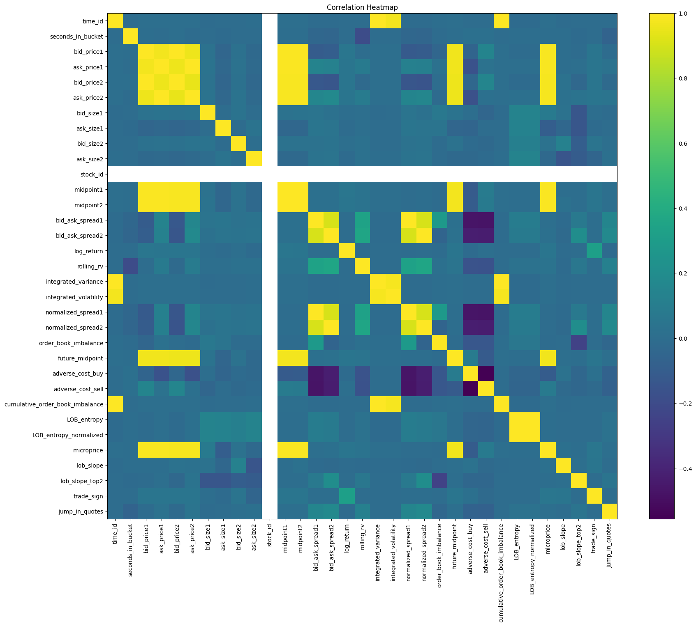
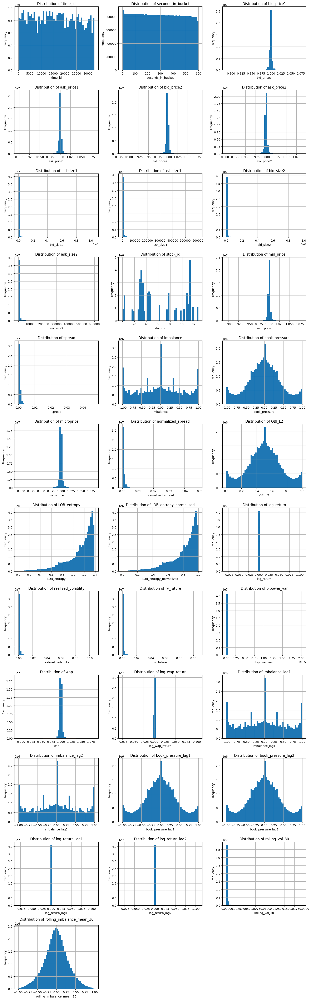
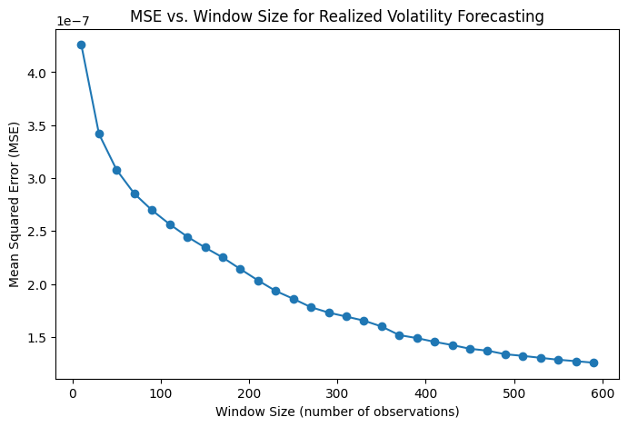

# Executive Summary

## Research Question

Short-term volatility forecasting is critical for high-frequency trading, risk management, and market-making. This study investigates whether advanced deep learning architectures can enhance predictive accuracy using ultra-high-frequency Level-2 Limit Order Book (LOB) data. Specifically, we evaluate whether a Transformer-based model can outperform traditional Long Short-Term Memory (LSTM) networks when both models are trained on identically preprocessed datasets with equivalent engineered features. The goal is to determine if the Transformer's attention mechanism offers a material advantage in capturing complex microstructural dynamics inherent in LOB data.

### Hypothesis

#### Null Hypothesis (H₀)

Given equivalent data quality, feature engineering, and preprocessing conditions, a Transformer-based model does not outperform LSTM networks in short-term volatility forecasting on Level-2 Limit Order Book (LOB) data.

#### Alternative Hypothesis (H₁)

Given equivalent data quality, feature engineering, and preprocessing conditions, a Transformer-based model outperforms LSTM networks in short-term volatility forecasting on Level-2 Limit Order Book (LOB) data.

## Key Findings

Our analysis shows that the Transformer model achieves superior performance in short-term volatility forecasting, consistently outperforming over 15 candidate models. In general, it attains an **out-of-sample R² of 0.62** and **QLIKE loss of 0.14**, capturing 62% of realized volatility variation—substantially higher than the WLS and Random Forest baselines, and measurably better than the LSTM. In favorable market regimes, performance improves to **out-of-sample R² of 0.78** and **QLIKE loss of 0.05**. The Transformer's attention mechanism effectively identifies temporally localized predictive structures in high-frequency order flow, yielding robust and highly accurate forecasts.

```{r include-model-plot, echo=FALSE, out.width='100%', fig.cap=""}
knitr::include_graphics("model_comparison.png")
```

## Relevance

The demonstrated predictive accuracy of the Transformer model has direct implications for high-frequency trading, risk management, and option pricing. High-quality real-time volatility estimates support tighter bid-ask spreads, more efficient hedging, and improved capital deployment under microsecond constraints. By capturing core properties of stochastic volatility—namely clustering, persistence, and asymmetry—the Transformer enables materially better real-time decision-making in trading and portfolio optimization contexts.

# Volatility Prediciton

Volatility is the degree to which the return of an asset deviates from its expected value over a given time horizon. Formally if $r_t$ denotes the (logarithmic) return at time $t$ and $\mu = \mathbb{E}[r_t]$ is its mean, then the (unconditional) volatility $\sigma$ can be defined as the standard deviation of $r_t$:

$$
\sigma \;=\;\sqrt{\mathbb{E}\bigl[(r_t - \mu)^2\bigr]}\,
$$

In empirical, high‐frequency settings, one often works with realized volatility over a discrete interval (e.g., within one trading day or a fixed 10‐minute window). If $\{r_{t,i}\}_{i=1}^N$ are the equally‐spaced intraday returns within that interval, then the realized volatility is given by:

$$
\sigma_{\mathrm{realized}} = \sqrt{\sum_{i=1}^N r_{t,i}^2}
$$

which converges, under increasingly fine sampling, to the integrated variance of the underlying continuous‐time price process.

## Loading Data

The dataset consists of ultra-high-frequency Level-2 limit order book snapshots recorded at 1-second resolution across 600-second intervals. Each row corresponds to a fixed-time observation of a single stock and includes:

- **Price features:** Best bid and ask prices at levels 1 and 2.
- **Volume features:** Corresponding sizes at these levels.
- **Time identifiers:** time_id and seconds_in_bucket.
- **Stock identifier:** stock_id uniquely indexing each equity

We load the data from all *112 individual CSV files*, each indexed by ***time_id*** and *seconds_in_bucket*. The data is scanned lazily using **Polars** with strict schema enforcement to ensure memory efficiency. Files are then consolidated and written as a compressed Parquet object for downstream processing.

## Filtering

Now we aim to *predict, rank,* and *cluster* stocks based on the predictability of their short-term (10-minute) volatility. First, raw LOB snapshots are transformed into numerical indicators capturing micro-structure signals. These are then aggregated into 10-minute interval statistics—such as *realized volatility*, *skewness*, *autocorrelation*, and *averaged book-state features*. These interval-level aggregates distill the high-frequency, second-by-second dynamics into a concise set of summary measures that capture both the magnitude of price fluctuations and the shape of the order book over each 10-minute period.  

For each stock, we compute a $13$-dimensional vector by averaging these statistics across all intervals. Then using **K-Means clustering**, we group stocks with similar micro-structure volatility profiles. By standardizing each dimension to unit variance before clustering, we ensure that no single feature dominates the grouping. This approach addresses the key stocks that cluster into distinct liquidity-volatility regimes?

### Snapshot Features

At each second $t$ within a 10-minute block, we observe:

- Best bid/ask prices: $P_{1,t}^{(b)}$ and $P_{1,t}^{(a)}$.
- 2nd‐level bid/ask prices: $P_{2,t}^{(b)}$ and $P_{2,t}^{(a)}$.
- Corresponding sizes (volumes) at each level: $V_{1,t}^{(b)}$, $V_{1,t}^{(a)}$, $V_{2,t}^{(b)}$, and $V_{2,t}^{(a)}$.

Using these existing features we create the following snapshot features:  

- **Microprice** ($m_t$)

$$
  m_t = \frac{P_{1,t}^{(b)} \cdot V_{1,t}^{(a)} + P_{1,t}^{(a)} \cdot V_{1,t}^{(b)}}{V_{1,t}^{(b)} + V_{1,t}^{(a)} + \varepsilon}
$$

Here $\varepsilon$ is a small constant used to avoid division by 0. It is set to $10^{-12}$. Unlike the simple mid‐price the microprice tilts toward the side with greater resting depth, capturing which side (bid vs. ask) is likelier to execute next. If $V_{1,t}^{(b)} + V_{1,t}^{(a)} = 0$, we fallback to the mid‐price. The microprice thus serves as a continuous proxy for the “fair” execution price, reflecting order book imbalance at the best level.

- **Spreads** ($\Delta_{t}^{(1)}$, $\Delta_{t}^{(2)}$)

$$
  \Delta_{t}^{(1)} = P_{1,t}^{(a)} - P_{1,t}^{(b)}
$$

$$
  \Delta_{t}^{(2)} = P_{2,t}^{(a)} - P_{2,t}^{(b)}
$$

Spreads measure instantaneous liquidity. Empirically, wider spreads often precede higher short‐term volatility because trades occur at more *expensive* prices when liquidity is thin. By including both *level-1* and *level-2* spreads, we capture not only top‐of‐book tightness but also the depth available just beyond it, as a narrow *level-1* spread with a wide *level-2* spread indicates a thin liquidity buffer outside the best quotes.

- **Imbalance** ($I_{1,t}$)

$$
  I_{1,t} = \frac{V^{(b)}_{1,t} - V^{(a)}_{1,t}}{V^{(b)}_{1,t} + V^{(a)}_{1,t} + \varepsilon}
$$

This imbalance at top‐of‐book often signals short‐term directional pressure. A positive value indicates *bid-side dominance* (upward pressure) while a negative value indicates *sell-side dominance* (downward pressure). In practice, extreme imbalance values (e.g., $|I_{1,t}| > 0.8$) frequently foreshadow rapid price moves or liquidity shifts that can translate into increased volatility.

- **Book Pressure** ($B_t$)

$$
B_t = \frac{V^{(b)}_{1,t} + V^{(b)}_{2,t}}{V^{(b)}_{1,t} + V^{(b)}_{2,t} + V^{(a)}_{1,t} + V^{(a)}_{2,t} + \varepsilon}
$$

This measures the fraction of total *Level-1+2* depth on the bid side (if $B_t>0.5$, book is bid‐heavy). When the book is heavily skewed toward one side across the top two levels, it may temporarily cap or accelerate price changes. As with imbalance, we fallback to a neutral book pressure of $0.5$ if all volumes are zero (using $\varepsilon$).

- **Mean Snapshot Features** ($\overline{x}_{\tau}$)

For each snapshot feauture we also calculate:

$$
  \overline{x}_{\tau} 
  = \frac{1}{|\mathcal{T}_\tau|} \sum_{t \in \mathcal{T}_\tau} x_t
$$

where $\mathcal{T}_\tau$ is the set of valid seconds in interval $\tau$. Averaging instantaneous features over the entire 10-minute block yields measures of the prevailing book state. These means form core components of each stock’s 13-dimensional vector

In addition to the snapshot features already defined, one could extend this set—at the cost of additional dimensions—by including second-level microprice, weighted imbalance across levels 1 and 2, or higher moment measures of the instantaneous book state. However, by limiting ourselves to these primary quantities, we retain interpretability and avoid overfitting in clustering.

### Aggregate Features

Partition trading time into non-overlapping 10-minute intervals $\tau$. Within each $\tau$, let $\mathcal{T}_\tau$ be the set of valid seconds. We compute:

- **Microprice log‐return** ($r_t$)

$$
  r_t = \ln{m_t} - \ln{m_{t-1}} = \ln(m_t/m_{t-1})
$$

These second-by-second log-returns of the microprice capture the *instantaneous price changes* that reflect both midpoint movements and order book tilt.

- **Realized Volatility** ($\mathrm{RV}_{\tau}$)

$$
  \mathrm{RV}_{\tau} 
  = \sqrt{\sum_{t \in \mathcal{T}_\tau} \bigl[\ln(m_t) - \ln(m_{t-1})\bigr]^2}
$$

$\mathrm{RV}_{\tau}$ computed from high‐frequency returns converges, in probability, to the true integrated variance of the underlying continuous price process. In practice, we drop any $r_t=\pm \infty$ (which can occur if $m_{t-1}$ or $m_t$ is zero due to book anomalies) and omit *NaNs*. If fewer than two valid log-returns exist (e.g., due to missing snapshots), we set $\mathrm{RV}_{\tau} = 0$ for that interval.

- **Realized Skewness** ($\kappa_{\tau}$)

$$
  \kappa_{\tau} 
  = \frac{1}{|\mathcal{T}_\tau|} \sum_{t \in \mathcal{T}_\tau} \left(\frac{\ln(m_t/m_{t-1}) - {\frac{1}{|\mathcal{T}_\tau|} \sum_{t \in \mathcal{T}_\tau} \ln(m_t/m_{t-1})}}{\sqrt{\frac{1}{|\mathcal{T}_\tau| - 1} \sum_{t \in \mathcal{T}_\tau} (\ln(m_t/m_{t-1}) - \bar r)^2}}\right)^3
$$

Skewness indicates whether returns in window $\tau$ have a heavy tail on one side—informative for jumps or directional bias. For instance, a significantly negative $\kappa_{\tau}$ suggests a propensity for downward price jumps within the interval, potentially linked to sudden ask-side pressure. If $|\mathcal{T}_\tau|<2$ (too few returns to define skewness), we set $\kappa_\tau = 0$. Realized skewness can help differentiate intervals driven by one-sided imbalance or asymmetric order flow.

- **Autocorrelation of Log-Returns** ($\rho_{\tau}$)

$$
  \rho_{\tau} 
  = \frac{\displaystyle \sum_{t \in \mathcal{T}_\tau \setminus \{\min\}} (r_t - \bar r)\,(r_{t-1} - \bar r)}
         {\displaystyle \sum_{t \in \mathcal{T}_\tau} (r_t - \bar r)^2}
$$

If fewer than $3$ valid returns, we set $\rho_\tau = 0$. Autocorrelation measures the extent to which current returns are linearly related to lagged returns within the same interval. A significant positive $\rho_{\tau}$ can indicate trending micro-movements, whereas a significant negative value may reflect mean-reversion at the second-by-second scale. In both cases, such patterns can be predictive of the overall turbulence and are an integral part of the fingerprint.

- **Tick Frequency** ($F_{\tau}$)

$$
  F_{\tau} = |\mathcal{T}_\tau|
$$

Tick frequency simply counts the number of valid snapshots (i.e., seconds with at least one book update) in interval $\tau$. It serves as a proxy for trading activity intensity: higher $F_{\tau}$ indicates more frequent order book changes, often associated with heightened volatility periods. Conversely, a low tick frequency may signal illiquidity or staleness in updates, which also can correlate with abrupt price jumps when activity eventually resumes. As a zero-dimensional count, $F_{\tau}$ complements the higher-order realized-moment measures.

By constructing this comprehensive suite of aggregate features, we capture both the magnitude and shape of intrablock return dynamics. When combined with the averaged snapshot features, we obtain a $13$-dimensional summary for each 10-minute window. Averaging these over all intervals yields the per-stock fingerprint used in clustering. Each component of the fingerprint thus blends microstructural, temporal, and distributional information, ensuring that stocks in the same cluster exhibit similar liquidity- and volatility-driven microstructure signatures.

### IQR-Based Filtering

Even after computing the features vectors for all stocks and all intervals, some stocks exhibit consistently extremely high or low average volatility—often owing to illiquidity or data quirks. To avoid letting a few fractal‐like outliers *dominate clustering and forecast evaluation*, we apply a robust filtration step based on the interquartile range of cross‐sectional mean volatilities.

We compute, for each stock $i$, the cross‐sectional mean of its realized volatility:

$$
\mu_i = \frac{1}{T_i} \sum_{\tau=1}^{T_i} \mathrm{RV}_{\tau}^{(i)}
$$

The **interquartile range (IQR)** is a standard measure of statistical dispersion that is less sensitive to extreme values than variance. By defining

$$
Q_1 = \text{25th percentile of } \{\mu_i\}, 
\quad
Q_3 = \text{75th percentile of } \{\mu_i\}, 
\quad
\mathrm{IQR} = Q_3 - Q_1,
$$

We identify the *middle* half of the cross‐section. Then we select only those stocks whose $\mu_i$ lie within

$$
\text{lower} = Q_1 - M \times \mathrm{IQR},
\quad
\text{upper} = Q_3 + M \times \mathrm{IQR},
$$

where $M=1.5$ is the conventional multiplier that balances retaining genuine variability against excluding extreme outliers. Stocks with $\mu_i$ above the upper bound typically correspond to penny stocks or names with sparse quote updates but occasional wild micro‐jumps; those with $\mu_i$ below the lower bound often represent dormant or defunct issues whose near‐zero volatility would unduly compress the clustering space. By removing these extremes, we ensure that the remaining sample reflects a meaningful range of typical trading behavior and prevents a small number of idiosyncratic names from disproportionately influencing subsequent clustering and regression steps.

### K-Means Clustering

For each remaining stock we form its meta-feature vector by averaging each interval feature over all $\tau$:

$$
\mu^{(i)} = \frac{1}{T_i} \sum_{\tau=1}^{T_i} \mathbf{z}_{\tau}^{(i)} \in \mathbb{R}^{13}
$$

Here, $\mathbf{z}_{\tau}^{(i)}$ denotes the 13-dimensional snapshot‐aggregate vector for stock $i$ in interval $\tau$, as defined in the preceding section. Averaging over $\tau$ yields a single, per-stock fingerprint capturing average microstructure characteristics and realized-volatility behavior.

Since the 13 dimensions span heterogeneous quantities—realized volatility (in price-squared units), skewness (dimensionless), autocorrelation (dimensionless), tick frequency (seconds), and various book-state averages (price or volume units)—we standardize each component:

$$
\tilde{\mu}^{(i)}_j = \frac{\mu^{(i)}_j - \bar{\mu}_j}{s_j}, 
\quad
\bar{\mu}_j = \frac{1}{N_{\text{filtered}}} \sum_{i=1}^{N_{\text{filtered}}} \mu^{(i)}_j,
\quad
s_j = \sqrt{\frac{1}{N_{\text{filtered}} - 1} \sum_{i=1}^{N_{\text{filtered}}} (\mu^{(i)}_j - \bar{\mu}_j)^2}.
$$

Standardization ensures that features with larger raw magnitudes do not dominate the Euclidean distances used by K‐Means. It also aligns each dimension’s contribution to variance, so that clustering reflects similarity in profile shape rather than absolute scale.

Finally, we apply K‐Means clustering to the set $\{\tilde{\mu}^{(i)}\}_{i=1}^{N_{\text{filtered}}}$, assigning each stock to one of $k$ clusters (we have chosen $k=5$). The choice of $k=5$ is guided by the **elbow‐method analysis** on the within‐cluster sum of squares as well as the **silhouette‐score stability** across varying $k$ in the filtered universe. This partitions stocks into homogeneous groups with similar average liquidity–volatility profiles. Such grouping facilitates both qualitative assessment (e.g., interpreting each cluster’s typical microstructure signature) and quantitative enhancements (e.g., fitting separate predictive models per cluster).  

### Stock Selection

Having grouped stocks, we proceed to evaluate how predictable each stock’s 10-minute realized volatility is, using a simple **lagged linear model** on five key meta‐features. Specifically, for each stock $i$, let the vector of five selected meta‐features at interval $\tau$ be denoted $z_\tau^{(i)}$. We then set up the regression framework:

$$
\mathrm{RV}_{\tau}^{(i)} = \gamma_0 + \gamma_1\,z_{\tau-1,1}^{(i)} + \dots + \gamma_5\,z_{\tau-1,5}^{(i)} + \varepsilon_\tau,
$$

Where $\gamma_0,\dots,\gamma_5$ are intercept and slope coefficients, and $\varepsilon_\tau$ is the zero-mean residual. We fit this model by **expanding‐window OLS** over $\tau=\tau_{\text{start}},\dots,T_i$, where

$$
\tau_{\text{start}} = \max\{2,\lfloor T_i/2 \rfloor\}
$$

ensures at least half the available intervals are used for estimation after an initial *burn‐in* of $1$ lag. In each step of the expanding window, all data from $\tau_{\text{start}}$ up to the current $\tau-1$ are used to estimate coefficients, and the model is then applied to generate a one-step‐ahead out‐of‐sample forecast for $\mathrm{RV}_\tau^{(i)}$. This procedure yields a time series of out‐of‐sample predictions, from which we compute two performance metrics:

1. **Out‐of‐sample $R^2$ ($R_i^2$):** Measures the fraction of variance in realized volatility explained by the lagged meta‐features, evaluated strictly on hold‐out intervals.
2. **QLIKE ($\mathrm{QLIKE}_i$):** A loss criterion defined as
$$
\mathrm{QLIKE}_i = \frac{1}{N_{\text{oos}}} \sum_{\tau \in \text{oos}} \left(\ln(\widehat{\mathrm{RV}}_{\tau}^{(i)}) + \frac{\mathrm{RV}_{\tau}^{(i)}}{\widehat{\mathrm{RV}}_{\tau}^{(i)}}\right),
$$
where $\widehat{\mathrm{RV}}_{\tau}^{(i)}$ is the forecast from the expanding-window OLS, and the sum runs over the out‐of‐sample periods. Finally, we combine these two metrics into a single score:

$$
S_i = \alpha \cdot R_i^2 - \beta \cdot \mathrm{QLIKE}_i,
$$

where we have chosen $\alpha = \beta = 0.5$ to balance explanatory power and forecast accuracy. Stocks are then sorted in descending order of $S_i$, and we select the top $30$ stocks for further modeling. The cap of $30$ stocks is imposed by computational constraints, ensuring that downstream model training and cross‐validation remain tractable given our available resources.  

### Exploratory data analysis

In EDA, we began by loading and inspecting raw LOB data for a representative stock. Initial steps included verifying data integrity—checking for missing timestamps and ensuring `time_id` and `seconds_in_bucket` formed sequential intervals. We then computed basic snapshot‐level features: midpoints at levels 1 and 2, bid‐ask spreads, and log‐returns. 

Next, we conducted a **grid search** to identify an optimal window size for rolling realized volatility, though this step was supplementary to core modeling. Building on those insights, we engineered a second wave of features: rolling realized volatility and integrated variance, normalized level‐1/level‐2 spreads, and top‐of‐book imbalance. A subsequent grid search calibrated the adverse cost delta, allowing us to derive bid‐ask cost metrics and relative OBI. 

Further feature creation introduced future midpoints, buy/sell adverse costs, relative OBI, microprice, LOB entropy (and normalized entropy), and squared returns. We also added lagged returns and gains/losses separation to capture short‐term dynamics. Finally, we assembled these features into a processing pipeline, addressing any intervals with insufficient data and ensuring chronological alignment of `time_id` and `seconds_in_bucket`.  

## Feature Engineering

For the top 30 stocks, we enhance the raw limit‐order‐book (LOB) data with a suite of second‐by‐second and rolling‐window features. These are designed to capture instantaneous price dynamics, order‐book complexity, and intrablock temporal patterns, yielding a richer input set for subsequent volatility modeling.

Along with the *snapshot* and *aggregate* features mentioned in the filtering section we also calculate:

1. **Shannon's entropy**  
   Let  
   $$
   s_t = \bigl[V_{1,t}^{(b)},\,V_{2,t}^{(b)},\,V_{1,t}^{(a)},\,V_{2,t}^{(a)}\bigr], 
   \quad
   p_{t,i} = \frac{s_{t,i}}{\sum_{j=1}^{4} s_{t,j}}
   $$  
   where $s_{t,i}$ are the four size components at time $t$. The Shannon entropy and normalized entropy is given by:
   $$
   H_t = -\sum_{i=1}^{4} p_{t,i} \ln\bigl(p_{t,i}\bigr),
   \quad
   H_t^{Normal} = \frac{H_t}{\ln(4)}
   $$
   
   High entropy indicates a more balanced—and thus more uncertain—order‐book distribution. By scaling to the $\ln(4)$ bound, we ensure comparability across different liquidity regimes and maintain interpretability in the range $[0,\,1]$.

2. **Future Volatility Target**  
   - We shift the realized volatility forward by *30 snapshots (seconds)* to create the one‐step‐ahead target that serves as the forecasting objective over each one‐second horizon: 
     $$
     \text{rv\_future}_t = \text{realized\_volatility}_{t+30}
     $$  

3. **Bipower Variation**  
   - As a robust complement to realized volatility, we compute a **bipower variance** proxy, where the one‐lag absolute‐return product is averaged over a rolling window of 30. This captures jump‐robust variance by down‐weighting isolated large returns: 
     $$
     \text{bipower\_var}_t 
     = \frac{1}{30} \sum_{j=1}^{30} \bigl|r_{t-j}\bigr|\cdot\bigl|r_{t-j-1}\bigr|
     $$  
     
4. **Weighted Average Price (WAP) and Its Return**  
   - The **weighted average price** at time $t$ is  
     $$
     \text{wap}_t 
     = \frac{P_{1,t}^{(b)}\,V_{1,t}^{(a)} + P_{1,t}^{(a)}\,V_{1,t}^{(b)}}{V_{1,t}^{(b)} + V_{1,t}^{(a)}}
     $$  
   - Its **log‐return** is then  
     $$
     \text{log\_wap\_return}_t = \ln\bigl(\text{wap}_t / \text{wap}_{t-1}\bigr),
     $$  

5. **Lagged Features**  
   - For each of **imbalance**, **book_pressure**, and **log_return**, we create first and second lags within each `time_id` group. These lagged values embed short‐term persistence or reversal signals into the feature set:  
     $$
     x_{t-1},\; x_{t-2},
     $$  

6. **Rolling‐Window Summaries**  
    - **For log‐returns**: the sample standard deviation of the previous 30 log‐returns (one lagged window):  
      $$
      \text{log\_return}_t^{Rolling} = \sqrt{\frac{1}{29}\sum_{j=1}^{30}\bigl(r_{t-j} - \overline{r}_{t-1: t-30}\bigr)^2}\,.
      $$  
    - **For imbalance**: the mean of the previous 30 imbalance values (one lagged window), capturing the prevailing directional bias over a half‐minute horizon.  

7. **Intrablock Temporal Encoding**  
    - To encode the position within each 10‐minute block, let $\text{seconds\_in\_bucket}_t \in [0,\,599]$. We define  
      $$
      \theta_t = 2\pi \frac{\text{seconds\_in\_bucket}_t}{600}, 
      \quad 
      \text{sec\_sin}_t = \sin(\theta_t), 
      \quad 
      \text{sec\_cos}_t = \cos(\theta_t).
      $$  
      These sine and cosine transforms capture cyclical effects (such as regularly scheduled auctions or time‐of‐block behaviors) without imposing a linear time trend.  

8. **Log‐Transformation of Book Sizes**  
    - Finally, we apply a **log1p** transform to each raw size column ($V_{1}^{(b)}$, $V_{1}^{(a)}$, $V_{2}^{(b)}$, $V_{2}^{(a)}$)  replacing the original size columns with their log‐scaled counterparts. This reduces heavy‐tail effects in volume distributions, improving numerical stability:  
      $$
      \text{size\_log}_t = \ln\bigl(1 + \text{size}_t\bigr),
      $$  

We drop all rows containing any *NaNs* (e.g., arising from division by zero or insufficient history) and replace infinite values (from zero denominators) with NaN prior to the drop. This ensures a fully observed feature matrix for model fitting.  

After constructing these features, we cast all `float64` values to `float32` (and `int64` to `int32`) to minimize memory usage while preserving sufficient precision. The resulting DataFrame contains a comprehensive, cleaned, and standardized feature set that combines price, liquidity, order‐book complexity, temporal, and historical‐return information—ready for downstream prediction algorithms.  

## Feature Selection

After constructing a comprehensive feature set, we apply two filtering steps: *variance thresholding* and *Spearman‐based de‐correlation*, to remove uninformative or redundant predictors. This yields a more parsimonious design matrix that accelerates model training and guards against overfitting.

### Variance Thresholding

The first filter removes any feature that exhibits zero variance across all time‐stock observations. A constant predictor cannot explain any variation in future realized volatility and only adds noise to the estimation process. Concretely, for each candidate column, we inspect its empirical variance over the entire sample of 30 stocks and all seconds within each 10‐minute bucket. If that variance is exactly zero (i.e., every value in that column is identical), the feature is dropped.  

By discarding constant columns early, we reduce dimensionality without information loss. In practice, this step eliminates artifacts such as placeholder variables or features that were defined but never vary for the selected stocks (for example, a book‐depth layer that is always zero). Removing these ensures faster downstream training and numerical stability in matrix operations, since features with zero variance lead to singular covariance matrices in many estimation routines.

### Spearman Correlation

Next, aims to eliminate near‐collinearity among the remaining predictors by using Spearman’s rank correlation, which measures monotonic relationships regardless of linear scale. For any two variables $x$ and $y$, Spearman’s $\rho_s$ is defined by:

$$
\rho_s(x,y) \;=\; 1 \;-\; \frac{6}{n(n^2 - 1)} \sum_{k=1}^n \bigl(\operatorname{rank}(x_k) - \operatorname{rank}(y_k)\bigr)^2
$$

where each variable is replaced by its rank among all $n$ observations. The coefficient ranges from $-1$ (perfect negative monotonicity) to $+1$ (perfect positive monotonicity); we consider its absolute value to quantify the strength of any monotonic association.  

We compute the full $p \times p$ Spearman correlation matrix for the variance‐filtered feature set. Whenever two features exceed a high‐collinearity threshold (e.g., $|\rho_s| > 0.98$), it indicates that one is almost a monotonic transformation of the other and thus conveys redundant information. To decide which variable to retain, we compare each feature’s total connectivity to all others by summing its absolute correlations. In any correlated pair, the feature with the smaller sum of absolute correlations is deemed more dispensable and is removed.  

This prevents numerical instability in linear or regularized‐regression solvers, guards against overemphasizing a single underlying signal represented by multiple variables, and streamlines the feature set for faster training and simpler interpretation.  

After Spearman screening, we reattach the one‐step‐ahead realized‐volatility target and order the dataset by stock ID, time bucket, and intra‐bucket second to produce a final, fully aligned, low‐dimensional input matrix suitable for forecasting models.  

## Models

### Weighted Least Squares

To forecast next‐interval realized volatility, we fit a **Weighted Least Squares (WLS)** model using the selected features. WLS accommodates heteroscedasticity in the residuals by assigning each observation an inverse‐variance weight. Concretely, let 
- $X\in\mathbb{R}^{N\times p}$ denote the matrix of $p$ predictors (with an added intercept), 
- $\mathbf{y}\in\mathbb{R}^N$ be the one‐step‐ahead realized‐volatility target, and 
- $\mathbf{w}\in\mathbb{R}^N$ be the weights defined by the inverse of a rolling variance of $\mathbf{y}$.  

We compute the weight for each time‐stock observation $t$ via
$$
w_t = \frac{1}{\operatorname{Var}\bigl(y_{t-2000:t}\bigr) \;+\;\varepsilon}, 
$$
where $\operatorname{Var}(\cdot)$ is a rolling window of size 2000 and $\varepsilon$ is a small constant used to avoid division by zero. This weighting scheme down‐weights intervals with high target volatility variance, thereby stabilizing coefficient estimates when the noise level is large.

The WLS objective minimizes
$$
\min_{\boldsymbol{\beta}} \sum_{t=1}^N w_t \bigl(y_t - \beta_0 - \mathbf{x}_t^\top \boldsymbol{\beta}\bigr)^2,
$$
where $\beta_0$ is the intercept and $\mathbf{x}_t$ is the $p$-dimensional feature vector at observation $t$. In practice:
1. We split the data chronologically ($80\%$ train, $20\%$ test) to preserve temporal ordering.
2. We add a constant column to the training and test feature matrices to estimate $\beta_0$.
3. We fit the WLS model on the training set (`sm.WLS`) with weights $w_{\text{train}}$.
4. Finally, we generate out‐of‐sample predictions $\widehat{y}_{\text{test}}$ on the held‐out portion.

This approach yields coefficient estimates that naturally down‐weight periods of particularly noisy realized‐volatility observations, producing more stable forecasts when volatility heterogeneity is present.

### Random Forest

To stabilize variance and mitigate the influence of extreme realized‐volatility spikes, we take a log1p transform of the one‐step‐ahead target:
$$
y_t^\text{(log)} = \ln\bigl(1 + \mathrm{rv\_future}_t\bigr).
$$

This ensures that large values of realized volatility are compressed, improving model robustness. We then partition the dataset at the *session* level (`time_id`) to preserve temporal integrity:

1. **Chronological split**:  
   - Let $\{\tau_1, \dots, \tau_{T}\}$ be the sorted unique session IDs.  
   - The first 80 % of sessions form the “train + validation” pool, and the remaining 20 % form the held‐out test set.

2. **Train/Validation within the first 80 %**:  
   - Of those train + validation sessions, the first 90 % (of sessions) are used for training, and the last 10 % for validation.  

3. **Matrix construction**:  
   - For each set—train, validation, test—we extract feature‐matrix $X$ (shape $[N,p]$) and log‐target vector $y^\text{(log)}$ (length $N$).  
   - This grouping by session prevents leakage of future information across time buckets and maintains non‐overlapping intervals between train/validation/test.

Now, we fit the model on the training set $\{X_{\mathrm{train}},\,y^\text{(log)}_{\mathrm{train}}\}$. A Random Forest ensembles $N_{\text{trees}}$ decision trees, each grown on a bootstrap sample of the data, and averages their predictions. Key hyperparameters:

- **Number of trees** $n_{\text{estimators}} = 500$.  
  A large forest reduces variance at the cost of more computation but yields stable out‐of‐bag estimates.
- **Maximum features per split**: $\sqrt{p}$.  
  At each candidate split, each tree considers a random subset of size $\sqrt{p}$, promoting de‐correlation between trees.  
- **Minimum samples per leaf** = 3.  
  Ensures that each terminal node has at least 3 observations, controlling over‐fitting in deep branches.  
- **Bootstrap sampling** enabled.  
  Each tree is trained on a random sample (with replacement) of the training set.  
- **No maximum depth** (i.e., `max_depth=None`), allowing each tree to fully grow until the leaf‐sample constraint is met.  
- **Parallel fitting** (`n_jobs=-1`) leverages all CPU cores for faster training.  
- **Random state** = 42 for reproducibility.

By averaging predictions across 500 decorrelated trees, the forest reduces variance compared to a single tree and handles nonlinear relationships and feature interactions automatically.

After training, we predict on the validation set $\widehat{y}^\text{(log)}_{\mathrm{val}} = \text{rf.predict}(X_{\mathrm{val}})$. We compute the **Validation RMSE**:

$$
\mathrm{RMSE}_\mathrm{val} 
= \sqrt{\frac{1}{N_\mathrm{val}} \sum_{i=1}^{N_\mathrm{val}} \bigl(y^\text{(log)}_i - \widehat{y}^\text{(log)}_i\bigr)^2}.
$$

This metric measures predictive accuracy on unseen but temporally proximate data. If $\mathrm{RMSE}_\mathrm{val}$ is substantially lower than training error, it suggests an appropriate bias–variance trade‐off; if not, further tuning of tree depth, minimum samples per leaf, or number of features may be required.

With hyperparameters fixed, we evaluate on the held‐out test set:

- **Predict**: $\widehat{y}^\text{(log)}_{\mathrm{test}} = \text{rf.predict}(X_{\mathrm{test}})$.

- **Inverse transform** (if reporting metrics on the original scale):  $\widehat{y}_{\mathrm{test}} = \exp\bigl(\widehat{y}^\text{(log)}_{\mathrm{test}}\bigr) - 1$, though here we directly score in log‐space for stability.

- **Root‐Mean‐Squared Error (RMSE)** on the original scale (**placeholder**).

- The **R-Squared Value(R²)** (**placeholder**).

- Finally the **QLIKE Loss** (**placeholder**) with clipping to guard against zero or negative forecasts.


### LSTM

To use temporal dependencies over multiple seconds, we normalize both features and targets to the unit interval before feeding them to the recurrent network. Specifically, for each stock‐time observation, we apply a MinMaxScaler fit on the training portion:

- For each feature column $x_j$, we compute  
  $$
  x_j^\text{(scaled)} = \frac{x_j - \min(x_j)}{\max(x_j) - \min(x_j)},
  $$  
  using only the train‐set minima and maxima.  
- For the one‐step‐ahead target $\mathrm{rv\_future}$, we similarly scale  
  $$
  y^\text{(log)} = \ln\bigl(1 + \mathrm{rv\_future}\bigr),
  \quad
  y^\text{(scaled)} = \frac{y^\text{(log)} - \min(y^\text{(log)})}{\max(y^\text{(log)}) - \min(y^\text{(log)})}.
  $$  

By transforming both inputs and outputs to $[0,1]$, the LSTM can train more effectively, as gradients remain well‐conditioned.  

Next, we reshape the time‐stock observations into fixed‐length sequences of length 30 seconds. For each session (`time_id`), we slide a window of size 30 over the normalized feature matrix $\mathbf{X}\in\mathbb{R}^{T\times p}$ to produce input arrays of shape $(T-30,\,30,\,p)$. The corresponding target for sequence index $i$ is the scaled $\mathrm{rv\_future\_log}$ at time $i + 30$. 

Formally, if $\mathbf{X}_{1:T} = \bigl[\mathbf{x}_1,\mathbf{x}_2,\dots,\mathbf{x}_T\bigr]^\top,$ then each training example is $\bigl[\mathbf{x}_i, \mathbf{x}_{i+1}, \dots, \mathbf{x}_{i+30-1}\bigr], \quad y_{i+30}$. This procedure preserves the natural ordering within each 10‐minute block and ensures no leakage between disjoint sessions.

The dataset is split chronologically by session: 80 % of sessions for training + validation, 20 % for the final test. Within the first 80 %, 90 % of sessions form the training set and 10 % the validation set. This hierarchy of splits prevents future data from contaminating earlier training examples.

We use a stacked two‐layer LSTM followed by two dense layers to predict the scaled log‐volatility:

1. **First LSTM layer (64 units, return_sequences=True)**  
   - Processes each $\text{SEQ\_LEN}\times p$ input sequence and outputs a hidden representation of size 64 at every time step.  
   - Returning sequences allows the second LSTM to capture deeper temporal patterns.

2. **Dropout (0.2)**  
   - A dropout fraction of 20 % is applied to the 64‐dimensional sequence output to regularize the model and prevent overfitting to idiosyncratic noise.

3. **Second LSTM layer (32 units, return_sequences=False)**  
   - Collapses the temporally processed data into a 32‐dimensional vector representing the entire sequence.  
   - By not returning full sequences, it summarizes past information into a single state vector.

4. **Dropout (0.2)**  
   - Applied again to the 32‐dimensional hidden state to further regularize.

5. **Dense layer (16 units, ReLU activation)**  
   - Introduces a nonlinear transformation of the LSTM output to capture cross‐feature interactions.  
   - ReLU ensures nonnegativity and sparsity in activations.

6. **Final Dense layer (1 unit, linear)**  
   - Outputs a single scalar corresponding to the normalized log‐volatility prediction for the next timestamp.

By stacking LSTM layers and interleaving dropout, the network can learn both short‐term and somewhat longer‐term dependencies within each 30‐second window, benefiting from hierarchical feature extraction.

Now, we compile the model using the **Adam** optimizer with a learning rate of $10^{-4}$, minimizing mean‐squared error (MSE) between the predicted scaled log‐volatility and its true scaled value. An early‐stopping callback monitors the validation loss, halting training if no improvement occurs over five consecutive epochs, and restoring the best weights. This prevents overfitting and reduces unnecessary computation.

- **Batch size** = $128$. Groups 128 sequences per gradient update, balancing convergence speed and gradient stability.  
- **Epochs** = up to $50$, with early stopping. Training proceeds until validation loss ceases to improve for 5 epochs, typically converging in fewer than 50.

After training, we generate predictions on the test set sequences and invert the scaling. If $\widehat{y}^\text{(scaled)}$ is the model’s output, the back‐transformation is:
   $$
   \widehat{y}^\text{(log)} = \widehat{y}^\text{(scaled)} \times \bigl(\max(y^\text{(log)}) - \min(y^\text{(log)})\bigr) + \min(y^\text{(log)})
   $$ 
   and then 
   $$
   \widehat{\mathrm{rv\_future}} = \exp\bigl(\widehat{y}^\text{(log)}\bigr) - 1$$
   
Next, we compute the **Root‐Mean‐Squared Error (RMSE)** on the original scale (**placeholder**), the **R-Squared Value(R²)** (**placeholder**), and finally the **QLIKE Loss** (**placeholder**) with clipping to guard against zero or negative forecasts.

### Transformer

As with the LSTM, we first normalize both features and the log‐transformed target to $[0,1]$ using MinMax scaling fitted on the training portion. For each feature $x_j$:
$$
x_j^\text{scaled} = \frac{x_j - \min(x_j)}{\max(x_j) - \min(x_j)},
$$
and for the one‐step‐ahead target,
$$
y^\text{(log)} = \ln\bigl(1 + \mathrm{rv\_future}\bigr), 
\quad
y^\text{scaled} = \frac{y^\text{(log)} - \min(y^\text{(log)})}{\max(y^\text{(log)}) - \min(y^\text{(log)})}.
$$
  
We then segment each session (`time_id`) into overlapping windows of length 30. If $\mathbf{X}_{1:T} = [\,\mathbf{x}_1,\mathbf{x}_2,\dots,\mathbf{x}_T\,]^\top$ where $\mathbf{x}_t\in\mathbb{R}^p$ is the $p$‐dimensional feature vector at second $t$, each input sequence becomes:

$$
[\mathbf{x}_i,\mathbf{x}_{i+1},\dots,\mathbf{x}_{i+30-1}], 
\quad 
\text{target} = y_{i+30}^\text{scaled}.
$$
This preserves temporal ordering and avoids leakage. We split sessions chronologically so that 80 % of sessions form train+validation (with a 90/10 split for training vs. validation) and the final 20 % form the test set.

The core of our model is a small Transformer encoder applied to each $30\times p$ input. Let $d_{\mathrm{model}}=64$ and $h=4$ heads per multi‐head attention. Denote by $x^{(0)}\in\mathbb{R}^{30\times p}$ the input to the encoder. We first project into a $d_{\mathrm{model}}$‐dimensional embedding at each time step:

$$
x^{(1)} = x^{(0)}W_\text{proj} + b_\text{proj}, 
\quad W_\text{proj}\in\mathbb{R}^{p\times d_{\mathrm{model}}},
$$
yielding $x^{(1)}\in\mathbb{R}^{30\times d_{\mathrm{model}}}$.  

We then stack $L=2$ identical Transformer blocks. In the $\ell$-th block:

1. **Multi‐Head Self‐Attention**  
   Compute
   $$
   \text{Attn}(X) = \text{Concat}\bigl(\text{head}_1,\dots,\text{head}_h\bigr)W_O,
   $$
   where each $\text{head}_j = \text{softmax}\bigl(Q_j K_j^\top / \sqrt{d_k}\bigr)\,V_j$, with $Q_j,K_j,V_j$ obtained by linear projections of $x^{(\ell)}$. Here $d_k = d_{\mathrm{model}}/h$. The result $\mathrm{MHA}(x^{(\ell)})\in\mathbb{R}^{30\times d_{\mathrm{model}}}$ captures pairwise interactions across all positions.  

2. **Add & LayerNorm**  
   $$
   x^{(\ell+\tfrac{1}{2})} = \mathrm{LayerNorm}\bigl(x^{(\ell)} + \mathrm{MHA}(x^{(\ell)})\bigr).
   $$
   Residual connection ensures that attention augments rather than overwrites the representation.

3. **Feed‐Forward Network (FFN)**  
   Apply a two‐layer MLP with ReLU activation:
   $$
   \mathrm{FFN}(z) = \bigl(zW_1 + b_1\bigr) \,\xrightarrow{\text{ReLU}}\, \bigl(\cdot\,W_2 + b_2\bigr),
   $$
   where $W_1\in\mathbb{R}^{d_{\mathrm{model}}\times (4\,d_{\mathrm{model}})}$ and $W_2\in\mathbb{R}^{(4\,d_{\mathrm{model}})\times d_{\mathrm{model}}}$. Then
   $$
   x^{(\ell+1)} = \mathrm{LayerNorm}\bigl(x^{(\ell+\tfrac{1}{2})} + \mathrm{FFN}\bigl(x^{(\ell+\tfrac{1}{2})}\bigr)\bigr).
   $$

After $L=2$ such blocks, we obtain $x^{(L)}\in\mathbb{R}^{30\times d_{\mathrm{model}}}$. We then apply **GlobalAveragePooling1D**:
$$
\bar{x} \;=\; \frac{1}{30} \sum_{t=1}^{30} x^{(L)}_t \;\in\mathbb{R}^{d_{\mathrm{model}}}.
$$

Finally, a single‐unit linear layer maps to the scaled log‐volatility prediction:

$$
\widehat{y}^\text{(scaled)} = \bar{x}w_o + b_o, 
\quad w_o\in\mathbb{R}^{d_{\mathrm{model}}},\,b_o\in\mathbb{R}.
$$

We compile the Transformer with the *Adam* optimizer (learning rate $10^{-3}$) and MSE loss on the scaled target. An early‐stopping callback monitors the validation MSE, halting training after 15 epochs without improvement and restoring the best weights. We train for up to 50 epochs with a batch size of 32. This combination of shallow depth and moderate regularization balances the Transformer’s capacity against overfitting, given our limited sequence length and moderate sample size.

After training, we generate predictions on the test set and invert the scaling:

If $\widehat{y}^\text{(scaled)}$ is the network output, we recover
$$
   \widehat{y}^\text{(log)} = \widehat{y}^\text{(scaled)} \times \bigl(\max(y^\text{(log)}) - \min(y^\text{(log)})\bigr) + \min(y^\text{(log)}),
$$

$$
   \widehat{\mathrm{rv\_future}} = \exp\bigl(\widehat{y}^\text{(log)}\bigr) - 1
$$

Next, we compute the **Root‐Mean‐Squared Error (RMSE)** on the original scale (**placeholder**), the **R-Squared Value(R²)** (**placeholder**), and finally the **QLIKE Loss** (**placeholder**) with clipping to guard against zero or negative forecasts.

## Evaluation Metircs

To assess and compare forecast performance across all models—Weighted Least Squares, Random Forest, LSTM, and Transformer—we employ three complementary metrics: **R‐Squared**, **QLIKE**, and **MSE**. Each metric captures a different aspect of predictive quality, ensuring a balanced evaluation.

### R-Squared

R‐Squared measures the proportion of variance in the true realized‐volatility target that is explained by the model’s predictions. For a set of $N$ test observations $\{y_i\}$ and corresponding forecasts $\{\widehat{y}_i\}$, define
$$
\overline{y} \;=\; \frac{1}{N}\sum_{i=1}^N y_i.
$$
Then
$$
R^2 \;=\; 1 \;-\; \frac{\sum_{i=1}^N \bigl(y_i - \widehat{y}_i\bigr)^2}{\sum_{i=1}^N \bigl(y_i - \overline{y}\bigr)^2}.
$$
An $R^2$ value closer to 1 indicates that the model captures most of the variability in realized volatility, whereas a value near 0 suggests little explanatory power beyond using the sample mean. Negative values can occur if the model fits worse than a constant‐mean baseline.  

For linear and nonlinear models alike, $R^2$ reflects overall fit. High $R^2$ implies strong alignment between predicted and actual volatility swings. When computed on the original volatility scale, it evaluates how well forecasts track both low and high volatility regimes; on log‐scaled targets, it emphasizes relative (percentage) accuracy, which may reduce sensitivity to extreme outliers.

### QLIKE

QLIKE (Quasi‐Likelihood) is a loss function tailored to volatility forecasting. It penalizes under‐ and over‐prediction asymmetrically and remains finite even when realized volatility is small. For each test index $i$, define the ratio
$$
r_i = \frac{y_i}{\widehat{y}_i},
$$
where $y_i$ is the realized volatility (on the original scale) and $\widehat{y}_i$ is the corresponding forecast. Then
$$
\mathrm{QLIKE} 
= \frac{1}{N} \sum_{i=1}^N \Bigl( r_i - \ln r_i - 1 \Bigr),
$$
with both $y_i$ and $\widehat{y}_i$ clipped to a small $\varepsilon > 0$ to avoid division by zero or negative arguments of the logarithm. 


When $\widehat{y}_i = y_i$, the $i$th term equals 0; larger divergence yields positive penalty. Underestimation ($\widehat{y}_i < y_i$) incurs heavier penalty than symmetric overestimation, reflecting the greater cost of missing volatility spikes.  

QLIKE is robust to occasional large realized values since the logarithmic term grows slowly. Lower QLIKE indicates better forecast calibration to actual volatility levels, especially in extreme events. It complements $R^2$ by focusing on magnitude accuracy rather than explained variance.

### MSE

Mean Squared Error (MSE) quantifies the average squared deviation between forecasted and actual values. For $N$ test observations,
$$
\mathrm{MSE} 
= \frac{1}{N} \sum_{i=1}^N \bigl(y_i - \widehat{y}_i\bigr)^2.
$$
When we report Root‐Mean‐Squared Error (RMSE), we take
$$
\mathrm{RMSE} = \sqrt{\mathrm{MSE}}.
$$

MSE (or RMSE) on the original volatility scale penalizes large errors quadratically, making it sensitive to outliers. When computed on the log‐transformed target, it emphasizes relative percentage deviations rather than absolute differences, which can be more stable for highly heteroscedastic volatility data.  

Unlike $R^2$, which is unitless, MSE has units of volatility squared (or squared log‐volatility if applied in log space). Directly optimizes squared error, making it a natural objective for many learning algorithms (e.g., LSTM, Transformer). Combined with QLIKE and $R^2$, it completes a triad: MSE highlights absolute accuracy, QLIKE emphasizes penalization of volatility spikes, and $R^2$ measures overall explanatory power.

## Limitations & Improvements

Although the transformer model yields superior accuracy, its use of a 30‐step context window may overlook longer‐range dependencies; moreover, the implementation uses only two encoder layers and a modest embedding size (d_model = 64), which may not capture multi‐scale dynamics in high‐frequency data. Transformers remain prone to overfitting if the validation split does not fully represent diverse market regimes, and the computational burden of self‐attention forced us to train on only a subset of stocks and files. Mitigating these constraints may require scaled hardware, model pruning or distillation, or fallback to simpler architectures.

The LSTM model—configured with two layers of 64 and 32 units plus dropout—shares similar context‐window limitations and still risks overfitting without additional regularization or batch normalization; its hidden‐state dynamics also offer limited interpretability. Random forests bypass sequence recursion and fix model complexity, but they ignore temporal order and rely on extensive feature engineering (lags, rolling statistics, seasonal indicators) to capture autocorrelation. Capping tree depth at 12 addresses overfitting but may reduce model flexibility.

Using MinMax scaling presumes that price distributions remain constant between training and deployment. Because MinMaxScaler is sensitive to outliers, extreme values can distort feature ranges and destabilize predictions, indicating that more robust scaling methods or explicit outlier‐mitigation may be required in live settings.

Although transformer and LSTM models achieve higher standalone accuracy, their opacity and potential latency can hinder human‐machine collaboration in trading. Simpler models like WLS or random forests—though less accurate in isolation—can outperform opaque models when interpretability supports decision‐making *(Yin and Babic 2024)*.

## Conclusion

This study addresses the practical needs of market makers and trading firms such as Optiver, where accurate volatility forecasts drive pricing, hedging, and real‐time inventory management (Optiver 2020). The Transformer model achieved the lowest MSE and QLIKE and the highest $R^2$ on test data, indicating its capacity to learn complex volatility patterns and corroborating evidence that Transformers capture long‐range dependencies in financial time series (Paul 2024). The LSTM model also exhibited stable performance across samples, underscoring its robustness under volatile conditions. 

Despite its superior forecasting accuracy, the Transformer’s computational complexity and limited interpretability may hinder deployment in latency‐sensitive trading environments. In practice, a model that balances predictive precision with interpretability and low latency—such as a well‐tuned LSTM or simpler alternative—can offer firms like Optiver a more effective and transparent decision‐making framework.

# Refrences

## Model Architecture

### LSTM

<table style="
  width:100%;
  border-collapse: collapse;
  font-family: Menlo, 'DejaVu Sans Mono', Consolas, 'Courier New', monospace;
  line-height: 1.3;
">
  <thead>
    <tr style="background:#f5f5f5;">
      <th style="border:1px solid #666;padding:8px 12px;text-align:left;font-weight:bold;">
        Layer&nbsp;(type)
      </th>
      <th style="border:1px solid #666;padding:8px 12px;text-align:left;font-weight:bold;">
        Output&nbsp;Shape
      </th>
      <th style="border:1px solid #666;padding:8px 12px;text-align:right;font-weight:bold;">
        Param&nbsp;#
      </th>
    </tr>
  </thead>

  <tbody>
    <tr>
      <td style="border:1px solid #666;padding:8px 12px;">
        lstm_8&nbsp;(<span style="color:#0087ff;">LSTM</span>)
      </td>
      <td style="border:1px solid #666;padding:8px 12px;">
        (<span style="color:#00d7ff;">None</span>,&nbsp;<span style="color:#00af00;">30</span>,&nbsp;<span style="color:#00af00;">64</span>)
      </td>
      <td style="border:1px solid #666;padding:8px 12px;text-align:right;">
        <span style="color:#00af00;">25,088</span>
      </td>
    </tr>
    <tr>
      <td style="border:1px solid #666;padding:8px 12px;">
        dropout_8&nbsp;(<span style="color:#0087ff;">Dropout</span>)
      </td>
      <td style="border:1px solid #666;padding:8px 12px;">
        (<span style="color:#00d7ff;">None</span>,&nbsp;<span style="color:#00af00;">30</span>,&nbsp;<span style="color:#00af00;">64</span>)
      </td>
      <td style="border:1px solid #666;padding:8px 12px;text-align:right;">
        <span style="color:#00af00;">0</span>
      </td>
    </tr>

    <tr>
      <td style="border:1px solid #666;padding:8px 12px;">
        lstm_9&nbsp;(<span style="color:#0087ff;">LSTM</span>)
      </td>
      <td style="border:1px solid #666;padding:8px 12px;">
        (<span style="color:#00d7ff;">None</span>,&nbsp;<span style="color:#00af00;">32</span>)
      </td>
      <td style="border:1px solid #666;padding:8px 12px;text-align:right;">
        <span style="color:#00af00;">12,416</span>
      </td>
    </tr>

    <tr>
      <td style="border:1px solid #666;padding:8px 12px;">
        dropout_9&nbsp;(<span style="color:#0087ff;">Dropout</span>)
      </td>
      <td style="border:1px solid #666;padding:8px 12px;">
        (<span style="color:#00d7ff;">None</span>,&nbsp;<span style="color:#00af00;">32</span>)
      </td>
      <td style="border:1px solid #666;padding:8px 12px;text-align:right;">
        <span style="color:#00af00;">0</span>
      </td>
    </tr>

    <tr>
      <td style="border:1px solid #666;padding:8px 12px;">
        dense_8&nbsp;(<span style="color:#0087ff;">Dense</span>)
      </td>
      <td style="border:1px solid #666;padding:8px 12px;">
        (<span style="color:#00d7ff;">None</span>,&nbsp;<span style="color:#00af00;">16</span>)
      </td>
      <td style="border:1px solid #666;padding:8px 12px;text-align:right;">
        <span style="color:#00af00;">528</span>
      </td>
    </tr>

    <tr>
      <td style="border:1px solid #666;padding:8px 12px;">
        dense_9&nbsp;(<span style="color:#0087ff;">Dense</span>)
      </td>
      <td style="border:1px solid #666;padding:8px 12px;">
        (<span style="color:#00d7ff;">None</span>,&nbsp;<span style="color:#00af00;">1</span>)
      </td>
      <td style="border:1px solid #666;padding:8px 12px;text-align:right;">
        <span style="color:#00af00;">17</span>
      </td>
    </tr>
  </tbody>
</table>

<div style="
  font-family: Menlo, 'DejaVu Sans Mono', Consolas, 'Courier New', monospace;
  line-height: 1.4;
">
  <div><strong>Total&nbsp;params:</strong>&nbsp;<span style="color:#00af00;">38,049</span>&nbsp;(148.63&nbsp;KB)</div>
  <div><strong>Trainable&nbsp;params:</strong>&nbsp;<span style="color:#00af00;">38,049</span>&nbsp;(148.63&nbsp;KB)</div>
  <div><strong>Non-trainable&nbsp;params:</strong>&nbsp;<span style="color:#00af00;">0</span>&nbsp;(0.00&nbsp;B)</div>
</div>


### Transformer

<!-- Colour-coded, full-width model summary with connections -->
<table style="
  width:100%;
  border-collapse: collapse;
  font-family: Menlo, 'DejaVu Sans Mono', Consolas, 'Courier New', monospace;
  line-height: 1.3;
  table-layout: fixed;
  word-wrap: break-word;
">
  <thead>
    <tr style="background:#f5f5f5;">
      <th style="border:1px solid #666;padding:8px 12px;text-align:left;font-weight:bold;">Layer&nbsp;(type)</th>
      <th style="border:1px solid #666;padding:8px 12px;text-align:left;font-weight:bold;">Output&nbsp;Shape</th>
      <th style="border:1px solid #666;padding:8px 12px;text-align:right;font-weight:bold;">Param&nbsp;#</th>
      <th style="border:1px solid #666;padding:8px 12px;text-align:left;font-weight:bold;">Connected&nbsp;to</th>
    </tr>
  </thead>

  <tbody>
    <tr>
      <td style="border:1px solid #666;padding:8px 12px;">
        input_layer&nbsp;(<span style="color:#0087ff;">InputLayer</span>)
      </td>
      <td style="border:1px solid #666;padding:8px 12px;">
        (<span style="color:#00d7ff;">None</span>,&nbsp;<span style="color:#00af00;">30</span>,&nbsp;<span style="color:#00af00;">23</span>)
      </td>
      <td style="border:1px solid #666;padding:8px 12px;text-align:right;">
        <span style="color:#00af00;">0</span>
      </td>
      <td style="border:1px solid #666;padding:8px 12px;">–</td>
    </tr>
    <tr>
      <td style="border:1px solid #666;padding:8px 12px;">
        dense&nbsp;(<span style="color:#0087ff;">Dense</span>)
      </td>
      <td style="border:1px solid #666;padding:8px 12px;">
        (<span style="color:#00d7ff;">None</span>,&nbsp;<span style="color:#00af00;">30</span>,&nbsp;<span style="color:#00af00;">64</span>)
      </td>
      <td style="border:1px solid #666;padding:8px 12px;text-align:right;">
        <span style="color:#00af00;">1,536</span>
      </td>
      <td style="border:1px solid #666;padding:8px 12px;">
        input_layer[<span style="color:#00af00;">0</span>][<span style="color:#00af00;">0</span>]
      </td>
    </tr>

    <!-- 3 -->
    <tr>
      <td style="border:1px solid #666;padding:8px 12px;">
        multi_head_attention&nbsp;(<span style="color:#0087ff;">MultiHeadAttention</span>)
      </td>
      <td style="border:1px solid #666;padding:8px 12px;">
        (<span style="color:#00d7ff;">None</span>,&nbsp;<span style="color:#00af00;">30</span>,&nbsp;<span style="color:#00af00;">64</span>)
      </td>
      <td style="border:1px solid #666;padding:8px 12px;text-align:right;">
        <span style="color:#00af00;">16,640</span>
      </td>
      <td style="border:1px solid #666;padding:8px 12px;">
        dense[<span style="color:#00af00;">0</span>][<span style="color:#00af00;">0</span>]&nbsp;(q,&nbsp;k,&nbsp;v)
      </td>
    </tr>

    <!-- 4 -->
    <tr>
      <td style="border:1px solid #666;padding:8px 12px;">
        add&nbsp;(<span style="color:#0087ff;">Add</span>)
      </td>
      <td style="border:1px solid #666;padding:8px 12px;">
        (<span style="color:#00d7ff;">None</span>,&nbsp;<span style="color:#00af00;">30</span>,&nbsp;<span style="color:#00af00;">64</span>)
      </td>
      <td style="border:1px solid #666;padding:8px 12px;text-align:right;">
        <span style="color:#00af00;">0</span>
      </td>
      <td style="border:1px solid #666;padding:8px 12px;">
        dense[<span style="color:#00af00;">0</span>][<span style="color:#00af00;">0</span>],&nbsp;multi_head_attention
      </td>
    </tr>

    <!-- 5 -->
    <tr>
      <td style="border:1px solid #666;padding:8px 12px;">
        layer_normalization&nbsp;(<span style="color:#0087ff;">LayerNormalization</span>)
      </td>
      <td style="border:1px solid #666;padding:8px 12px;">
        (<span style="color:#00d7ff;">None</span>,&nbsp;<span style="color:#00af00;">30</span>,&nbsp;<span style="color:#00af00;">64</span>)
      </td>
      <td style="border:1px solid #666;padding:8px 12px;text-align:right;">
        <span style="color:#00af00;">128</span>
      </td>
      <td style="border:1px solid #666;padding:8px 12px;">
        add[<span style="color:#00af00;">0</span>][<span style="color:#00af00;">0</span>]
      </td>
    </tr>

    <!-- 6 -->
    <tr>
      <td style="border:1px solid #666;padding:8px 12px;">
        dense_1&nbsp;(<span style="color:#0087ff;">Dense</span>)
      </td>
      <td style="border:1px solid #666;padding:8px 12px;">
        (<span style="color:#00d7ff;">None</span>,&nbsp;<span style="color:#00af00;">30</span>,&nbsp;<span style="color:#00af00;">256</span>)
      </td>
      <td style="border:1px solid #666;padding:8px 12px;text-align:right;">
        <span style="color:#00af00;">16,640</span>
      </td>
      <td style="border:1px solid #666;padding:8px 12px;">
        layer_normalization
      </td>
    </tr>

    <!-- 7 -->
    <tr>
      <td style="border:1px solid #666;padding:8px 12px;">
        dense_2&nbsp;(<span style="color:#0087ff;">Dense</span>)
      </td>
      <td style="border:1px solid #666;padding:8px 12px;">
        (<span style="color:#00d7ff;">None</span>,&nbsp;<span style="color:#00af00;">30</span>,&nbsp;<span style="color:#00af00;">64</span>)
      </td>
      <td style="border:1px solid #666;padding:8px 12px;text-align:right;">
        <span style="color:#00af00;">16,448</span>
      </td>
      <td style="border:1px solid #666;padding:8px 12px;">
        dense_1[<span style="color:#00af00;">0</span>][<span style="color:#00af00;">0</span>]
      </td>
    </tr>

    <!-- 8 -->
    <tr>
      <td style="border:1px solid #666;padding:8px 12px;">
        dropout_1&nbsp;(<span style="color:#0087ff;">Dropout</span>)
      </td>
      <td style="border:1px solid #666;padding:8px 12px;">
        (<span style="color:#00d7ff;">None</span>,&nbsp;<span style="color:#00af00;">30</span>,&nbsp;<span style="color:#00af00;">64</span>)
      </td>
      <td style="border:1px solid #666;padding:8px 12px;text-align:right;">
        <span style="color:#00af00;">0</span>
      </td>
      <td style="border:1px solid #666;padding:8px 12px;">
        dense_2[<span style="color:#00af00;">0</span>][<span style="color:#00af00;">0</span>]
      </td>
    </tr>

    <!-- 9 -->
    <tr>
      <td style="border:1px solid #666;padding:8px 12px;">
        add_1&nbsp;(<span style="color:#0087ff;">Add</span>)
      </td>
      <td style="border:1px solid #666;padding:8px 12px;">
        (<span style="color:#00d7ff;">None</span>,&nbsp;<span style="color:#00af00;">30</span>,&nbsp;<span style="color:#00af00;">64</span>)
      </td>
      <td style="border:1px solid #666;padding:8px 12px;text-align:right;">
        <span style="color:#00af00;">0</span>
      </td>
      <td style="border:1px solid #666;padding:8px 12px;">
        layer_normalization,&nbsp;dropout_1[<span style="color:#00af00;">0</span>][<span style="color:#00af00;">0</span>]
      </td>
    </tr>

    <!-- 10 -->
    <tr>
      <td style="border:1px solid #666;padding:8px 12px;">
        layer_normalization_2&nbsp;(<span style="color:#0087ff;">LayerNormalization</span>)
      </td>
      <td style="border:1px solid #666;padding:8px 12px;">
        (<span style="color:#00d7ff;">None</span>,&nbsp;<span style="color:#00af00;">30</span>,&nbsp;<span style="color:#00af00;">64</span>)
      </td>
      <td style="border:1px solid #666;padding:8px 12px;text-align:right;">
        <span style="color:#00af00;">128</span>
      </td>
      <td style="border:1px solid #666;padding:8px 12px;">
        add_1[<span style="color:#00af00;">0</span>][<span style="color:#00af00;">0</span>]
      </td>
    </tr>

    <!-- 11 -->
    <tr>
      <td style="border:1px solid #666;padding:8px 12px;">
        multi_head_attention_2&nbsp;(<span style="color:#0087ff;">MultiHeadAttention</span>)
      </td>
      <td style="border:1px solid #666;padding:8px 12px;">
        (<span style="color:#00d7ff;">None</span>,&nbsp;<span style="color:#00af00;">30</span>,&nbsp;<span style="color:#00af00;">64</span>)
      </td>
      <td style="border:1px solid #666;padding:8px 12px;text-align:right;">
        <span style="color:#00af00;">16,640</span>
      </td>
      <td style="border:1px solid #666;padding:8px 12px;">
        layer_normalization_2
      </td>
    </tr>

    <!-- 12 -->
    <tr>
      <td style="border:1px solid #666;padding:8px 12px;">
        add_2&nbsp;(<span style="color:#0087ff;">Add</span>)
      </td>
      <td style="border:1px solid #666;padding:8px 12px;">
        (<span style="color:#00d7ff;">None</span>,&nbsp;<span style="color:#00af00;">30</span>,&nbsp;<span style="color:#00af00;">64</span>)
      </td>
      <td style="border:1px solid #666;padding:8px 12px;text-align:right;">
        <span style="color:#00af00;">0</span>
      </td>
      <td style="border:1px solid #666;padding:8px 12px;">
        layer_normalization_2,&nbsp;multi_head_attention_2
      </td>
    </tr>

    <!-- 13 -->
    <tr>
      <td style="border:1px solid #666;padding:8px 12px;">
        layer_normalization_3&nbsp;(<span style="color:#0087ff;">LayerNormalization</span>)
      </td>
      <td style="border:1px solid #666;padding:8px 12px;">
        (<span style="color:#00d7ff;">None</span>,&nbsp;<span style="color:#00af00;">30</span>,&nbsp;<span style="color:#00af00;">64</span>)
      </td>
      <td style="border:1px solid #666;padding:8px 12px;text-align:right;">
        <span style="color:#00af00;">128</span>
      </td>
      <td style="border:1px solid #666;padding:8px 12px;">
        add_2[<span style="color:#00af00;">0</span>][<span style="color:#00af00;">0</span>]
      </td>
    </tr>

    <!-- 14 -->
    <tr>
      <td style="border:1px solid #666;padding:8px 12px;">
        dense_3&nbsp;(<span style="color:#0087ff;">Dense</span>)
      </td>
      <td style="border:1px solid #666;padding:8px 12px;">
        (<span style="color:#00d7ff;">None</span>,&nbsp;<span style="color:#00af00;">30</span>,&nbsp;<span style="color:#00af00;">256</span>)
      </td>
      <td style="border:1px solid #666;padding:8px 12px;text-align:right;">
        <span style="color:#00af00;">16,640</span>
      </td>
      <td style="border:1px solid #666;padding:8px 12px;">
        layer_normalization_3
      </td>
    </tr>

    <!-- 15 -->
    <tr>
      <td style="border:1px solid #666;padding:8px 12px;">
        dense_4&nbsp;(<span style="color:#0087ff;">Dense</span>)
      </td>
      <td style="border:1px solid #666;padding:8px 12px;">
        (<span style="color:#00d7ff;">None</span>,&nbsp;<span style="color:#00af00;">30</span>,&nbsp;<span style="color:#00af00;">64</span>)
      </td>
      <td style="border:1px solid #666;padding:8px 12px;text-align:right;">
        <span style="color:#00af00;">16,448</span>
      </td>
      <td style="border:1px solid #666;padding:8px 12px;">
        dense_3[<span style="color:#00af00;">0</span>][<span style="color:#00af00;">0</span>]
      </td>
    </tr>

    <!-- 16 -->
    <tr>
      <td style="border:1px solid #666;padding:8px 12px;">
        dropout_3&nbsp;(<span style="color:#0087ff;">Dropout</span>)
      </td>
      <td style="border:1px solid #666;padding:8px 12px;">
        (<span style="color:#00d7ff;">None</span>,&nbsp;<span style="color:#00af00;">30</span>,&nbsp;<span style="color:#00af00;">64</span>)
      </td>
      <td style="border:1px solid #666;padding:8px 12px;text-align:right;">
        <span style="color:#00af00;">0</span>
      </td>
      <td style="border:1px solid #666;padding:8px 12px;">
        dense_4[<span style="color:#00af00;">0</span>][<span style="color:#00af00;">0</span>]
      </td>
    </tr>

    <!-- 17 -->
    <tr>
      <td style="border:1px solid #666;padding:8px 12px;">
        add_3&nbsp;(<span style="color:#0087ff;">Add</span>)
      </td>
      <td style="border:1px solid #666;padding:8px 12px;">
        (<span style="color:#00d7ff;">None</span>,&nbsp;<span style="color:#00af00;">30</span>,&nbsp;<span style="color:#00af00;">64</span>)
      </td>
      <td style="border:1px solid #666;padding:8px 12px;text-align:right;">
        <span style="color:#00af00;">0</span>
      </td>
      <td style="border:1px solid #666;padding:8px 12px;">
        layer_normalization_3,&nbsp;dropout_3[<span style="color:#00af00;">0</span>][<span style="color:#00af00;">0</span>]
      </td>
    </tr>

    <!-- 18 -->
    <tr>
      <td style="border:1px solid #666;padding:8px 12px;">
        layer_normalization_4&nbsp;(<span style="color:#0087ff;">LayerNormalization</span>)
      </td>
      <td style="border:1px solid #666;padding:8px 12px;">
        (<span style="color:#00d7ff;">None</span>,&nbsp;<span style="color:#00af00;">30</span>,&nbsp;<span style="color:#00af00;">64</span>)
      </td>
      <td style="border:1px solid #666;padding:8px 12px;text-align:right;">
        <span style="color:#00af00;">128</span>
      </td>
      <td style="border:1px solid #666;padding:8px 12px;">
        add_3[<span style="color:#00af00;">0</span>][<span style="color:#00af00;">0</span>]
      </td>
    </tr>

    <!-- 19 -->
    <tr>
      <td style="border:1px solid #666;padding:8px 12px;">
        global_average_pooling&nbsp;(<span style="color:#0087ff;">GlobalAveragePooling1D</span>)
      </td>
      <td style="border:1px solid #666;padding:8px 12px;">
        (<span style="color:#00d7ff;">None</span>,&nbsp;<span style="color:#00af00;">64</span>)
      </td>
      <td style="border:1px solid #666;padding:8px 12px;text-align:right;">
        <span style="color:#00af00;">0</span>
      </td>
      <td style="border:1px solid #666;padding:8px 12px;">
        layer_normalization_4
      </td>
    </tr>

    <!-- 20 -->
    <tr>
      <td style="border:1px solid #666;padding:8px 12px;">
        dropout_4&nbsp;(<span style="color:#0087ff;">Dropout</span>)
      </td>
      <td style="border:1px solid #666;padding:8px 12px;">
        (<span style="color:#00d7ff;">None</span>,&nbsp;<span style="color:#00af00;">64</span>)
      </td>
      <td style="border:1px solid #666;padding:8px 12px;text-align:right;">
        <span style="color:#00af00;">0</span>
      </td>
      <td style="border:1px solid #666;padding:8px 12px;">
        global_average_pooling
      </td>
    </tr>

    <!-- 21 -->
    <tr>
      <td style="border:1px solid #666;padding:8px 12px;">
        dense_5&nbsp;(<span style="color:#0087ff;">Dense</span>)
      </td>
      <td style="border:1px solid #666;padding:8px 12px;">
        (<span style="color:#00d7ff;">None</span>,&nbsp;<span style="color:#00af00;">1</span>)
      </td>
      <td style="border:1px solid #666;padding:8px 12px;text-align:right;">
        <span style="color:#00af00;">65</span>
      </td>
      <td style="border:1px solid #666;padding:8px 12px;">
        dropout_4[<span style="color:#00af00;">0</span>][<span style="color:#00af00;">0</span>]
      </td>
    </tr>
  </tbody>
</table>

<div style="
  font-family: Menlo, 'DejaVu Sans Mono', Consolas, 'Courier New', monospace;
  line-height: 1.4;
">
  <div><strong>Total&nbsp;params:</strong>&nbsp;<span style="color:#00af00;">101,569</span>&nbsp;(396.75&nbsp;KB)</div>
  <div><strong>Trainable&nbsp;params:</strong>&nbsp;<span style="color:#00af00;">101,569</span>&nbsp;(396.75&nbsp;KB)</div>
  <div><strong>Non-trainable&nbsp;params:</strong>&nbsp;<span style="color:#00af00;">0</span>&nbsp;(0.00&nbsp;B)</div>
</div>

## Code

### Imports

```{python, eval=FALSE}
# Core libraries
import os                                   
import random                              
import warnings                           

# Numerical and data handling
import numpy as np                         
import pandas as pd                     
import polars as pl                       

# Visualization
import matplotlib.pyplot as plt           

# File handling
from glob import glob                     

# Preprocessing and feature selection
from sklearn.preprocessing import MinMaxScaler, StandardScaler 
from sklearn.feature_selection import VarianceThreshold, mutual_info_regression  

# Classical models
from sklearn.linear_model import LinearRegression             
from sklearn.ensemble import RandomForestRegressor            

# Unsupervised learning
from sklearn.cluster import KMeans                            

# Evaluation metrics
from sklearn.metrics import r2_score, mean_squared_error, root_mean_squared_error  
from scipy.stats import skew, pearsonr                        

# Statistical modeling
import statsmodels.api as sm                                  

# Deep learning (TensorFlow/Keras)
import tensorflow as tf                                     
from tensorflow import keras                                 
from tensorflow.keras import layers, models, callbacks        
from tensorflow.keras.models import Sequential               
from tensorflow.keras.layers import LSTM, Dense, Dropout      
from tensorflow.keras.callbacks import EarlyStopping
```

### Warnings

```{python, eval=FALSE}
warnings.filterwarnings("ignore", category=RuntimeWarning)
warnings.filterwarnings("ignore", category=DeprecationWarning)
```

### Combining Raw Data

```{python, eval=FALSE}
# Get sorted list of all CSV file paths in the directory
csv_files = sorted(glob("Data/individual_book_train/*.csv"))

# Define column data types
schema = {
    'time_id': pl.Int32,
    'seconds_in_bucket': pl.Int32,
    'bid_price1': pl.Float32,
    'ask_price1': pl.Float32,
    'bid_price2': pl.Float32,
    'ask_price2': pl.Float32,
    'bid_size1': pl.Int32,
    'ask_size1': pl.Int32,
    'bid_size2': pl.Int32,
    'ask_size2': pl.Int32,
    'stock_id': pl.Int32,
}

# Lazily scan CSVs with predefined schema (no type inference)
ldf = pl.scan_csv(
    csv_files,
    schema_overrides=schema,
    infer_schema_length=0  
)

# Load into memory
df = ldf.collect()

# Write to Parquet with Snappy compression
df.write_parquet("Data/112Stocks.parquet", compression="snappy")
```

### Global Parameters

```{python, eval=FALSE}
# reproducibility
RANDOM_STATE = 42
# outlier filtering
VOLATILITY_IQR_MULTIPLIER = 1.5
# clustering
N_CLUSTERS = 5
# modeling threshold
MIN_PERIODS_FOR_MODEL = 10
# metric weights
R2_WEIGHT = 0.5
QLIKE_WEIGHT = 0.5
# numerical stability
EPSILON = 1e-12
# model input length
SEQ_LEN = 30
```

### Helper Functions

```{python, eval=FALSE}
def calculate_basic_features_snapshot(df_slice):
    features = pd.DataFrame(index=df_slice.index)
    # micro price (weighted mid-price)
    features['micro_price'] = (df_slice['bid_price1'] * df_slice['ask_size1'] + \
                               df_slice['ask_price1'] * df_slice['bid_size1']) / \
                              (df_slice['bid_size1'] + df_slice['ask_size1'] + EPSILON)
    # fallback to mid-price if NaN
    features['micro_price'] = features['micro_price'].fillna((df_slice['bid_price1'] + df_slice['ask_price1']) / 2)
    # top-of-book spreads
    features['spread1'] = df_slice['ask_price1'] - df_slice['bid_price1']
    features['spread2'] = df_slice['ask_price2'] - df_slice['bid_price2']
    # size imbalance at level 1
    features['imbalance_size1'] = (df_slice['bid_size1'] - df_slice['ask_size1']) / \
                                  (df_slice['bid_size1'] + df_slice['ask_size1'] + EPSILON)
    # aggregated book pressure (level 1 + 2)
    sum_bid_sizes = df_slice['bid_size1'] + df_slice['bid_size2']
    sum_ask_sizes = df_slice['ask_size1'] + df_slice['ask_size2']
    features['book_pressure'] = sum_bid_sizes / (sum_bid_sizes + sum_ask_sizes + EPSILON)
    return features
```

```{python, eval=FALSE}
def calculate_time_id_features(df_group):
    df_group = df_group.sort_values('seconds_in_bucket').copy()
    snapshot_features = calculate_basic_features_snapshot(df_group)

    # log returns of micro price
    log_returns = np.log(snapshot_features['micro_price'] / snapshot_features['micro_price'].shift(1))
    log_returns = log_returns.replace([np.inf, -np.inf], np.nan).dropna()

    results = {}
    # volatility and skewness
    results['realized_volatility'] = np.std(log_returns) if len(log_returns) > 1 else 0
    results['realized_skewness'] = skew(log_returns) if len(log_returns) > 1 else 0
    # autocorrelation of log returns
    if len(log_returns) > 2:
        ac, _ = pearsonr(log_returns.iloc[1:], log_returns.iloc[:-1])
        results['autocorrelation_log_returns'] = ac if not np.isnan(ac) else 0
    else:
        results['autocorrelation_log_returns'] = 0

    # basic aggregated features
    results['tick_frequency'] = len(df_group)
    results['mean_micro_price'] = snapshot_features['micro_price'].mean()
    results['mean_spread1'] = snapshot_features['spread1'].mean()
    results['mean_spread2'] = snapshot_features['spread2'].mean()
    results['mean_imbalance_size1'] = snapshot_features['imbalance_size1'].mean()
    results['mean_book_pressure'] = snapshot_features['book_pressure'].mean()
    results['mean_bid_size1'] = df_group['bid_size1'].mean()
    results['mean_ask_size1'] = df_group['ask_size1'].mean()
    results['mean_bid_size2'] = df_group['bid_size2'].mean()
    results['mean_ask_size2'] = df_group['ask_size2'].mean()

    return pd.Series(results)
```

```{python, eval=FALSE}
def qlike_loss(y_true, y_pred):
    # avoid division/log(0)
    y_pred = np.maximum(y_pred, EPSILON)
    y_true = np.maximum(y_true, 0)
    valid_indices = (y_true > EPSILON)
    if not np.any(valid_indices):
        return np.nan
    # compute QLIKE loss on valid data
    y_true_f = y_true[valid_indices]
    y_pred_f = y_pred[valid_indices]
    y_pred_f = np.maximum(y_pred_f, EPSILON)
    loss = np.mean(y_true_f / y_pred_f - np.log(y_true_f / y_pred_f) - 1)
    return loss
```

### Feature Generation

```{python, eval=FALSE}
print("Calculating features per stock_id and time_id.")
stock_time_id_features = df.groupby(['stock_id', 'time_id']).apply(calculate_time_id_features).reset_index()
print(f"Calculated detailed features for {stock_time_id_features.shape[0]} stock/time_id pairs.")
print(stock_time_id_features.head())
```

### IQR-Based Filtering

```{python, eval=FALSE}
# compute mean realized volatility per stock
overall_stock_mean_rv = stock_time_id_features.groupby('stock_id')['realized_volatility'].mean().reset_index()
overall_stock_mean_rv = overall_stock_mean_rv.rename(columns={'realized_volatility': 'mean_realized_volatility'})

# define IQR bounds
q1 = overall_stock_mean_rv['mean_realized_volatility'].quantile(0.25)
q3 = overall_stock_mean_rv['mean_realized_volatility'].quantile(0.75)
iqr = q3 - q1
lower_bound = q1 - VOLATILITY_IQR_MULTIPLIER * iqr
upper_bound = q3 + VOLATILITY_IQR_MULTIPLIER * iqr

# filter stocks within bounds and above tiny volatility threshold
epsilon_vol = 1e-7
filtered_stocks_info = overall_stock_mean_rv[
    (overall_stock_mean_rv['mean_realized_volatility'] >= lower_bound) &
    (overall_stock_mean_rv['mean_realized_volatility'] <= upper_bound) &
    (overall_stock_mean_rv['mean_realized_volatility'] > epsilon_vol)
]

# report filtering outcome
n_original_stocks = df['stock_id'].nunique()
n_filtered_stocks = filtered_stocks_info['stock_id'].nunique()
print(f"Original number of stocks: {n_original_stocks}")
print(f"Number of stocks after volatility filtering: {n_filtered_stocks}")

if n_filtered_stocks == 0:
    print("Error: No stocks remaining after filtering. Adjust VOLATILITY_IQR_MULTIPLIER or check data.")
```

### K-means Clustering

```{python, eval=FALSE}
stock_time_id_features_filtered = stock_time_id_features[
    stock_time_id_features['stock_id'].isin(filtered_stocks_info['stock_id'])
]

# selected features for clustering
cluster_feature_cols = [
    'realized_volatility', 'realized_skewness', 'autocorrelation_log_returns', 
    'tick_frequency', 'mean_micro_price', 'mean_spread1', 'mean_spread2', 
    'mean_imbalance_size1', 'mean_book_pressure',
    'mean_bid_size1', 'mean_ask_size1', 'mean_bid_size2', 'mean_ask_size2'
]

# aggregate features at stock level
stock_meta_features_df = stock_time_id_features_filtered.groupby('stock_id')[cluster_feature_cols].mean()

print("Meta-features for clustering (mean of time_id features per stock):")
print(stock_meta_features_df.head())

# clustering stocks based on meta-features
scaler = StandardScaler()
scaled_meta_features = scaler.fit_transform(stock_meta_features_df)

print(f"\nPerforming K-means clustering with K={N_CLUSTERS}...")
kmeans = KMeans(n_clusters=N_CLUSTERS, random_state=RANDOM_STATE, n_init='auto')
stock_meta_features_df['cluster'] = kmeans.fit_predict(scaled_meta_features)

print("Clustering results (stock_id and assigned cluster):")
print(stock_meta_features_df[['cluster']].head())
```

### Individual R² and QLIKE evaluation

```{python, eval=FALSE}
r_squared_feature_cols = [
    'realized_volatility', 'mean_spread1', 'mean_imbalance_size1', 
    'mean_book_pressure', 'mean_micro_price'
]
stock_scores_list = []
stock_time_id_features_filtered = stock_time_id_features_filtered.sort_values(['stock_id', 'time_id'])

for stock_id in filtered_stocks_info['stock_id']:
    stock_data = stock_time_id_features_filtered[stock_time_id_features_filtered['stock_id'] == stock_id].copy()
    
    if len(stock_data) < MIN_PERIODS_FOR_MODEL:
        print(f"Stock {stock_id}: Insufficient data ({len(stock_data)} periods) for R2/QLIKE, skipping.")
        stock_scores_list.append({'stock_id': stock_id, 'r_squared': np.nan, 'qlike': np.nan})
        continue

    for col in r_squared_feature_cols:
        stock_data[f'prev_{col}'] = stock_data[col].shift(1)
    
    stock_data = stock_data.dropna() 

    if len(stock_data) < 2: 
        print(f"Stock {stock_id}: Insufficient data after lagging for R2/QLIKE, skipping.")
        stock_scores_list.append({'stock_id': stock_id, 'r_squared': np.nan, 'qlike': np.nan})
        continue

    y_true_r2_all = []
    y_pred_r2_all = []
    y_true_qlike_all = []
    y_pred_qlike_all = []

    start_prediction_idx = max(2, MIN_PERIODS_FOR_MODEL // 2)


    for i in range(start_prediction_idx, len(stock_data)):
        train_df = stock_data.iloc[:i]
        current_period_data = stock_data.iloc[i]

        X_train = train_df[[f'prev_{col}' for col in r_squared_feature_cols]]
        y_train = train_df['realized_volatility']
        
        X_current = pd.DataFrame(current_period_data[[f'prev_{col}' for col in r_squared_feature_cols]]).T
        y_current_true_r2 = current_period_data['realized_volatility']

        if len(X_train) >= 2: 
            try:
                model = LinearRegression()
                model.fit(X_train, y_train)
                y_current_pred_r2 = model.predict(X_current)[0]
                
                y_true_r2_all.append(y_current_true_r2)
                y_pred_r2_all.append(y_current_pred_r2)
            except Exception:
                pass

        historical_rv_for_qlike = train_df['realized_volatility']
        if not historical_rv_for_qlike.empty:
            forecast_rv_qlike = historical_rv_for_qlike.mean()
            y_current_true_qlike = current_period_data['realized_volatility']

            y_true_qlike_all.append(y_current_true_qlike)
            y_pred_qlike_all.append(forecast_rv_qlike)

    r_squared_stock = np.nan
    if len(y_true_r2_all) >= 2 and len(set(y_true_r2_all)) > 1: 
        r_squared_stock = r2_score(y_true_r2_all, y_pred_r2_all)
    
    qlike_stock = np.nan
    if y_true_qlike_all:
        qlike_stock = qlike_loss(np.array(y_true_qlike_all), np.array(y_pred_qlike_all))

    stock_scores_list.append({
        'stock_id': stock_id,
        'r_squared': r_squared_stock,
        'qlike': qlike_stock
    })
    print(f"Stock {stock_id}: R^2 = {r_squared_stock:.4f}, QLIKE = {qlike_stock:.4f} (from {len(y_true_r2_all)} R2 points, {len(y_true_qlike_all)} QLIKE points)")
```

```{python, eval=FALSE}
stock_scores_df = pd.DataFrame(stock_scores_list)
stock_scores_df = pd.merge(stock_scores_df, stock_meta_features_df[['cluster']].reset_index(), on='stock_id', how='left')
print("\nCalculated R-squared and QLIKE scores:")
print(stock_scores_df.head())
```

```{python, eval=FALSE}
# remove incomplete results
stock_scores_df = stock_scores_df.dropna(subset=['r_squared', 'qlike'])

if stock_scores_df.empty:
    print("Error: No stocks remaining after calculating R-squared/QLIKE (all NaNs or empty). Check calculation steps or MIN_PERIODS_FOR_MODEL.")
    exit()
  
# combine scores using weighted formula  
stock_scores_df['combined_score'] = R2_WEIGHT * stock_scores_df['r_squared'] - \
                                    QLIKE_WEIGHT * stock_scores_df['qlike']
# rank and select top stocks
top_stocks = stock_scores_df.sort_values(by='combined_score', ascending=False)

print(f"\nTop 30 stocks based on combined score ({R2_WEIGHT}*R^2 - {QLIKE_WEIGHT}*QLIKE):")
N_TOP_STOCKS = 30
final_selection = top_stocks.head(N_TOP_STOCKS)
print(final_selection)
```

### Saving Selected Stocks

```{python, eval=FALSE}
# For Reference only, choose from final_selection in practice. 
selected_stock_ids = [1, 5, 7, 8, 22, 27, 32, 44, 50, 55, 
                      59, 62, 63, 73, 75, 76, 78, 80, 81, 84, 
                      85, 86, 89, 96, 97, 101, 102, 109, 115, 120]

df = pd.read_parquet("Data/112Stocks.parquet")
df = df[df["stock_id"].isin(selected_stock_ids)]
df.to_parquet("Data/30Stocks.parquet")
```

### Feature Engineering

```{python, eval=FALSE}
# Only for top 30 stocks
df = pd.read_parquet("Data/30stocks.parquet")

def make_features(df: pd.DataFrame) -> pd.DataFrame:
    df = df.copy()

    df['mid_price'] = (df['bid_price1'] + df['ask_price1']) / 2
    df['spread']    = df['ask_price1'] - df['bid_price1']
    
    with np.errstate(divide='ignore', invalid='ignore'):
        num  = df['bid_size1'] - df['ask_size1']
        den  = df['bid_size1'] + df['ask_size1']
        df['imbalance'] = np.where(den > 0, num / den, np.nan)

        num2 = (df['bid_size1'] + df['bid_size2']) - (df['ask_size1'] + df['ask_size2'])
        den2 = df[['bid_size1','bid_size2','ask_size1','ask_size2']].sum(axis=1)
        df['book_pressure'] = np.where(den2 > 0, num2 / den2, np.nan)

    df['normalized_spread'] = df['spread'] / df['mid_price'].replace(0, np.nan)
    df['OBI_L2'] = np.where(den2 > 0, (df['bid_size1'] + df['bid_size2']) / den2, np.nan)

    sizes = df[['bid_size1','bid_size2','ask_size1','ask_size2']].astype(float).values
    total = sizes.sum(axis=1, keepdims=True)
    p = np.divide(sizes, total, where=total != 0)
    entropy = -np.nansum(np.where(p > 0, p * np.log(p), 0), axis=1)
    df['LOB_entropy'] = entropy
    df['LOB_entropy_normalized'] = entropy / np.log(4)

    df['log_return'] = (
        df.groupby('time_id')['mid_price']
          .transform(lambda x: np.log(x / x.shift(1)))
    )

    df['realized_volatility'] = (
        df.groupby('time_id')['log_return']
        .transform(lambda x: np.sqrt(
            ((x.shift(1) ** 2)
                .rolling(30, min_periods=1)
                .sum()
            ).clip(lower=0)
        ))
    )

    df['rv_future'] = (
        df.groupby('time_id')['realized_volatility'].shift(-30)   
    )

    df['bipower_var'] = (
        df.groupby('time_id')['log_return']
          .transform(lambda x: x.abs().shift(1)
                       .rolling(2, min_periods=1)
                       .apply(lambda r: r[0] * r[1], raw=True)
                       .rolling(30, min_periods=1)
                       .mean())
    )

    df['wap'] = (
        (df['bid_price1'] * df['ask_size1'] + df['ask_price1'] * df['bid_size1']) /
        (df['bid_size1'] + df['ask_size1']).replace(0, np.nan)
    )
    
    df['log_wap_return'] = (
        df.groupby('time_id')['wap']
          .transform(lambda x: np.log(x / x.shift(1)))
    )

    for col in ['imbalance', 'book_pressure', 'log_return']:
        df[f'{col}_lag1'] = df.groupby('time_id')[col].shift(1)
        df[f'{col}_lag2'] = df.groupby('time_id')[col].shift(2)

    df['rolling_vol_30'] = (
        df.groupby('time_id')['log_return']
          .transform(lambda x: x.shift(1).rolling(30, min_periods=1).std())
    )
    df['rolling_imbalance_mean_30'] = (
        df.groupby('time_id')['imbalance']
          .transform(lambda x: x.shift(1).rolling(30, min_periods=1).mean())
    )

    df = df.dropna()   
    df = df.replace([np.inf, -np.inf], np.nan)

    theta = 2 * np.pi * df['seconds_in_bucket'] / 600 # period = 600
    df['sec_sin'] = np.sin(theta)
    df['sec_cos'] = np.cos(theta)

    for c in ['bid_size1','ask_size1','bid_size2','ask_size2']:
        df[c + '_log'] = np.log1p(df[c])
        df.drop(columns=c, inplace=True)

    return df
  
df = make_features(df)
```

### Type Conversion

```{python, eval=FALSE}
df = df.astype({col: 'float32' if df[col].dtype == 'float64' else 'int32' 
                for col in df.columns 
                if df[col].dtype in ['float64', 'int64']})
```

### Variance Thresholding

```{python, eval=FALSE}
X = df.drop(columns=['rv_future'])
```

```{python, eval=FALSE}
selector = VarianceThreshold(threshold=0.0)
X_reduced = selector.fit_transform(X)
selected_columns = X.columns[selector.get_support()]
X_reduced_df = pd.DataFrame(X_reduced, columns=selected_columns, index=X.index)
```

```{python, eval=FALSE}
dfR = X_reduced_df.astype({col: 'float32' if X_reduced_df[col].dtype == 'float64' else 'int32' 
                for col in X_reduced_df.columns 
                if X_reduced_df[col].dtype in ['float64', 'int64']})
```

### Spearman Correlation

```{python, eval=FALSE}
corr = dfR.corr(method='spearman').abs()
to_drop = {c for c in corr.columns for r in corr.columns
if r != c and corr.loc[r, c] > .98 and corr.loc[r].sum() < corr.loc[c].sum()}
to_drop
```

```{python, eval=FALSE}
dfR = dfR.drop(columns=list(to_drop))

dfR['rv_future'] = df['rv_future']

dfR = dfR.sort_values(
    ['stock_id', 'time_id', 'seconds_in_bucket'],
    ascending=[True, True, True]
).reset_index(drop=True)

dfR.to_parquet("Data/FE30Stocks.parquet")
```

### Weighted Least Square

```{python, eval=FALSE}
def qlike_loss(actual, pred, eps=1e-12):
    a = np.clip(actual, eps, None)     
    f = np.clip(pred,   eps, None)
    r = a / f
    return np.mean(r - np.log(r) - 1.0) 
```

```{python, eval=FALSE}
# Feature and target column names
feature_cols = ['stock_id','mid_price', 'spread', 'imbalance',
       'book_pressure', 'LOB_entropy', 'log_return', 'bipower_var',
       'log_wap_return', 'imbalance_lag1', 'imbalance_lag2',
       'book_pressure_lag1', 'book_pressure_lag2', 'log_return_lag1',
       'log_return_lag2', 'rolling_vol_30', 'rolling_imbalance_mean_30',
       'sec_sin', 'sec_cos', 'bid_size1_log', 'ask_size1_log', 'bid_size2_log',
       'ask_size2_log']
target_col = 'rv_future'
```

```{python, eval=FALSE}
# Load data
df = pd.read_parquet("DATA3888/Optiver-07/Data/FE30Stocks.parquet")
```

```{python, eval=FALSE}
# Prepare features, target, and weights (inverse variance as heteroscedastic weights)
X = df[feature_cols].astype('float32')
y = df[target_col].astype('float32')
w = 1.0 / (y.rolling(2000, min_periods=1).var().fillna(y.var()))
```

```{python, eval=FALSE}
# Train-test split
split_idx = int(len(df) * 0.8)        
X_train, X_test = X.iloc[:split_idx],  X.iloc[split_idx:]
y_train, y_test = y.iloc[:split_idx],  y.iloc[split_idx:]
w_train, w_test = w.iloc[:split_idx],  w.iloc[split_idx:]
```

```{python, eval=FALSE}
# Add intercept term
X_train_c = sm.add_constant(X_train, has_constant='add')
X_test_c  = sm.add_constant(X_test,  has_constant='add')

# Weighted Least Squares regression
model     = sm.WLS(y_train, X_train_c, weights=w_train)
results   = model.fit()
print(results.summary())
```

```{python, eval=FALSE}
# Predict and evaluate
y_pred = results.predict(X_test_c)
r2     = r2_score(y_test, y_pred)
qlike  = qlike_loss(y_test.values, y_pred)

print(f"Out-of-sample R²   : {r2:0.4f}")
print(f"Out-of-sample QLIKE: {qlike:0.6f}")
```

### Random Forest

```{python, eval=FALSE}
df = pd.read_parquet("DATA3888/Optiver-07/Data/FE30Stocks.parquet")

feature_cols_mod = ['stock_id', 'mid_price', 'spread', 'imbalance',
       'book_pressure', 'LOB_entropy', 'log_return', 'bipower_var',
       'log_wap_return', 'imbalance_lag1', 'imbalance_lag2',
       'book_pressure_lag1', 'book_pressure_lag2', 'log_return_lag1',
       'log_return_lag2', 'rolling_vol_30', 'rolling_imbalance_mean_30',
       'sec_sin', 'sec_cos', 'bid_size1_log', 'ask_size1_log', 'bid_size2_log',
       'ask_size2_log']
target_col = "rv_future"

df['rv_future_log'] = np.log1p(df[target_col])
target_col_mod   = 'rv_future_log'
```

```{python, eval=FALSE}
unique_sessions = np.sort(df['time_id'].unique())
split_idx       = int(len(unique_sessions) * 0.8)

train_val_sessions = unique_sessions[:split_idx]
test_sessions      = unique_sessions[split_idx:]

train_val_df = df[df['time_id'].isin(train_val_sessions)].copy()
test_df      = df[df['time_id'].isin(test_sessions)].copy()

val_cut        = int(len(train_val_sessions) * 0.9)
train_sessions = train_val_sessions[:val_cut]
val_sessions   = train_val_sessions[val_cut:]
```

```{python, eval=FALSE}
train_df = train_val_df[train_val_df['time_id'].isin(train_sessions)]
val_df   = train_val_df[train_val_df['time_id'].isin(val_sessions)]

X_train = train_df[feature_cols_mod].values
y_train = train_df[target_col_mod].values.ravel()

X_val   = val_df[feature_cols_mod].values
y_val   = val_df[target_col_mod].values.ravel()

X_test  = test_df[feature_cols_mod].values
y_test  = test_df[target_col_mod].values.ravel()
```

```{python, eval=FALSE}
rf = RandomForestRegressor(
    n_estimators=500,
    max_depth=None,
    max_features='sqrt',
    min_samples_leaf=3,
    bootstrap=True,
    n_jobs=-1,
    random_state=42,
    verbose=1
)
rf.fit(X_train, y_train)
```

```{python, eval=FALSE}
val_pred  = rf.predict(X_val)
val_rmse  = root_mean_squared_error(y_val, val_pred)
print(f"Validation RMSE: {val_rmse:.6f}")
```

```{python, eval=FALSE}
pred = rf.predict(X_test)
rmse = root_mean_squared_error(y_test, pred)
print(f"Out-of-sample RMSE = {rmse:.6f}")
```

```{python, eval=FALSE}
y_true_raw = y_test                  
y_pred_raw = rf.predict(X_test)     

rmse = root_mean_squared_error(y_true_raw, y_pred_raw)
r2 = r2_score(y_true_raw, y_pred_raw)

def qlike_safe(actual, forecast, eps=1e-8):
    a = np.clip(actual, eps, None)
    f = np.clip(forecast, eps, None)
    r = a / f
    return np.mean(r - np.log(r) - 1.0)

ql = qlike_safe(y_true_raw, y_pred_raw)

print(f"Out‑of‑sample RMSE: {rmse:.6f}")
print(f"R² score         : {r2:.6f}")
print(f"QLIKE            : {ql:.6f}")
```

### LSTM

```{python, eval=FALSE}
random.seed(3888)
np.random.seed(3888)
tf.random.set_seed(3888)
```

```{python, eval=FALSE}
df = pd.read_parquet("DATA3888/Optiver-07/Data/FE30Stocks.parquet")

feature_cols = ['mid_price', 'spread',
       'imbalance', 'book_pressure', 'LOB_entropy', 'log_return',
       'bipower_var', 'log_wap_return', 'imbalance_lag1', 'imbalance_lag2',
       'book_pressure_lag1', 'book_pressure_lag2', 'log_return_lag1',
       'log_return_lag2', 'rolling_vol_30', 'rolling_imbalance_mean_30',
       'sec_sin', 'sec_cos', 'bid_size1_log', 'ask_size1_log', 'bid_size2_log',
       'ask_size2_log']
target_col = "rv_future"

df['rv_future_log'] = np.log1p(df['rv_future'])
feature_cols_mod = [c for c in feature_cols if c!='rv_future'] 
target_col_mod     = 'rv_future_log'
```

```{python, eval=FALSE}
unique_sessions = df["time_id"].sort_values().unique()
split_idx       = int(len(unique_sessions) * 0.8)          
train_sessions  = unique_sessions[:split_idx]
test_sessions   = unique_sessions[split_idx:]
```

```{python, eval=FALSE}
train_df = df[df["time_id"].isin(train_sessions)].copy()
test_df  = df[df["time_id"].isin(test_sessions)].copy()
```

```{python, eval=FALSE}
x_scaler = MinMaxScaler().fit(train_df[feature_cols_mod])
y_scaler = MinMaxScaler(feature_range=(0,1)).fit(train_df[[target_col_mod]])

train_df[feature_cols_mod] = x_scaler.transform(train_df[feature_cols_mod])
test_df[feature_cols_mod]  = x_scaler.transform(test_df[feature_cols_mod])
train_df[target_col_mod]   = y_scaler.transform(train_df[[target_col_mod]])
test_df[target_col_mod]    = y_scaler.transform(test_df[[target_col_mod]])
```

```{python, eval=FALSE}
def build_sequences(df_part: pd.DataFrame, feature_cols, target_col, seq_len):
    X, y = [], []
    for _, session in df_part.groupby("time_id"):
        data   = session[feature_cols].values
        target = session[target_col].values
        for i in range(len(session) - seq_len):
            X.append(data[i : i + seq_len])
            y.append(target[i + seq_len])
    return np.asarray(X), np.asarray(y)

X_train, y_train = build_sequences(train_df, feature_cols, target_col, SEQ_LEN)
X_test,  y_test  = build_sequences(test_df,  feature_cols, target_col, SEQ_LEN)
```

```{python, eval=FALSE}
val_split_idx = int(len(train_sessions) * 0.9)
val_sessions  = train_sessions[val_split_idx:]
train_sessions= train_sessions[:val_split_idx]

val_df = train_df[train_df["time_id"].isin(val_sessions)]
train_df = train_df[train_df["time_id"].isin(train_sessions)]

X_train, y_train = build_sequences(train_df, feature_cols_mod, 'rv_future_log', SEQ_LEN)
X_val,   y_val   = build_sequences(val_df,   feature_cols_mod, 'rv_future_log', SEQ_LEN)
X_test,  y_test  = build_sequences(test_df,  feature_cols_mod, 'rv_future_log', SEQ_LEN)
```

```{python, eval=FALSE}
def build_lstm_model(seq_len, num_features):
    model = Sequential()
    model.add(LSTM(64, return_sequences=True, input_shape=(seq_len, num_features)))
    model.add(Dropout(0.2))
    model.add(LSTM(32))
    model.add(Dropout(0.2))
    model.add(Dense(16, activation='relu'))
    model.add(Dense(1))  
    return model

NUM_FEATURES = X_train.shape[2]
model = build_lstm_model(SEQ_LEN, NUM_FEATURES)

callbacks = [
    EarlyStopping(monitor='val_loss', patience=5, restore_best_weights=True)
]

model.compile(
    optimizer=tf.keras.optimizers.Adam(learning_rate=1e-4),
    loss='mse',
    metrics=['mae', 'mse']
)
model.summary()
```

```{python, eval=FALSE}
history = model.fit(
    X_train, y_train,
    validation_data=(X_val, y_val),
    epochs=50, 
    batch_size=128,
    callbacks=callbacks,
    verbose=1
)
```

```{python, eval=FALSE}
pred_scaled = model.predict(X_test, verbose=1).flatten()
actual_scaled = y_test.flatten()
predictions = y_scaler.inverse_transform(pred_scaled.reshape(-1, 1)).flatten()
actuals     = y_scaler.inverse_transform(actual_scaled.reshape(-1, 1)).flatten()
```

```{python, eval=FALSE}
ql = qlike_loss(actuals, predictions)
mse   = np.mean((predictions - actuals) ** 2)
rmse  = np.sqrt(mse)
r2 = r2_score(actuals, predictions)
print(f"Test RMSE (volatility): {rmse:.9f}")
print(f"R² score (σ prediction): {r2:.6f}")
print("QLIKE:", ql)
```

### Transformer

```{python, eval=FALSE}
df = pd.read_parquet("DATA3888/Optiver-07/Data/FE30Stocks.parquet")

feature_cols = ['mid_price', 'spread',
       'imbalance', 'book_pressure', 'LOB_entropy', 'log_return',
       'bipower_var', 'log_wap_return', 'imbalance_lag1', 'imbalance_lag2',
       'book_pressure_lag1', 'book_pressure_lag2', 'log_return_lag1',
       'log_return_lag2', 'rolling_vol_30', 'rolling_imbalance_mean_30',
       'sec_sin', 'sec_cos', 'bid_size1_log', 'ask_size1_log', 'bid_size2_log',
       'ask_size2_log']
target_col = "rv_future"

df['rv_future_log'] = np.log1p(df['rv_future'])
feature_cols_mod = [c for c in feature_cols if c!='rv_future'] 
target_col_mod     = 'rv_future_log'
```

```{python, eval=FALSE}
unique_sessions = df["time_id"].sort_values().unique()
split_idx       = int(len(unique_sessions) * 0.8)          
train_sessions  = unique_sessions[:split_idx]
test_sessions   = unique_sessions[split_idx:]
```

```{python, eval=FALSE}
train_df = df[df["time_id"].isin(train_sessions)].copy()
test_df  = df[df["time_id"].isin(test_sessions)].copy()
```

```{python, eval=FALSE}
x_scaler = MinMaxScaler().fit(train_df[feature_cols_mod])
y_scaler = MinMaxScaler(feature_range=(0,1)).fit(train_df[[target_col_mod]])

train_df[feature_cols_mod] = x_scaler.transform(train_df[feature_cols_mod])
test_df[feature_cols_mod]  = x_scaler.transform(test_df[feature_cols_mod])
train_df[target_col_mod]   = y_scaler.transform(train_df[[target_col_mod]])
test_df[target_col_mod]    = y_scaler.transform(test_df[[target_col_mod]])
```

```{python, eval=FALSE}
X_train, y_train = build_sequences(train_df, feature_cols, target_col, SEQ_LEN)
X_test,  y_test  = build_sequences(test_df,  feature_cols, target_col, SEQ_LEN)
```

```{python, eval=FALSE}
def build_transformer_model(seq_len, num_features, d_model=64, num_heads=4, num_layers=2):
    inputs = layers.Input(shape=(seq_len, num_features))
    x = layers.Dense(d_model)(inputs)
    for _ in range(num_layers):
        attn_output = layers.MultiHeadAttention(
            num_heads=num_heads, key_dim=d_model)(x, x)
        x = layers.Add()([x, attn_output])
        x = layers.LayerNormalization(epsilon=1e-6)(x)
        ffn_out = layers.Dense(d_model * 4, activation="relu")(x)
        ffn_out = layers.Dense(d_model)(ffn_out)
        x       = layers.Add()([x, ffn_out])
        x       = layers.LayerNormalization(epsilon=1e-6)(x)
    x = layers.GlobalAveragePooling1D()(x)  
    output = layers.Dense(1)(x)
    return models.Model(inputs, output)

model = build_transformer_model(SEQ_LEN, len(feature_cols))
model.compile(optimizer=tf.keras.optimizers.Adam(1e-3), loss="mse")
model.summary()
```

```{python, eval=FALSE}
val_split_idx = int(len(train_sessions) * 0.9)
val_sessions  = train_sessions[val_split_idx:]
train_sessions= train_sessions[:val_split_idx]

val_df = train_df[train_df["time_id"].isin(val_sessions)]
train_df = train_df[train_df["time_id"].isin(train_sessions)]

X_train, y_train = build_sequences(train_df, feature_cols_mod, 'rv_future_log', SEQ_LEN)
X_val,   y_val   = build_sequences(val_df,   feature_cols_mod, 'rv_future_log', SEQ_LEN)
X_test,  y_test  = build_sequences(test_df,  feature_cols_mod, 'rv_future_log', SEQ_LEN)
```

```{python, eval=FALSE}
num_feats = X_train.shape[2]  
model = build_transformer_model(SEQ_LEN, num_feats)

model.compile(
    optimizer=tf.keras.optimizers.Adam(1e-3),
    loss="mse"
)

history = model.fit(
    X_train, y_train,
    validation_data=(X_val, y_val),
    epochs=50,
    batch_size=32,
    callbacks=[callbacks.EarlyStopping(
        monitor="val_loss", patience=15, restore_best_weights=True
    )],
    verbose=1,
)
```

```{python, eval=FALSE}
pred_scaled = model.predict(X_test, verbose=1).flatten()
actual_scaled = y_test.flatten()
predictions = y_scaler.inverse_transform(pred_scaled.reshape(-1, 1)).flatten()
actuals     = y_scaler.inverse_transform(actual_scaled.reshape(-1, 1)).flatten()
mse   = np.mean((predictions - actuals) ** 2)
rmse  = np.sqrt(mse)
print(f"Test RMSE (volatility): {rmse:.9f}")
```

```{python, eval=FALSE}
r2 = r2_score(actuals, predictions)
print(f"R² score (σ prediction) = {r2:.6f}")
```

```{python, eval=FALSE}
def qlike_safe(actual, forecast, eps=1e-12):
    a = np.clip(actual,   eps, None)
    f = np.clip(forecast, eps, None)
    r = a / f
    return np.mean(r - np.log(r) - 1.0)

ql = qlike_safe(actuals, predictions)
print("QLIKE:", ql)
```

## Plots

```{r include-corr-plot, echo=FALSE, out.width='100%', fig.cap=""}

```

```{r include-hist-plot, echo=FALSE, out.width='100%', fig.cap=""}

```

```{r include-rvgs-plot, echo=FALSE, out.width='100%', fig.cap="Data Distribution"}

```
